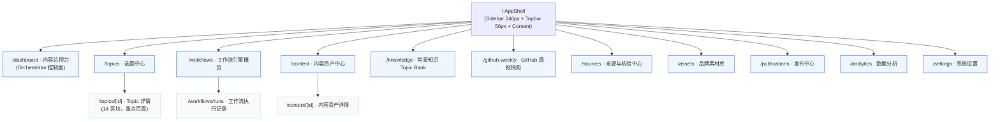
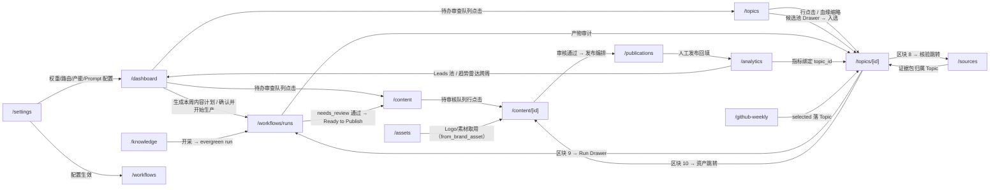

# 02 信息架构（Information Architecture）

> **状态**：本文档为正式文档（`/docs/02-information-architecture.md`），对应需求二十第 3 步"输出信息架构"。
> **事实源声明**：本文档的唯一事实源为 `docs/` 下 5 个基线文件——`_requirements.md`（需求原文）、`_canonical-data-model.md`（数据模型，字段/枚举唯一裁决依据）、`_canonical-workflow.md`（工作流与状态机行为契约）、`_canonical-ia.md`（导航树/页面职责/区块顺序/设计系统）、`_canonical-roadmap.md`（MVP 范围与阶段）。凡字段、枚举、路由、状态、区块顺序一律引用基线原文，本文档**不新增、不删减、不改写**。
> **裁决顺序**：与数据模型基线冲突 → 以数据模型基线为准；与需求原文冲突 → 以 IA 基线（正式落地形态）为准；发现基线遗漏或需偏离处，记录于文末 Open Questions 并在返回值 `deviationsFromCanonical` 中以 `[REVIEW]` 标注，**不改动基线文件**。
> **引用约定**：页面展示字段一律使用数据模型表列名（如 `topics.topic_id`、`source_packets.verification_status`）；枚举展示为"中文标签 + 英文 value 双显"，value 以数据模型 `§1 全局枚举` 为准。

---

## 1. 信息架构总览与设计原则

本平台是面向 AI / B2B 内容运营团队的 **Content Operations OS**，核心链路为：内容机会发现 → Topic 形成 → 事实核验 → AI 工作流分发 → 内容生产 → 人工审核 → 多平台内容资产 → 发布管理 → 数据追踪 → 线索转化 → 数据反哺下一轮选题。

信息架构围绕以下 7 条原则展开（全部继承自基线，本文不做新的裁量）：

| 编号 | 原则 | 依据 | 落地含义 |
|---|---|---|---|
| IA-1 | **Topic 中心化** | 需求一、数据模型 §5 | `topics` 是全系统唯一核心枢纽表；`content_assets` 与 Topic 严格分离。14 页中有 9 页直接消费 `topics` 或其关联表（见 §4.3） |
| IA-2 | **14 条路由为硬边界** | 需求十四、IA §1.2/§1.3 | `/dashboard`、`/topics`、`/topics/[id]`、`/workflows`、`/workflows/runs`、`/content`、`/content/[id]`、`/knowledge`、`/github-weekly`、`/sources`、`/assets`、`/publications`、`/analytics`、`/settings` 全量保留；L3 派生详情（`/workflows/runs/[id]`、`/sources/[id]`）用 **Drawer** 承载，**不新增路由**（🔸 基线追加建议，本文维持） |
| IA-3 | **Topic Detail 14 区块顺序不可重排** | 需求十五、IA §3 | 基础信息 → 评分 → Priority → Tags → Parent → Source Topics → Lineage 可视化 → Source Packet → Workflow Runs → Content Assets → Derived Topics → Metrics → CTA → 历史记录；任何实现不得重排/删节（DC-35） |
| IA-4 | **读血缘一律走边表** | 数据模型 §2.3、DC-11 | 所有 Lineage 可视化只读 `topic_relations`（`WITH RECURSIVE` 递归 CTE，深度 3-5 层）；写血缘仅经 `lineage service` 单事务（同写 `topics.parent_topic_id` + `topics.source_topic_ids` + `topic_relations`），禁止页面直写 |
| IA-5 | **人工门禁显性** | 数据模型 §2.8、workflow §7 | 所有审核/发布动作在 UI 上显性标识"人工"，并落 `audit_log`；不存在绕过路径；`publications.status='published'` 仅人工触发 |
| IA-6 | **三态约定** | IA §4.4、DC-38 | 全站统一 `Skeleton`（加载）/ `EmptyState`（空态）/ `Error`（错误+重试），**禁止空白页** |
| IA-7 | **桌面优先** | IA §4.4、DC-39 | 桌面 3 栏 → 平板 2 栏 → 移动端单栏；Sidebar 折叠为 Drawer，Table 降级为 Card 列表；V1 以桌面为第一优先级 |

---

## 2. 站点地图与路由表（14 页）

### 2.1 站点地图（Site Map）

路由即文件系统目录（Next.js App Router，路由一律小写 kebab-case）：



### 2.2 路由总表（Route Table，14 条）

> "主数据表"列直接引用 IA 基线 §5 的页面 ↔ 数据模型映射（与数据模型基线 34 表对齐）；"阶段"列引用 roadmap 基线（M0 占位 / M1 / M2 / M4）。

| # | 路由 | 层级 | 页面类型 | 一句话职责 | 主数据表（IA §5 引用） | 关键操作 / CTA | 阶段 |
|---|---|---|---|---|---|---|---|
| 1 | `/dashboard` | L1 | 控制台 | 每周内容运营单屏总览 + Orchestrator 人工触发入口 | `workflow_batches`、`workflow_runs`、`topics`、`content_assets`、`publications`、`leads`、`content_metrics`、`trend_radar`、`event_pool` | 「生成本周内容计划」「确认并开始生产」（人工触发，落 `workflow_runs`） | M1（D4） |
| 2 | `/topics` | L1 | 列表 | Topic 列表、筛选、排序、批量操作与候选导入入口 | `topics`、`event_pool`、`topic_clusters` | 批量改 priority / 批量归档 / 批量派发；候选池 Drawer | M1（D4） |
| 3 | `/topics/[id]` | L2 | 详情（重点页） | Topic 全生命周期单页工作台（14 区块） | `topics`、`topic_relations`、`source_packets`、`source_packet_items`、`sources`、`workflow_runs`、`workflow_outputs`、`content_assets`、`content_asset_versions`、`content_metrics`、`ctas`、`audit_log` | 状态迁移操作、重新评分（🔸）、冲突裁决入口、run Drawer | M1（D5） |
| 4 | `/workflows` | L1 | 配置/概览 | 工作流注册表、模板、路由规则与批次生命周期管理 | `workflow_types`、`workflow_templates`、`workflow_routing_rules`、`workflow_batches`、`ai_prompt_templates` | 新建/重跑批次（`batch_id` 追加 `-NN`） | M2（D9） |
| 5 | `/workflows/runs` | L2 | 列表 + Drawer | 全部 `workflow_runs` 执行留痕与状态追踪 | `workflow_runs`、`workflow_tasks`、`workflow_outputs`、`workflow_batches` | `needs_review` 审查队列（通过→`completed` / 退回→同 run 重跑）；Run 详情 Drawer | M2（D9） |
| 6 | `/content` | L1 | 列表 | `content_assets` 逻辑资产及其版本的管理入口 | `content_assets`、`content_asset_versions`、`publications` | 待审核队列（`Review` / `Needs Revision`）、批量导出/改平台/归档 | M1（D8） |
| 7 | `/content/[id]` | L2 | 详情 | 单个资产的编辑、版本管理与审核工作台 | `content_assets`、`content_asset_versions`、`publications`、`deep_dive_image_plans`、`ctas`、`audit_log` | Approve / Needs Revision / Ready to Publish（人工门禁）；版本回滚/对比 | M1（D8） |
| 8 | `/knowledge` | L1 | 列表 + 图 | AI Knowledge Topic Bank 开采与覆盖度管理 | `knowledge_topic_bank`、`knowledge_concept_edges`、`knowledge_derivations`、`topics` | 开采操作（触发 `evergreen_knowledge` run）；衍生预算指示 | M1（D7） |
| 9 | `/github-weekly` | L1 | 列表 + 操作 | GitHub 周榜快照抓取、定稿（frozen 不可变）与 Replay 管理 | `github_snapshots`、`github_snapshot_items`、`topics` | 抓取本周（Original）、Replay 重生成、标记 selected/淘汰原因 | M1（D7） |
| 10 | `/sources` | L1 | 列表 + 面板 | 来源主档、证据包与逐条事实核验的三层管理 | `sources`、`source_packets`、`source_packet_items`、`audit_log` | `source_consistency='conflict'` 冲突裁决面板（写 `audit_log`） | M1（D6） |
| 11 | `/assets` | L1 | 列表 + 上传 | `brand_assets` 上传、取用策略与 Logo 保护管理 | `brand_assets`、`asset_brand_usages` | 上传至 Supabase Storage 回填 `file_url`；Logo 强制 `ai_policy='reference_only'` | 占位 M0，完整实现待拆分（OQ-IA-06） |
| 12 | `/publications` | L1 | 列表 + 操作 | 发布计划编排与人工发布执行（V1 绝不自动发布） | `publications`、`content_assets`、`audit_log` | 人工发布：回填 `published_date / published_url / published_by`（仅人工触发 `published`） | M4（D14） |
| 13 | `/analytics` | L1 | 图表/数据 | 全量指标事实面——Conversion Funnel 与维度洞察 | `content_metrics`（视图 `conversion_funnel`）、`leads`、`trend_radar` | 平台/周维度下钻；Leads 池处理 | M4（D15） |
| 14 | `/settings` | L1 | 配置 | 评分权重/阈值、产能、路由与 Prompt 模板的配置驱动管理 | `system_settings`、`workflow_routing_rules`、`ai_prompt_templates`、`workflow_types` | 评分配置编辑、产能配置、路由规则编辑、Prompt 模板管理、LLM Provider 集成、用户/权限（V1 预留） | 占位 M0，完整实现待拆分（OQ-IA-06） |

### 2.3 路由参数与 `[id]` 语义

| 动态段 | 取值 | 展示规则 | 说明 |
|---|---|---|---|
| `/topics/[id]` | `topics.topic_id`（如 `2026W36-001`）**或** `topics.id`（uuid） | 详情页标题/面包屑 = `topic_id`（`2026W36-001`）+ `topics.title` **双显**，避免纯 uuid 无意义 | `topic_id` 业务格式 `^[0-9]{4}W[0-9]{2}-[0-9]{3}$`（数据模型 §2.1） |
| `/content/[id]` | `content_assets.id`（uuid） | 标题/面包屑 = `asset_key`（`{topic_id}:{asset_type}:{platform}`）+ title | `asset_key` 跨版本不变的逻辑标识（数据模型 §3.7） |

**参数与回退**：无效/不存在的 id → 返回 `EmptyState`（图标 + 说明 + 返回列表 CTA），禁止空白页；`/topics/[id]` 深度链接可直接进入 14 区块任意区块（锚点滚动，🔸 追加建议）。

### 2.4 层级规则与 L3 承载方式

| 层级 | 定义 | 页面清单 |
|---|---|---|
| L1 主入口 | 14 条路由中的 11 个顶级页（无动态段），均为 Sidebar 直达 | `/dashboard`、`/topics`、`/workflows`、`/content`、`/knowledge`、`/github-weekly`、`/sources`、`/assets`、`/publications`、`/analytics`、`/settings` |
| L2 子页 | L1 的二级路由，Sidebar 高亮归属父级 | `/topics/[id]`、`/workflows/runs`、`/content/[id]` |
| L3 派生详情（🔸） | 用 **Drawer** 承载，不建立独立路由，保持 14 路由不变 | `/workflows/runs/[id]`（Run 详情）、`/sources/[id]`（来源详情），以及候选池、核验明细、冲突裁决、蓝图（见 §6.4） |

**App Router 文件映射**（落地实现直接对应）：

| 路由 | 文件 |
|---|---|
| `/dashboard` | `app/dashboard/page.tsx` |
| `/topics` | `app/topics/page.tsx` |
| `/topics/[id]` | `app/topics/[id]/page.tsx` |
| `/workflows` | `app/workflows/page.tsx` |
| `/workflows/runs` | `app/workflows/runs/page.tsx` |
| `/content` | `app/content/page.tsx` |
| `/content/[id]` | `app/content/[id]/page.tsx` |
| `/knowledge` | `app/knowledge/page.tsx` |
| `/github-weekly` | `app/github-weekly/page.tsx` |
| `/sources` | `app/sources/page.tsx` |
| `/assets` | `app/assets/page.tsx` |
| `/publications` | `app/publications/page.tsx` |
| `/analytics` | `app/analytics/page.tsx` |
| `/settings` | `app/settings/page.tsx` |

---

## 3. 导航结构

### 3.1 AppShell 三层骨架（全站一致）

| 区域 | 尺寸 | 内容 |
|---|---|---|
| Sidebar（左侧导航） | 桌面 240px，可折叠为 64px 图标栏；移动端折叠为 Drawer | 品牌区、L1 主导航树（4 组，见 §3.2）、底部当前周/用户区 |
| Topbar（顶部栏） | 56px | 面包屑（L1 / L2 / [id]）、全局 Command Menu 触发（⌘K）、当前内容周选择器、审核待办铃铛、用户菜单 |
| Content（内容区） | 剩余视口，垂直滚动 | 页面级骨架：PageHeader → Toolbar/FilterBar → 顺序区块（Card/Table） |

通用页面骨架（引用 IA §4.4）：`PageHeader`（标题 + 一句话职责 + 右侧主/次操作）、`Toolbar/FilterBar`（过滤 + 排序 + 视图，筛选状态可清空）、区块以 Card 分组、列表优先 Table。

### 3.2 Sidebar 导航分组（4 组 11 项）

| 分组 | 导航项 | 路由 |
|---|---|---|
| **总览** | Dashboard | `/dashboard` |
| **生产** | Topics / Knowledge / GitHub Weekly / Workflows / Content / Sources / Assets / Publications | `/topics`、`/knowledge`、`/github-weekly`、`/workflows`、`/content`、`/sources`、`/assets`、`/publications` |
| **数据** | Analytics | `/analytics` |
| **系统** | Settings | `/settings` |

🔸 追加建议（不改变分组）：Sidebar 条目可显示状态徽标计数（待审核内容数、待发布内容数、`needs_review` run 数），数据源与 Dashboard 周概览 KPI 行一致（`topics` / `content_assets` / `publications` / `workflow_runs`），点击直达对应页面的待办队列（锚点/默认过滤）。

### 3.3 Topbar 全局工具（全站常驻）

| 工具 | 规格 | 数据/行为 |
|---|---|---|
| 面包屑 | L1 / L2 / [id] | `[id]` 显示 `topic_id`+title 或 `asset_key`+title 双显 |
| ⌘K Command Menu | `cmdk`，`--shadow-xl` + `--radius-xl` | 索引 = Topic（`topic_id`/title）+ 批次（`batch_id`）+ 资产（`asset_key`）+ 导航 + 动作；动作清单见 OQ-IA-02 |
| 当前内容周选择器 | 默认当前周（`content_week`，如 `2026W36`） | 影响列表页默认范围：`/dashboard`、`/topics`、`/github-weekly`、`/workflows`、`/workflows/runs`、`/analytics`（作用域清单见 OQ-IA-03） |
| 审核待办铃铛 | Badge 计数 | 入口 = Dashboard 待办审查队列同一数据源：`workflow_runs.status='needs_review'`、`content_assets.status ∈ {Review, Needs Revision}`、`source_packets.source_consistency='conflict'`、`topics.history_dedupe_status='review_required'` |
| 用户菜单 | Avatar + DropdownMenu | V1 单用户，预留用户/权限区（OQ-04 / roadmap §1.2 第 6 项） |

### 3.4 导航与状态联动

- **状态显性**：全站状态用 Badge + 语义色双重编码（不单靠颜色）。语义映射（IA §4.1）：`verified` / `completed` / `published` → 成功绿；`needs_update` / `needs_revision` / `needs_review` → 警告橙；`failed` / `conflict` / `P0` → 危险红；Priority 徽标 P0 红 / P1 橙 / P2 蓝 / P3 中性灰（固定）。
- **导航-待办联动**：Sidebar 徽标计数、Topbar 铃铛、Dashboard 待办审查队列三者同源，点击任一入口进入对应页面的过滤视图。
- **当前周切换**：切换 `content_week` 后全局列表页刷新为该周数据（`/topics` 过滤 `content_week`、`/github-weekly` 周选择器等）；Topic Detail 不受周选择影响（按 `topic_id` 定位）。

---

## 4. 实体 → 页面映射

### 4.1 全量矩阵（34 表 → 页面）

> 列定义：**主页面** = 该表的主要消费/编辑面（IA §2/§5 明示）；**关联入口** = 次级引用或跳转可达处。表名与字段全部引用数据模型基线。

**Domain A — Topic 域**

| 表 | 主页面 | 关联入口 | 关键展示字段 |
|---|---|---|---|
| `topics` | `/topics`、`/topics/[id]` | `/dashboard`（KPI）、`/content`（资产归属）、`/knowledge`（1:1）、`/github-weekly`（落 Topic）、`/publications`（`topic_id` 必填）、`/analytics`（指标绑定）、`/workflows/runs`（Topic 过滤） | `topic_id`、`content_week`、`title`、`topic_type`、`status`、`priority`、五维评分、`primary_cta`、`history_dedupe_status` |
| `topic_relations` | `/topics/[id]`（Lineage 区块 7） | — | `from_topic_id`、`to_topic_id`、`relation_type`（parent/source） |
| `event_pool` | `/topics`（候选池 Drawer，🔸） | `/dashboard`（待办审查队列）、`/workflows/runs` | `candidate_id`、`selection_status`（pending/selected/eliminated）、`elimination_reason`、`event_date` |
| `topic_clusters` | `/topics`（查重聚类结果） | `/dashboard`（`review_required` 待办）、`/topics/[id]`（查重状态） | `cluster_key`、`canonical_topic_id`、`status`（open/resolved/merged） |
| `ctas` | `/topics/[id]`（CTA 区块 13）、`/content/[id]`（CTA 面板） | —（词表管理入口未指定，见 §8 OQ-IA-01） | `key`、`label`、`cta_type`、`target_url_template` |

**Domain B — Source 域**

| 表 | 主页面 | 关联入口 | 关键展示字段 |
|---|---|---|---|
| `sources` | `/sources`（区块 1） | `/topics/[id]`（证据包明细引用）、`/sources` 来源详情 Drawer（L3） | `source_name`、`source_url`、`source_type`、`source_quality_score`、`is_confidential` |
| `source_packets` | `/sources`（区块 2） | `/topics/[id]`（区块 8）、`/dashboard`（`conflict` 待办） | `packet_id`、`verification_status`（包级五态 rollup）、`source_consistency`、`conflict_fact_ids` |
| `source_packet_items` | `/sources`（区块 3） | `/topics/[id]`（区块 8 明细） | `core_fact`、`key_numbers`、`number_test_conditions`、`item_verification_status`、`event_assessment` |

**Domain C — Workflow 域**

| 表 | 主页面 | 关联入口 | 关键展示字段 |
|---|---|---|---|
| `workflow_types` | `/workflows`（区块 1） | `/settings`（集成/注册） | `key`（5 类）、`scheduling`、`capacity_rules`、`enabled` |
| `workflow_templates` | `/workflows`（区块 2） | — | `version`、`prompt_refs`、`step_definition`、`active` |
| `workflow_batches` | `/workflows`（区块 4） | `/dashboard`（四大工作流状态卡）、`/workflows/runs`（批次过滤） | `batch_id`、`week`、`status`（batch_status 6 态）、`topic_ids` |
| `workflow_runs` | `/workflows/runs` | `/dashboard`（CTA 触发 + 最近时间线）、`/topics/[id]`（区块 9）、`/workflows`（批次列表） | `run_number`、`workflow_type_key`、`status`、`attempt_count`、`parent_run_id` |
| `workflow_tasks` | `/workflows/runs`（Run 详情 Drawer） | `/topics/[id]`（run Drawer） | `task_type`、`sequence`、`status`（含 `skipped`）、`provider_class` |
| `workflow_outputs` | `/workflows/runs`（Run 详情 Drawer） | `/topics/[id]`（区块 9 产物） | `output_type`（11 类）、`applied`、`applied_at` |
| `workflow_routing_rules` | `/workflows`（区块 3）、`/settings`（区块 3） | —（职责边界见 §8 OQ-IA-04） | `match_field`、`match_value`、`workflow_type_key`、`overridable` |
| `ai_prompt_templates` | `/settings`（区块 4） | `/workflows`（模板版本表引用 `prompt_refs`） | `key`、`version`、`system_prompt`、`active` |

**Domain D — GitHub 快照域**

| 表 | 主页面 | 关联入口 | 关键展示字段 |
|---|---|---|---|
| `github_snapshots` | `/github-weekly`（区块 1） | — | `snapshot_id`、`snapshot_type`（original/replay）、`selection_basis`、`status`（captured/frozen + 锁标识） |
| `github_snapshot_items` | `/github-weekly`（区块 2） | `/topics/[id]`（落 Topic 后跳转） | `rank`、`repository`、`weekly_growth`、`total_stars`、`verification_status`、`selected`、`elimination_reason` |

**Domain E — Knowledge 域**

| 表 | 主页面 | 关联入口 | 关键展示字段 |
|---|---|---|---|
| `knowledge_topic_bank` | `/knowledge`（区块 1） | `/topics/[id]`（`topic_type='knowledge'` 行跳转） | `concept`、`category`、`knowledge_status`（6 态）、`content_status`（8 态）、`next_action` |
| `knowledge_concept_edges` | `/knowledge`（区块 2，V1 可选） | — | `source_concept_id`、`target_concept_id`、`edge_type`（upstream/related/downstream） |
| `knowledge_derivations` | `/knowledge`（区块 3 衍生预算条） | — | `workflow_run_id`、`main_topic_id`、`round_index`（1..3 预算条） |

**Domain F — Deep Dive 域**

| 表 | 主页面 | 关联入口 | 关键展示字段 |
|---|---|---|---|
| `deep_dive_plans` | **未指定**（[REVIEW]，见 §8 OQ-IA-05） | 建议承载于 `/content/[id]`（wechat_article 关联蓝图）或 `/topics/[id]` 区块内 Drawer | `content_role`（单值）、`section_structure`（12 段）、`status`（drafting/review/needs_revision/approved/archived）、`primary_cta` |
| `deep_dive_image_plans` | `/content/[id]`（区块 8，🔸 wechat_article 显示） | — | `image_type`、`image_priority_rank`、`source_status` |
| `image_type_priorities` | 无页面（查找表，种子数据） | — | `image_type` → `priority_rank`（1-7） |

**Domain G — Content / Asset 域**

| 表 | 主页面 | 关联入口 | 关键展示字段 |
|---|---|---|---|
| `content_assets` | `/content`、`/content/[id]` | `/topics/[id]`（区块 10）、`/publications`、`/analytics`、`/dashboard`（待审核内容） | `asset_key`、`asset_type`（8 类）、`platform`、`content_role`、`cta`、`status`、`current_version_id` |
| `content_asset_versions` | `/content/[id]`（区块 3 版本 Timeline） | `/content`（当前版摘要）、`/topics/[id]`（区块 10） | `version`、`status`、`is_current`、`created_by_run_id` |
| `brand_assets` | `/assets`（区块 1/2） | `/content/[id]`（配图取用，`from_brand_asset`） | `name`、`type`、`ai_policy`（logo 强制 `reference_only`）、`is_primary_logo` |
| `asset_brand_usages` | `/assets`（区块 4 使用审计） | — | `content_asset_id`、`brand_asset_id`、`usage_kind` |

**Domain H — Publication / Metrics / Leads 域**

| 表 | 主页面 | 关联入口 | 关键展示字段 |
|---|---|---|---|
| `publications` | `/publications`（区块 1） | `/content/[id]`（区块 6 发布状态）、`/dashboard`（待发布/已发布 KPI） | `platform`、`scheduled_date`、`published_date`、`published_url`、`status` |
| `content_metrics` | `/analytics`（区块 1/2/3） | `/topics/[id]`（区块 12 Metrics）、`/dashboard`（周 KPI） | 18 字段全量；`topic_id` 强制绑定；`conversion_funnel` 视图派生 |
| `trend_radar` | `/dashboard`（区块 6 趋势雷达图） | `/analytics`（区块 5 跨周对比） | `signal_strength`、`velocity`、`novelty_score`（1-10） |
| `leads` | `/analytics`（区块 4 Leads 池） | `/dashboard`（本周 Leads KPI） | `lead_type`、`lead_urgency`、`lead_status`、`suggested_reply`（仅建议不自动回复） |

**Domain I — 审计与配置域**

| 表 | 主页面 | 关联入口 | 关键展示字段 |
|---|---|---|---|
| `audit_log` | `/topics/[id]`（区块 14 历史记录 = 视图 `topic_status_history`） | `/sources`（核验记录 = 视图 `source_packet_verifications`）、`/content/[id]`（审核留痕）、`/workflows/runs` | `entity_type`、`action`、`from_status`、`to_status`、`actor`、`workflow_run_id` |
| `system_settings` | `/settings`（区块 1/2） | — | `scoring.weights.*`、`scoring.threshold.p0/p1/p2`、`capacity.global_concurrency` |

### 4.2 页面 ↔ 主数据表映射（IA §5 原文引用，唯一裁决）

| 路由 | 主数据表 |
|---|---|
| `/dashboard` | `workflow_batches`、`workflow_runs`、`topics`、`content_assets`、`publications`、`leads`、`content_metrics`、`trend_radar`、`event_pool` |
| `/topics` | `topics`、`event_pool`、`topic_clusters` |
| `/topics/[id]` | `topics`、`topic_relations`、`source_packets`、`source_packet_items`、`sources`、`workflow_runs`、`workflow_outputs`、`content_assets`、`content_asset_versions`、`content_metrics`、`ctas`、`audit_log` |
| `/workflows` | `workflow_types`、`workflow_templates`、`workflow_routing_rules`、`workflow_batches`、`ai_prompt_templates` |
| `/workflows/runs` | `workflow_runs`、`workflow_tasks`、`workflow_outputs`、`workflow_batches` |
| `/content` | `content_assets`、`content_asset_versions`、`publications` |
| `/content/[id]` | `content_assets`、`content_asset_versions`、`publications`、`deep_dive_image_plans`、`ctas`、`audit_log` |
| `/knowledge` | `knowledge_topic_bank`、`knowledge_concept_edges`、`knowledge_derivations`、`topics` |
| `/github-weekly` | `github_snapshots`、`github_snapshot_items`、`topics` |
| `/sources` | `sources`、`source_packets`、`source_packet_items`、`audit_log` |
| `/assets` | `brand_assets`、`asset_brand_usages` |
| `/publications` | `publications`、`content_assets`、`audit_log` |
| `/analytics` | `content_metrics`（视图 `conversion_funnel`）、`leads`、`trend_radar` |
| `/settings` | `system_settings`、`workflow_routing_rules`、`ai_prompt_templates`、`workflow_types` |

### 4.3 核心实体的跨页面足迹

**`topics`（9 页触达）**：

```
/dashboard (KPI: P0/P1 数、待审核/待发布/已发布)
  → /topics (列表/过滤/批量)
    → /topics/[id] (14 区块主页面)
  → /content (资产挂 topic_id，跳详情)
  → /knowledge (topic_type='knowledge' 1:1 行)
  → /github-weekly (selected=true 落 Topic)
  → /publications (topic_id 必填)
  → /analytics (content_metrics.topic_id 强制绑定)
  → /workflows/runs (topic 过滤)
```

**`workflow_runs`（5 页触达）**：`/dashboard`（CTA 创建 run + 最近时间线）→ `/workflows`（批次内 run 概览）→ `/workflows/runs`（全量留痕主页面）→ `/topics/[id]`（区块 9 关联 runs + 父子调用树）→ `/settings`（无，仅配置上游）。

**`source_packets`（3 页触达）**：`/sources`（聚合层主页面）→ `/topics/[id]`（区块 8 证据包）→ `/dashboard`（`source_consistency='conflict'` 待办）。

**字段 → 页面区块映射示例**（落实"页面展示字段名 = 数据模型列名"约定）：

| 字段 | 展示页面/区块 | 展示形态 |
|---|---|---|
| `topics.priority` | `/topics` 表格列；`/topics/[id]` 区块 3 | Priority 徽标（P0 红 / P1 橙 / P2 蓝 / P3 灰） |
| `topics.status` | `/topics` 过滤栏 + 徽标；`/topics/[id]` 区块 1 | 9 态徽标（中文标签 + 英文 value 双显） |
| `source_packets.verification_status` | `/sources` 区块 2；`/topics/[id]` 区块 8 | 包级五态徽标（rollup 结果，禁止手填） |
| `workflow_runs.status` | `/workflows/runs` 表格；`/dashboard` 工作流状态卡 | `queued/running/completed/failed/needs_review` 徽标 |
| `content_metrics.cta_clicks` | `/analytics` 漏斗；`/topics/[id]` 区块 12 | `conversion_funnel` 视图派生 |

---

## 5. Topic Lineage 可视化方式

### 5.1 数据源与查询（只读权威路径）

- **权威图存储**：`topic_relations`（`from_topic_id` / `to_topic_id` / `relation_type` ∈ `parent` | `source`，`UNIQUE(from_topic_id, to_topic_id, relation_type)`，`CHECK (from_topic_id <> to_topic_id)`）。
- **投影列**：`topics.parent_topic_id`（单父衍生树）+ `topics.source_topic_ids`（多对多来源血缘）为需求必填的展示/入口投影；**可视化渲染一律读 `topic_relations`**，投影列仅用于快速展示父/源标签与跳转。
- **查询方式**：`WITH RECURSIVE` 递归 CTE，沿 `parent`/`source` 边**双向**（上游父/源 + 下游衍生）遍历；V1 深度限制 **3-5 层**（默认 4，见 §5.3），不引入图数据库。
- **一致性保障**：写入仅经 `lineage service` 单事务（同写两列 + 边表），应用层祖先路径防环 + 数据库 CHECK 双保险；因此前端可视化**天然无环**，无需渲染期防环逻辑。

### 5.2 可视化形态（`LineageGraph` 有向图组件）

| 元素 | 规格 |
|---|---|
| 节点 | Topic 卡片：`topic_id`（等宽字体 `tabular-nums`）+ `title`；顶部优先级徽标（P0 红 / P1 橙 / P2 蓝 / P3 灰）；节点描边按 `priority` 语义色 |
| 边 | `relation_type='parent'` → **实线**（单父衍生链）；`relation_type='source'` → **虚线**（多源促成）；方向 from → to（上游指向下游），箭头标注 |
| 当前 Topic | 高亮：`--color-ring` focus 环 / `--color-primary` 描边加粗 |
| 布局 | 分层有向图：上层 = 上游（父/源，向上最多 2 层），下层 = 下游（衍生，向下最多 2 层）；同层按 `content_week` / `created_at` 排序 |
| 深度控制 | 默认 `depth=4`，上限 5；超过截断并显示"血缘深度已截断（上限 5 层）"提示 |
| 交互 | 平移/缩放；节点悬浮显示 `relation_type` + 边 `created_at`；节点点击跳转 `/topics/[id]`；子层可折叠（Collapsible） |
| 空态 | 无父/无源/无衍生 → 显示"独立顶层选题"空态卡（不渲染空图） |

**组件契约（伪代码）**：

```tsx
<LineageGraph
  topicId="<topics.id uuid>"
  depth={4}                    // 3-5 层，默认 4
  relationTypes={["parent", "source"]}
  direction="both"             // "upstream" | "downstream" | "both"
  highlightTopicId="<当前 Topic id>"
  onNodeClick={(topicId) => router.push(`/topics/${topicId}`)}
/>
```

**数据获取（示意）**：单次请求 = `lineage service` 暴露的 `getTopicLineage(topicId, { depth: 4, direction: "both" })`，内部执行 `WITH RECURSIVE` 并返回节点数组（含 `priority`、`topic_id`、`title`）与边数组（含 `relation_type`、`created_at`）；前端不自行递归查询。

### 5.3 放置位置

| 位置 | 形态 | 说明 |
|---|---|---|
| **主位置**：`/topics/[id]` 区块 7（Lineage 可视化） | 完整 `LineageGraph` 有向图 | 区块顺序硬性第 7 位；右侧侧栏可同时显示血缘摘要（父/源/衍生计数） |
| 辅助位置（🔸 追加建议）：`/topics` 列表 | 行展开的 `LineageGraph` 缩略（深度 2-3 层，只读） | 范围待确认，见 OQ-IA-01 |
| `/knowledge` 概念图 | **独立体系**，非 Topic Lineage | 可视化 `knowledge_topic_bank.upstream_concepts / related_concepts / downstream_concepts`（或 `knowledge_concept_edges`）；与 Topic 血缘是**两套独立边，不互写**（DC-23） |
| ⌘K Command Menu | 血缘搜索入口 | 索引含 `topic_id`/title，选中后跳 `/topics/[id]` 区块 7 锚点（🔸 追加建议） |

### 5.4 示例：血缘链路可视化

以需求三示例链路"AI 新闻 → Agent Skills 趋势 → 什么是 Agent Skills → 企业为什么需要 Agent Skills Library → 企业 Agent Skills Governance"为例：

```
AI 新闻（源） ─ ─ ─ ─ ─ ─ ─ ─ ─ ┐   （source 虚线：促成）
                                 ▼
Agent Skills 趋势 ◄───────────────┘
        │   （parent 实线：衍生）
        ▼
什么是 Agent Skills
        │
        ▼
企业为什么需要 Agent Skills Library
        │
        ▼
企业 Agent Skills Governance
```

- `AI 新闻 → Agent Skills 趋势`：`relation_type='source'`（虚线）
- 其余逐级：`relation_type='parent'`（实线），`parent_topic_id` 指向直接父
- 任一节点点击 → `/topics/[id]`，血缘链路 5 层 ≤ 上限 5，完整渲染

---

## 6. 页面间流转关系

### 6.1 主旅程：周运营闭环（10 步，最终目标链路）

> 步骤中的状态迁移以 workflow 基线 §7（Topic 9 态）与 §4（run 状态机）为准。

| 步 | 起点页 | 动作 | 目标页/承载 | 状态迁移与落库 |
|---|---|---|---|---|
| 1 | `/dashboard` | CTA「生成本周内容计划」 | `/workflows/runs`（观察） | 创建 `workflow_type='orchestrator'` run（`queued → running → completed`），产出 `production_plan`，生成 `workflow_batches` |
| 2 | `/workflows/runs`（或 `/topics` 候选池 Drawer） | 候选接收 → 查重 → 聚类（`review_required` 待人工裁决） | `/topics` | `event_pool.history_dedupe_status` 置 `unique/clustered/duplicate/merged/review_required`；入选提升 `topics`（`status='Draft'`） |
| 3 | `/topics` | 行点击 | `/topics/[id]` | 评分/优先级/CTA 定案；人工审核 14 区块；`Draft → Researching → Ready for Production`（守卫：`primary_cta` 必填、证据包核验 ≥ `verified`） |
| 4 | `/dashboard` | CTA「确认并开始生产」 | `/workflows/runs` | Orchestrator 派发子 run（`parent_run_id` 调用树）；`Ready for Production → Producing`；批次 `dispatching → in_progress` |
| 5 | `/workflows/runs` | 监控子 run；Run 详情 Drawer 审核 `needs_review` | `/workflows/runs`（Drawer） | `Producing → Review`；人工通过 `needs_review → completed`（可联动 `topics.status = Ready to Publish`） |
| 6 | `/content` | 待审核队列 → 行点击 | `/content/[id]` | 版本编辑/对比；审核操作（Approve / Needs Revision / Ready to Publish）落 `audit_log`；资产状态 `Review → Ready to Publish` |
| 7 | `/publications` | 编排 `planned → ready` → 人工发布 | `/publications` | 人工回填 `published_date / published_url / published_by`；`ready → published`（**仅人工**）；`topics.status = Published`（需存在 `publications` 记录） |
| 8 | `/analytics` | 指标录入/导入（绑定 `topic_id`） | `/analytics` | `content_metrics` 18 字段；`conversion_funnel` 视图：Read → CTA Click → Lead → Registration → Demo → Sales Lead → Deal → Revenue |
| 9 | `/dashboard` | 下周刷新 KPI；趋势雷达 | `/dashboard`、`/topics` | `trend_radar` 信号；二次候选 `secondary_candidates` 回写 `event_pool` |
| 10 | `/knowledge` | `knowledge_topic_bank.next_action` 驱动开采（M5） | `/workflows/runs` | 触发 `evergreen_knowledge` run（一次一主 + 最多 3 衍生，`checkDerivedTopicBudget` 守卫） |

### 6.2 页面跳转图



### 6.3 关键跳转矩阵

| 来源页 | 跳转目标 | 触发动作 | 传递参数/上下文 |
|---|---|---|---|
| `/dashboard` | `/topics` | KPI/待办点击 | 过滤参数（`status`、`priority`、`content_week`） |
| `/dashboard` | `/workflows/runs` | CTA 触发后 | `workflow_type_key` 过滤（如 `orchestrator`） |
| `/topics` | `/topics/[id]` | 行点击 | `[id]` = `topic_id` 或 uuid |
| `/topics` | `/topics`（候选池 Drawer） | "候选入口" | Drawer 内 `event_pool.selection_status` 过滤 |
| `/topics/[id]` | `/content/[id]` | 区块 10 资产点击 | `[id]` = `content_assets.id` |
| `/topics/[id]` | `/topics/[id]`（另一 Topic） | 血缘节点点击 / 父/源/衍生跳转 | 目标 `[id]` |
| `/topics/[id]` | `/sources` | 证据包/来源跳转（🔸） | `packet_id` / `source_id` 定位 |
| `/workflows/runs` | `/topics/[id]` | run 表格 `topic_id` 列点击 | `[id]` = run 关联 Topic |
| `/workflows/runs` | `/workflows/runs`（Run Drawer） | 行点击 | Drawer = 子路由替代（`/workflows/runs/[id]`） |
| `/content` | `/content/[id]` | 行点击 | `[id]` = `content_assets.id` |
| `/content/[id]` | `/topics/[id]` | 关联 Topic 跳转 | `content_assets.topic_id` |
| `/content/[id]` | `/publications` | 发布状态区块 | `publications` 关联记录（platform/status） |
| `/knowledge` | `/topics/[id]` | 知识行 → canonical topic | `knowledge_topic_bank.topic_id` |
| `/github-weekly` | `/topics/[id]` | `selected=true` 项落 Topic | `github_snapshot_items.topic_id` |
| `/sources` | `/topics/[id]` | 证据包归属 Topic | `source_packets.topic_id` |
| `/publications` | `/content/[id]` | 发布行 → 资产 | `publications.asset_id` |
| `/analytics` | `/topics/[id]` | 指标行/漏斗下钻 | `content_metrics.topic_id` |
| `/assets` | `/content/[id]` | 使用审计反查（`asset_brand_usages`） | `content_asset_id` |

### 6.4 Drawer 承载的次级流转（不新增路由，L3 方案）

| Drawer | 宿主页面 | 承载内容 | 流转去向 |
|---|---|---|---|
| 候选池 Drawer（🔸） | `/topics` | `event_pool` 候选列表（`selection_status`、`elimination_reason`） | 入选 → 提升生成 Topic → 跳 `/topics/[id]` |
| Run 详情 Drawer | `/workflows/runs`、`/topics/[id]` | `workflow_tasks` 步骤时间线（sequence/status/error）、`workflow_outputs`（output_type + content + `applied`）、`parent_run_id` 调用树、`error` | 审核通过 → 联动状态；退回 → 同 run 重跑（`attempt_count+1`） |
| 来源详情 Drawer | `/sources` | 单来源主档（`sources` 全字段 + `source_quality_score`） | 编辑来源 → 回列表 |
| 核验明细 Drawer | `/sources`、`/topics/[id]` | `source_packet_items` 逐条核验（`number_test_conditions` 断言执行、`key_numbers`） | 逐条核验 → 包级 rollup 刷新 |
| 冲突裁决面板 | `/sources`、`/topics/[id]` | `source_consistency='conflict'` 逐条裁决 | 裁决写 `audit_log`（`action='conflict_resolved'`） |
| 蓝图/配图 Drawer（[REVIEW]） | `/content/[id]`（建议） | `deep_dive_plans` 12 段结构 + `deep_dive_image_plans` | 蓝图审核（drafting → review → approved）→ 成文（见 §8 OQ-IA-05） |

### 6.5 跨页上下文与状态一致性

- **当前周上下文**：Topbar 周选择器为全局上下文，`/dashboard`、`/topics`、`/github-weekly`、`/workflows`、`/workflows/runs`、`/analytics` 默认过滤当前周（`content_week` / `radar_week` / `metric_date`）；跨页跳转时保持（OQ-IA-03）。
- **状态一致性约束**（继承 workflow 基线 §7，页面实现必须遵守）：
  - `topics.status` 迁移只能经守卫函数；`Ready for Production` 前 `primary_cta` 必填；`Published` 仅人工且需存在 `publications` 记录。
  - `workflow_runs.status='needs_review'` 为人工门禁吸收态；人工通过 → `completed`，人工退回 → 同 run 重跑。
  - 所有跨页联动动作（评分、查重、聚类、CTA、路由、状态迁移、发布）落 `workflow_runs` / `audit_log` 留痕。
- **跳转参数约定**：列表 → 详情一律传业务 ID（`topic_id`、`asset_key` 用于展示）+ 内部 id（用于查询）；详情 → 列表可携带返回过滤条件（🔸 追加建议）。

---

## 7. 信息架构落地检查清单（供 D1-D10 引用）

| # | 检查项 | 判定标准 | 关联任务 |
|---|---|---|---|
| 1 | 14 条路由可访问 | `npm run build` 通过；14 页无 404；占位页三态（Skeleton/EmptyState/Error）就绪 | D1 |
| 2 | 页面字段名引用数据模型列名 | 无自造字段名；枚举 value 与数据模型 §1 完全一致 | D4-D8 |
| 3 | Topic Detail 14 区块顺序 | 与 IA §3 顺序完全一致，不重排/不删节 | D5 |
| 4 | 血缘只读边表 | 页面无直接写 `topic_relations` / 两列投影的代码路径 | D3、D5 |
| 5 | 人工门禁显性 | 审核/发布按钮带"人工"标识；动作落 `audit_log`；无绕过路径 | D8、D14 |
| 6 | 三态全站统一 | 无空白页；空态含引导 CTA | 全部 |
| 7 | 周上下文生效 | 周选择器切换后列表页数据同步 | D4、D7、D15 |

---

## 8. Open Questions（本文档悬而未决的问题）

> 编号 `OQ-IA-xx`，与 roadmap 基线 `OQ-xx` 并行编号（本文档专属）；确认后回写本文档，不修改基线文件。

| 编号 | 问题 | 影响范围 | 推荐方案 |
|---|---|---|---|
| OQ-IA-01 | `/topics` 列表页的血缘缩略形态：行内展开 `LineageGraph`（深度 2-3 层）还是仅详情页提供血缘可视化？ | D4、D5 | 推荐 V1 仅在 `/topics/[id]` 提供完整血缘图；`/topics` 行展开缩略列为 🔸 追加（M5 评估） |
| OQ-IA-02 | ⌘K Command Menu 的"动作"清单未在 IA 基线定义（仅写"导航 + 动作"）：V1 支持哪些动作（如"生成本周内容计划""打开本周批次""搜索 source_packet"）？ | D1、D4 | 推荐 V1 动作 = 两个 Dashboard CTA + 跳转当前周批次 + 打开候选池 Drawer |
| OQ-IA-03 | 当前内容周选择器的作用域：是否影响 `/sources`、`/knowledge`、`/analytics` 的默认过滤？跨页跳转是否保持？ | D4、D6、D15 | 推荐仅影响带周语义的页面（dashboard/topics/github-weekly/workflows/runs/analytics）；knowledge/sources 按实体而非周过滤 |
| OQ-IA-04 | `/workflows` 与 `/settings` 对 `workflow_routing_rules`、`ai_prompt_templates`、`workflow_types` 的职责重叠（两页均展示）：只读 vs 可写边界？ | D9、Settings 实现 | 推荐 `/workflows` 为执行视图（只读展示 + 批次操作），`/settings` 为配置编辑（可写），避免双写入口（同 §8 下 [REVIEW] #3） |
| OQ-IA-05 | `deep_dive_plans`（蓝图 12 段 + 审核状态机 drafting/review/needs_revision/approved/archived）的页面承载位置未在 IA §5 映射表出现（见 [REVIEW] #1）：承载于 `/content/[id]`（wechat_article 关联蓝图 Drawer）还是 `/topics/[id]` 区块内？ | D13、D8、D5 | 推荐 `/content/[id]`：资产审核与蓝图审核同屏，天然衔接"plan.primary_cta == topic.primary_cta"校验项 |
| OQ-IA-06 | `/assets` 与 `/settings` 的完整实现未排入 roadmap D1-D10（D1 仅 14 路由占位，roadmap M1 交付物也未含二者）：安排在哪个阶段/任务？ | Roadmap D11+ | 推荐 M2 之后追加任务（或并入 D9/D10 的收尾），以 IA §2.11/§2.14 职责为准 |
| OQ-IA-07 | 趋势雷达在 Dashboard 的图表粒度与刷新策略（IA §6 遗留、roadmap OQ-09 同源）：当前周 vs 跨周？刷新时机？ | D4 区块 6、D15 | 推荐 Dashboard 当前周 + M5 增加跨周对比；刷新随 Orchestrator `trend_radar_management` 回写后失效缓存 |
| OQ-IA-08 | 移动端验收边界：V1 桌面优先，14 页在移动端的降级深度（Table → Card 列表、Sidebar → Drawer）是否有明确验收标准？ | D1、D4-D8 | 推荐 M1 验收仅要求"可浏览 + 无阻断"，完整移动端适配放 M5 后评估 |
| OQ-IA-09 | `ctas` 受控词表管理入口（见 [REVIEW] #2）：词表扩展（新 CTA key）由谁、在哪个页面维护？ | `/settings`、D8 | 推荐 `/settings` 追加"CTA 词表"区块（🔸 追加，不新增路由）；V1 可由种子数据 + 人工 SQL 维护 |

---

## 附录 A：本文档引用基线一览（对齐声明）

| 本文档章节 | 引用基线 | 一致性要求 |
|---|---|---|
| §2 站点地图与路由表 | IA §1.2/§1.3、§2、§5；需求十四 | 14 路由一字不差；L3 用 Drawer 不新增路由 |
| §3 导航结构 | IA §1.1、§4.4、§2（各页区块） | AppShell 尺寸、分组、Topbar 工具与基线一致 |
| §4 实体 → 页面映射 | IA §5；数据模型 §1/§3 | 表名/字段名/枚举值以数据模型为准 |
| §5 Topic Lineage 可视化 | 数据模型 §2.3、§3.1（topic_relations）；IA §3.7 | 递归 CTE 深度 3-5 层；parent 实线 / source 虚线；区块 7 顺序 |
| §6 页面间流转关系 | workflow §2/§4/§7；IA §2；roadmap §1 | 状态迁移、CTA、门禁与基线完全一致 |
| §8 Open Questions | roadmap §5（OQ 并行体系） | 本文档问题以 OQ-IA-xx 编号，不覆盖基线 OQ-xx |
