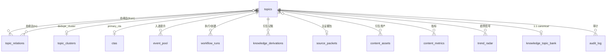

# 05 Topic 系统（Topic System）

> **状态**：本文档是【Topic 系统】领域的正式实现文档（13 份正式文档之一，覆盖需求二、三、五、十五与工作流基线 §7 的 Topic 侧全部内容）。
> **唯一事实源**：字段命名、类型、枚举取值一律以 `docs/_canonical-data-model.md` 为裁决依据；状态机与工作流行为契约以 `docs/_canonical-workflow.md` 为准；页面区块与设计系统以 `docs/_canonical-ia.md` 为准；MVP 范围与排期以 `docs/_canonical-roadmap.md` 为准；需求原文 `docs/_requirements.md` 为出发点。
> **原则**：本文档**不新增、不删减、不修改**任何基线字段/枚举/路由/状态；基线未明确的语义本文档以"约定"形式给出，并在文末"Open Questions"与返回的 `deviationsFromCanonical`（标注 [REVIEW]）中记录，不改动基线文件。
> **中文撰写，标识符与枚举用英文**；所有字段名引用数据模型基线列名。

---

## 0. 领域定位

Topic 是系统最核心的数据实体（需求一、DC-01）：

- 全系统以 `topics` 为枢纽；`topics` 与 `content_assets` 数据层**严格分离**，仅 `content_assets.topic_id → topics.id` 单向引用。
- 一个 Topic 可衍生 8 类内容资产（`ai_weekly_script` / `short_video_script` / `wechat_article` / `github_card` / `xiaohongshu` / `sales_material` / `infographic` / `cover`），Topic 生命周期独立于单个资产。
- 指标全量绑定 `topic_id`（`content_metrics.topic_id` 必填）；漏斗经 SQL 视图 `conversion_funnel` 派生。
- 候选事件先入 `event_pool`（DC-16），入选后提升为正式 `topics` 行（`derived_topic_id` 回填）；未入选/淘汰候选保留在 `event_pool`（含 `elimination_reason`）。
- Topic 全生命周期（评分、定级、查重、聚类、CTA 判断、路由、状态迁移）由 Orchestrator 作为 `workflow_type='orchestrator'` 的 run 落库留痕（硬性原则 5/6）。

---

## 1. Topic 数据模型

### 1.1 `topics` 表（系统核心枢纽表）

引用数据模型基线 §3.1。主键 `id uuid PK DEFAULT gen_random_uuid()`，时间戳 `timestamptz DEFAULT now()`。

| 列名 | 类型 | 约束 | 说明 |
|---|---|---|---|
| `id` | `uuid` | PK | 内部主键，稳定不变，**血缘引用此键**（`parent_topic_id` / `topic_relations` / 资产 / 指标全部指向 `id`） |
| `topic_id` | `text` | NOT NULL, UNIQUE | 业务 ID `2026W36-001`，规则见 §2 |
| `content_week` | `text` | NOT NULL, CHECK（`^[0-9]{4}W[0-9]{2}$`） | 目标内容周 `2026W36`；显式存储避免 ISO 跨年漂移 |
| `title` | `text` | NOT NULL | 主题标题 |
| `description` | `text` | | 主题描述/选题说明 |
| `topic_type` | `topic_type` | NOT NULL | 8 类（见 §1.3） |
| `trend_tags` | `text[]` | NOT NULL DEFAULT '{}' | 趋势标签 |
| `parent_topic_id` | `uuid` | NULL, FK→`topics.id` | 单一直接父 Topic（衍生链单父树） |
| `source_topic_ids` | `uuid[]` | NOT NULL DEFAULT '{}' | 多对多来源血缘；FK 语义经 `topic_relations` 保证 |
| `b2b_relevance` | `smallint` | NOT NULL, CHECK 1-10 | 面向 B2B 受众/行业关联度（五维之一） |
| `traffic_potential` | `smallint` | NOT NULL, CHECK 1-10 | 流量潜力 |
| `conversion_potential` | `smallint` | NOT NULL, CHECK 1-10 | 线索转化潜力 |
| `timeliness` | `smallint` | NOT NULL, CHECK 1-10 | 时效性 |
| `content_value` | `smallint` | NOT NULL, CHECK 1-10 | 内容价值/深度 |
| `business_relevance` | `smallint` | CHECK 1-10 | 与本公司产品/销售目标对齐度；**priority 门控**，不参与加权（与 `b2b_relevance` 严格区分） |
| `priority` | `priority` | NOT NULL | P0-P3，推导见 §4 |
| `status` | `topic_status` | NOT NULL DEFAULT 'Draft' | 全局 9 态状态机（见 §6） |
| `primary_cta` | `uuid` | NULL, FK→`ctas.id` | 唯一主 CTA；`Ready for Production` 前必填（守卫校验） |
| `history_dedupe_status` | `history_dedupe_status` | NOT NULL DEFAULT 'not_checked' | 查重聚类结果（见 §5） |
| `dedupe_cluster_id` | `uuid` | NULL, FK→`topic_clusters.id` | 所属聚类簇 |
| `dedupe_matched_topic_id` | `uuid` | NULL, FK→`topics.id` | 被并入的既有 Topic |
| `score_version` | `integer` | NOT NULL DEFAULT 1 | 评分版本号，变更即递增 |
| `score_rationale` | `jsonb` | | 各维评分依据 + priority 推导理由（见 §4.6） |
| `source_packet_id` | `uuid` | NULL, FK→`source_packets.id` | 当前生效证据包指针（循环引用决策，见数据模型 §3.2） |
| `created_by_run_id` | `uuid` | NULL, FK→`workflow_runs.id` | 创建此 Topic 的 workflow run（审计） |
| `created_at` / `updated_at` | `timestamptz` | NOT NULL | 审计时间 |
| `archived_at` | `timestamptz` | NULL | 归档时间 |

**索引**：`UNIQUE(topic_id)`；`INDEX(status)`；`INDEX(priority)`；`INDEX(topic_type)`；`INDEX(content_week)`；`INDEX(parent_topic_id)`；`GIN(trend_tags)`。

### 1.2 Topic 域全局枚举（全量取值，数据模型 §1.1）

| 枚举名 | 取值 | 说明 |
|---|---|---|
| `topic_type` | `hot` / `evergreen` / `technical_project` / `scenario` / `product` / `conversion` / `trend` / `knowledge` | 8 类，表示 Topic 性质/来源；与 `content_role` 正交 |
| `topic_status` | `Draft` / `Researching` / `Ready for Production` / `Producing` / `Review` / `Needs Revision` / `Ready to Publish` / `Published` / `Archived` | 全局 9 态状态机 |
| `priority` | `P0` / `P1` / `P2` / `P3` | 由五维评分按类型权重推导 |
| `history_dedupe_status` | `not_checked` / `unique` / `clustered` / `duplicate` / `merged` / `review_required` | 历史查重聚类结果 |
| `topic_cluster_status` | `open` / `resolved` / `merged` | 聚类组生命周期 |
| `cta_type` | `sales` / `content` / `community` / `brand` | CTA 受控词表分类 |
| `topic_relation_type` | `parent` / `source` | 血缘边类型：`parent`=单父衍生链；`source`=多源促成 |

> 落库实现 V1 推荐 `text + CHECK`（便于迁移回滚，DC-42）。

### 1.3 关联表（Topic 域直连）

| 表 | 关键列 | 与 Topic 的关系 |
|---|---|---|
| `topic_relations` | `from_topic_id` / `to_topic_id` / `relation_type` | 血缘权威图存储（§3.2） |
| `topic_clusters` | `cluster_key` / `canonical_topic_id` / `status` | 查重聚类组（§5.3） |
| `ctas` | `key` / `label` / `cta_type` / `target_url_template` / `active` | 主 CTA 受控词表（§7.1） |
| `event_pool` | `candidate_id` / `selection_status` / `history_dedupe_status` / `cluster_id` / `derived_topic_id` | 候选事件池，入选提升为 Topic（§5.7） |
| `knowledge_topic_bank` | `topic_id`（UNIQUE, FK→`topics.id`） | `topic_type='knowledge'` 的 1:1 知识行 |
| `source_packets` | `topic_id`（必填归属）/ `verification_status` | 证据包归属（核验 ≥ `verified` 是进入生产的守卫） |
| `workflow_runs` | `topic_id`（可空） | Topic 粒度执行记录；`created_by_run_id` 回溯创建者 |
| `content_assets` / `content_metrics` / `publications` / `audit_log` | `topic_id` 强制/可空 | 资产、指标、发布、审计统一落点 |

### 1.4 Topic 域 ER 关系（数据模型 §4 节选）



---

## 2. `topic_id` 命名规则

权威定义：数据模型 §2.1 + 工作流基线 §2.2。

### 2.1 格式

- 格式：`YYYY Www - NNN`，正例 `2026W36-001`。
- 正则：`^[0-9]{4}W[0-9]{2}-[0-9]{3}$`。
- 组成部分：`{ISO 内容周}` + 周内 3 位序号（`000`-`999`）。

| 段 | 含义 | 示例 |
|---|---|---|
| `YYYY` | ISO 年 | `2026` |
| `Www` | ISO 周数（2 位，不足补零） | `W36` |
| `NNN` | 周内 3 位序号 | `001` |

### 2.2 周语义：目标内容周（不是创建周）

- 取"**目标内容周**"（与 `batch_id` 前缀一致，便于 Dashboard 当前周对齐），**不取创建周**。
- 同时显式存 `topics.content_week` 列（CHECK `^[0-9]{4}W[0-9]{2}$`），避免跨 ISO 年漂移。示例：`2026-12-28` 属 `2027W01`，其 topic_id 应为 `2027W01-xxx`，`content_week='2027W01'`。
- 分配时校验 `topic_id` 前缀与 `content_week` 一致（一致性强约束）。

### 2.3 序号分配规则

- 序号**按周唯一**（`topic_id` 全局 UNIQUE，因含周前缀天然周内唯一）。
- **周内递增分配**：本周第 1 个为 `001`，其后 `002`、`003` …。
- **删除不回收**：即使 Topic 被归档/删除，序号不再复用，保证血缘与历史引用稳定。

### 2.4 分配职责与回写

- 分配由 Orchestrator 的 **ID 分配职责**（流水线第 4 步 `topic_id_assignment`，`workflow_tasks.task_type='id_assign'`）执行，回写 `topics.topic_id`。
- 同一批分配的 ID 集合即 `workflow_batches.topic_ids`（`Topic_ID_List`）。
- 分配动作与结果经 `workflow_runs` 留痕。

### 2.5 示例

| 场景 | topic_id | content_week | 说明 |
|---|---|---|---|
| 2026 年第 36 周首个入选 Topic | `2026W36-001` | `2026W36` | 周内首号 |
| 同周第 3 个 | `2026W36-003` | `2026W36` | 递增分配 |
| 2026W36-001 被归档后 | 新 Topic 不得再取 `2026W36-001` | — | 删除不回收 |
| 跨年周 | `2027W01-001` | `2027W01` | ISO 周语义，按目标内容周 |

### 2.6 关联 ID 体系（全系统对照，数据模型 §2.2）

| ID | 格式示例 | 生成方 |
|---|---|---|
| `topic_id` | `2026W36-001` | Orchestrator `id_assign` |
| `batch_id` | `2026W36-AI-WEEKLY`；同周重跑加 `-02` → `2026W36-AI-WEEKLY-02` | Orchestrator 批次 |
| `run_number` | `2026W36-AI-WEEKLY-R01`（批次内序号） | Workflow 引擎 |
| `candidate_id` | `2026W36-AI-CAND-001` | 候选接收 |
| `packet_id` | `2026W36-001-SP`（周-Topic序号-证据包） | Source 域 |
| `snapshot_id` | `2026W36-GH-ORIGINAL-PURE`（周-类型-口径） | GitHub Weekly |

---

## 3. 血缘建模与 Lineage 视图

权威定义：数据模型 §2.3（DC-11）+ §3.1 `topic_relations`；展示规范 IA §3.5/§3.6/§3.7。

### 3.1 混合建模方案（决策）

采用"**自引用列 + 规范化边表**"混合方案，不合并为单一方案：

| 载体 | 形态 | 承载语义 |
|---|---|---|
| `topics.parent_topic_id` | 单 FK 自引用（NULL 可空） | "单父衍生树"（需求三；衍生规则见 §8） |
| `topics.source_topic_ids` | `uuid[]`（NOT NULL DEFAULT '{}'） | "多对多来源血缘"（需求三 `Source_Topic_IDs`） |
| `topic_relations` | 规范化边表 | **血缘的权威图存储**（FK 背书） |

### 3.2 `topic_relations` 边表

| 列名 | 类型 | 约束 | 说明 |
|---|---|---|---|
| `id` | `uuid` | PK | |
| `from_topic_id` | `uuid` | NOT NULL, FK→`topics.id`, CHECK（`<> to_topic_id`） | 血缘起点 |
| `to_topic_id` | `uuid` | NOT NULL, FK→`topics.id` | 血缘终点 |
| `relation_type` | `topic_relation_type` | NOT NULL | `parent`=单父衍生边；`source`=多源促成边 |
| `created_at` | `timestamptz` | NOT NULL | |

索引：`UNIQUE(from_topic_id, to_topic_id, relation_type)`；`INDEX(to_topic_id)`（反向遍历）；`INDEX(relation_type)`。

> **边方向约定 [REVIEW]**：基线未显式定义 `from→to` 方向语义，本文档约定——`relation_type='parent'` 时 `from` = 父 Topic、`to` = 衍生子 Topic；`relation_type='source'` 时 `from` = 来源 Topic、`to` = 被促成的 Topic。该约定与 IA §3.11"Derived Topics = `topics WHERE parent_topic_id = 本 Topic.id`"的投影方向一致。

### 3.3 写路径（单写入口）

- 唯一 **`lineage service`** 负责写血缘；每次写血缘在**同一事务**内同时写：
  1. `topics.parent_topic_id`（衍生边）；
  2. `topics.source_topic_ids`（来源数组，追加/去重）；
  3. `topic_relations` 对应边（parent/source）。
- **禁止绕过 service 直接写边**；两条路径单写入口保证投影列与边表一致。
- 落点实现：D3（Topic 域服务：ID / Lineage / Audit）。

### 3.4 防环（双保险）

| 层 | 机制 |
|---|---|
| 应用层 | 祖先路径检查：新增父/源 Topic 时，若该 Topic 的祖先集合包含自身则拒绝 |
| 数据库层 | `topic_relations` CHECK（`from_topic_id <> to_topic_id`），杜绝自环 |

### 3.5 读路径（Lineage 查询）

- 读取血缘**一律走 `topic_relations` + `WITH RECURSIVE` 递归 CTE**（不读投影列拼图）。
- 遍历方向：从某 Topic 沿 `parent` / `source` 边**上下双向**遍历（上游 = 父/来源，下游 = 衍生）。
- 血缘深度 V1 限制 **3-5 层**（递归 CTE 足够，不引入图数据库；数据模型 §2.3）。

递归查询示意（D3 实现，pseudo-SQL）：

```sql
WITH RECURSIVE lineage AS (
  SELECT from_topic_id, to_topic_id, relation_type, 1 AS depth
  FROM topic_relations WHERE to_topic_id = :target_id   -- 上游（父/源）
  UNION ALL
  SELECT r.from_topic_id, r.to_topic_id, r.relation_type, l.depth + 1
  FROM topic_relations r JOIN lineage l
    ON r.to_topic_id = l.from_topic_id
  WHERE l.depth < 5                                     -- 深度上限
)
-- 下游（衍生）同理从 from_topic_id = :target_id 出发
```

### 3.6 血缘示例链（需求三原例）

```
AI 新闻（源）
  └─source→  Agent Skills 趋势
                └─parent→ 什么是 Agent Skills
                             └─parent→ 企业为什么需要 Agent Skills Library
                                          └─parent→ 企业 Agent Skills Governance
```

共 5 层，处于 V1 深度上限（3-5）内：第 1 条边为 `source`（多源促成），其后 3 条为 `parent`（单父衍生链）。

### 3.7 Lineage 视图（Topic Detail §3.7 区块）

- 权威数据源：`topic_relations` + 递归 CTE 结果。
- 渲染组件：`LineageGraph`（有向图；IA §4.5 追加组件）。
  - 节点 = Topic 卡片：`topic_id` + `title` + priority 色边；
  - 边 = `parent` 实线 / `source` 虚线；
  - 当前 Topic 高亮，上游（父/源）与下游（衍生）双向展示。
- 展示位置：`/topics/[id]` 第 7 区块（`Source Topics` 区块紧随其后按序展示投影列，二者并存：区块 5/6 展示 `parent_topic_id` / `source_topic_ids` 投影，区块 7 展示权威图）。
- 深度超出 3-5 层的处理见 Open Questions（OQ-T6）。

### 3.8 与 Knowledge concept 图的关系（两套独立边）

- `knowledge_topic_bank` 的 concept 图（`upstream_concepts` / `related_concepts` / `downstream_concepts`，或边表 `knowledge_concept_edges`）表示**知识前置关系**。
- `topics.parent_topic_id` / `source_topic_ids` 表示**选题/内容衍生关系**。
- 两者是**两套独立边，不互写**（数据模型 §3.5，DC-23）。

---

## 4. 五维评分 → priority 推导

权威定义：数据模型 §2.5（DC-13）+ 工作流基线 §2.3。

### 4.1 评分维度定义

| 维度 | 列名 | 范围 | 含义 |
|---|---|---|---|
| B2B 相关性 | `b2b_relevance` | smallint 1-10 | 面向 B2B 受众/行业关联度 |
| 流量潜力 | `traffic_potential` | smallint 1-10 | 流量潜力 |
| 转化潜力 | `conversion_potential` | smallint 1-10 | 线索转化潜力 |
| 时效性 | `timeliness` | smallint 1-10 | 时效性 |
| 内容价值 | `content_value` | smallint 1-10 | 内容价值/深度 |
| （门控维，不参与加权） | `business_relevance` | smallint 1-10 | 与本公司产品/销售目标对齐度 |

### 4.2 加权公式

```
priority_score = w1*b2b_relevance + w2*traffic_potential + w3*conversion_potential
               + w4*timeliness + w5*content_value
```

- 权重按 `topic_type` 使用**不同权重画像**（配置驱动，存 `system_settings`，**不硬编码**）。
- 配置键（数据模型 §3.9）：`scoring.weights.default` / `scoring.weights.hot` / `scoring.weights.evergreen` / `scoring.weights.conversion` / `scoring.threshold.p0` / `scoring.threshold.p1` / `scoring.threshold.p2`。

**权重画像（基线给定 + 示例值）**：

| topic_type | w1 b2b | w2 traffic | w3 conversion | w4 timeliness | w5 content | 说明 |
|---|---|---|---|---|---|---|
| 通用默认 | 0.20 | 0.20 | 0.25 | 0.20 | 0.15 | 基线固定值 |
| `hot` / `trend` | 0.20 | 0.20 | 0.15 | **0.35** | 0.10 | `timeliness` 提权（示例画像，落 `scoring.weights.hot`） |
| `evergreen` / `knowledge` | 0.25 | 0.10 | 0.10 | 0.20 | **0.35** | `content_value` 提权（示例画像，落 `scoring.weights.evergreen`） |
| `conversion` / `product` | 0.20 | 0.10 | **0.40** | 0.15 | 0.15 | `conversion_potential` 提权（示例画像，落 `scoring.weights.conversion`） |

> 各画像权重和为 1.0；"如 0.35/0.40"为基线示例方向，最终以 M0 种子数据写入 `system_settings` 的值为准（`/settings` 可调，DC-13 配置驱动）。

### 4.3 分档阈值

| 档位 | 条件 | 语义色（IA §4.1） |
|---|---|---|
| `P0` | `priority_score ≥ 8.0` | 红 `#DC2626` |
| `P1` | `priority_score ≥ 6.5` | 橙 `#EA580C` |
| `P2` | `priority_score ≥ 5.0` | 蓝 `#2563EB` |
| `P3` | `priority_score < 5.0` | 中性灰 `#64748B`（🔸 追加色） |

### 4.4 门控与兜底

| 规则 | 条件 | 效果 |
|---|---|---|
| **门控（封顶）** | `business_relevance < 4` **且** `topic_type NOT IN ('product','conversion')` | 最终 `priority` **封顶 P2**（即使加权分达 P0/P1 也不得超过 P2） |
| **兜底（升档）** | `topic_type IN ('hot','trend')` 且 `timeliness = 10` | 最终 `priority` **至少 P1** |
| 豁免 | `product` / `conversion` 型不受 `business_relevance` 门控封顶（产品/转化选题天然由销售目标驱动） | — |

`business_relevance` 只作门控，**不参与线性加权**；与 `b2b_relevance` 严格区分（一为"受众/行业关联"，一为"公司目标对齐"）。

### 4.5 计算示例

**示例 A：hot 型（命中兜底 → P0）**

- `topic_type='hot'`，`content_week='2026W36'`，五维：`b2b_relevance=8`，`traffic_potential=9`，`conversion_potential=6`，`timeliness=10`，`content_value=7`，`business_relevance=7`。
- 权重画像 `hot`：`0.20/0.20/0.15/0.35/0.10`。
- `priority_score = 0.20×8 + 0.20×9 + 0.15×6 + 0.35×10 + 0.10×7 = 1.6 + 1.8 + 0.9 + 3.5 + 0.7 = 8.5`。
- 分档：`8.5 ≥ 8.0` → 档位 P0；门控：`business_relevance=7 ≥ 4` 无封顶；兜底：`timeliness=10` → 至少 P1（P0 ≥ P1，生效但不改变结果）。
- **结论：`priority=P0`**。

**示例 B：evergreen 型（命中门控 → 封顶 P2）**

- `topic_type='evergreen'`，五维：`b2b_relevance=9`，`traffic_potential=5`，`conversion_potential=4`，`timeliness=3`，`content_value=9`，`business_relevance=3`。
- 权重画像 `evergreen`：`0.25/0.10/0.10/0.20/0.35`。
- `priority_score = 0.25×9 + 0.10×5 + 0.10×4 + 0.20×3 + 0.35×9 = 2.25 + 0.5 + 0.4 + 0.6 + 3.15 = 6.9`。
- 分档：`6.9 ≥ 6.5` → 档位 P1；门控：`business_relevance=3 < 4` 且非 product/conversion 型 → **封顶 P2**。
- **结论：`priority=P2`**（档位 P1 被门控压至 P2）。

### 4.6 `score_rationale`（jsonb）审计结构

计算结果落 `topics.priority`；推导依据落 `topics.score_rationale`，包含：各维分值、权重、阈值判定、`business_relevance` 门控结论。示例结构：

```json
{
  "dimensions": {
    "b2b_relevance": 8, "traffic_potential": 9, "conversion_potential": 6,
    "timeliness": 10, "content_value": 7, "business_relevance": 7
  },
  "weights_profile": "hot",
  "weights": { "w1": 0.20, "w2": 0.20, "w3": 0.15, "w4": 0.35, "w5": 0.10 },
  "priority_score": 8.5,
  "band_check": { "threshold_p0": 8.0, "result": "P0" },
  "gate": { "business_relevance": 7, "capped_at_p2": false },
  "floor": { "hot_timeliness_10": true, "floor_p1": true },
  "final_priority": "P0",
  "score_version": 1
}
```

### 4.7 审计与留痕

- `score_version` 每次重评分**递增**（默认 1）。
- 评分/定级变更由 Orchestrator 评分职责（流水线第 5 步 `scoring`、第 6 步 `priority_assignment`，`task_type='score'`）执行，并写 `workflow_runs` 留痕（硬性原则 5）。
- 重新评分入口：Topic Detail 评分区块"重新评分"（🔸 追加操作，触发 Orchestrator 评分 run）。

---

## 5. 历史查重与聚类（`history_dedupe_status`）

权威定义：数据模型 §2.9 + 工作流基线 §2.1 第 2/3 步。

### 5.1 流程总览

```
候选入池(event_pool, not_checked)
  → Orchestrator 历史查重(history_dedupe / task='dedupe')
  → 聚类(topic_clustering / task='cluster')
  → 裁决结果回写:
      event_pool.history_dedupe_status
      topic_clusters(收敛) + topics.dedupe_cluster_id / dedupe_matched_topic_id
  → 入选提升为 topics(derived_topic_id 回填)
```

### 5.2 `history_dedupe_status` 枚举语义

| 值 | 语义 | 落库位置 |
|---|---|---|
| `not_checked` | 候选入池初始态，未执行查重 | `event_pool` / `topics` 默认值 |
| `unique` | 独立选题，无重复/可并入簇 | `event_pool` / `topics` |
| `clustered` | 并入簇：与同簇候选归并，簇内收敛一个 `canonical_topic_id` | `event_pool` / `topics` + `dedupe_cluster_id` |
| `duplicate` | 与既有 Topic 完全重复（候选废弃，不提升）[REVIEW 语义细化，见下] | `event_pool` / `topics` |
| `merged` | 并入既有 Topic：有价值事实合并进既有 Topic [REVIEW 语义细化，见下] | `topics.dedupe_matched_topic_id` 指向被并入方 |
| `review_required` | 人工裁决：查重结论不确定，进入 `needs_review` 待人工 | `event_pool` / `topics` |

> [REVIEW] 基线未展开 `duplicate` 与 `merged` 的差异，本文档约定：`duplicate` = 候选与既有 Topic 内容完全重复，候选被废弃（不消耗周序号、不提升为 topics 行）；`merged` = 候选与既有 Topic 部分重叠但含增量事实，将增量并入既有 Topic 并记录 `dedupe_matched_topic_id`。两值均为基线枚举，语义为本文档细化。

### 5.3 聚类组 `topic_clusters`

| 列名 | 类型 | 约束 | 说明 |
|---|---|---|---|
| `id` | `uuid` | PK | |
| `cluster_key` | `text` | NOT NULL | 归一化标题/来源哈希或 embedding 相似键 |
| `week` | `text` | | ISO 周 |
| `cluster_name` | `text` | | 聚类名，如 "Agent Skills 趋势" |
| `canonical_topic_id` | `uuid` | NULL, FK→`topics.id` | 簇内收敛的正式 Topic |
| `status` | `topic_cluster_status` | NOT NULL DEFAULT 'open' | `open` / `resolved` / `merged` |
| `created_at` / `updated_at` | `timestamptz` | NOT NULL | |

索引：`UNIQUE(cluster_key, week)`。

聚类示例：本周候选 `["Agent Skills 是什么", "Agent Skills 入门指南", "解读 Anthropic Agent Skills"]` 归一化后同簇，`cluster_name="Agent Skills 趋势"`，收敛 `canonical_topic_id = 2026W36-002 对应 topics.id`，三个候选 `history_dedupe_status='clustered'`、`cluster_id` 指向该簇。

### 5.4 topics 侧落库字段

| 字段 | 指向 | 语义 |
|---|---|---|
| `topics.dedupe_cluster_id` | FK→`topic_clusters.id` | 本 Topic 所属聚类簇 |
| `topics.dedupe_matched_topic_id` | FK→`topics.id` | **被并入的既有 Topic**（`merged` 时记录被并入方） |

> [REVIEW] 基线未明确 `dedupe_matched_topic_id` 的赋值对象（并入方还是被并入方）。本文档按基线字面"记录被并入的既有 Topic"理解：字段值 = 被并入的既有 Topic 的 `id`；字段所在行 = 发起并入的一方（若其已提升为 topics 行）。若实现上允许"不提升、仅并入"，则该字段在 topics 侧可能为空——见 OQ-T2。

### 5.5 与 Orchestrator 流水线衔接

| 流水线步骤 | task_type | 落库 |
|---|---|---|
| 1 候选接收 `candidate_reception` | `fact_check`（证据包预绑定） | `event_pool` 入池：`selection_status='pending'`、`history_dedupe_status='not_checked'` |
| 2 历史查重 `history_dedupe` | `dedupe` | `event_pool.history_dedupe_status` 置 5 值之一 |
| 3 聚类 `topic_clustering` | `cluster` | `topic_clusters` 收敛；`topics.dedupe_cluster_id` / `dedupe_matched_topic_id` |
| 4 ID 分配 `topic_id_assignment` | `id_assign` | 入选候选分配 `topic_id`（§2） |
| 12 Return 回写 `return_writeback` | `return_writeback` | 入选提升为 `topics`，`event_pool.derived_topic_id` 回填 |

### 5.6 人工裁决（`review_required`）

- `history_dedupe_status='review_required'` 的候选/ Topic 进入待办审查队列（Dashboard 待办审查队列含 `review_required` 查重项，IA §2.1）。
- 人工裁决结果（判 unique / merged / duplicate / 调整簇）写 `audit_log`（`action='dedupe_merged'` 等）。

### 5.7 候选提升链路（event_pool → topics）

- 未入选/淘汰候选**保留**在 `event_pool`（含 `elimination_reason`），不污染 topics 表与周序号（DC-16）。
- 入选候选提升为 `topics` 行（`topic_type='hot'/'trend'` 等，`topic_id` 由 §2.4 分配），`event_pool.derived_topic_id` 回填，Topic 从 `Draft` 态进入状态机（§6）。

---

## 6. Topic 状态机（`topic_status` 9 态）

权威定义：工作流基线 §7；`topic_status` 枚举见数据模型 §1.1。

### 6.1 状态流转图

```mermaid
stateDiagram-v2
    [*] --> Draft
    Draft --> Researching : Orchestrator/AI（候选提升或人工建 Topic）
    Researching --> "Ready for Production" : 人工/Orchestrator 评估（守卫：核验≥verified、primary_cta 必填、评分已定）
    "Ready for Production" --> Producing : 人工「确认并开始生产」/Orchestrator 派发
    Producing --> Review : AI 子工作流完成
    Review --> "Needs Revision" : 人工审核不通过
    "Needs Revision" --> Producing : 人工（退回原因已确认）
    Review --> "Ready to Publish" : 人工审核通过
    "Ready to Publish" --> Published : 人工（必须存在 publications 记录）
    "Ready to Publish" --> "Needs Revision" : 发布前复核不通过
    Published --> Archived : 人工（下架/归档）
    "Ready to Publish" --> Archived : 人工（放弃推进）
    "Needs Revision" --> Archived : 人工（放弃推进）
    Draft --> Archived : 人工（放弃推进）
    Researching --> Archived : 人工（放弃推进）
```

### 6.2 权威迁移矩阵

| 迁移 | 触发者 | 前置条件 / 守卫 | 动作说明 |
|---|---|---|---|
| `Draft → Researching` | Orchestrator / AI | `source_packet_id` 可空 | 候选提升为 Topic 或人工建 Topic 后进入调研；证据包开始聚合 |
| `Researching → Ready for Production` | **人工**（或 Orchestrator 自动评估） | 证据包核验 ≥ `verified`；`primary_cta` **必填**（守卫校验）；五维评分 + `priority` 已定 | 事实核验完成、选题定案，可进入生产 |
| `Ready for Production → Producing` | **人工**（确认并开始生产）或 Orchestrator 派发 | 路由规则已命中、产能放行 | 子 workflow 开始生产内容资产 |
| `Producing → Review` | AI（子 workflow 完成） | `workflow_runs.status = completed` 或 `needs_review`；产物已落 `workflow_outputs` | 生产完成，进入人工审核门禁 |
| `Review → Needs Revision` | **人工** | 审核不通过 | 退回修改；`workflow_runs.attempt_count+1` 重跑，或 Deep Dive 蓝图 `needs_revision` |
| `Needs Revision → Producing` | **人工** | 退回原因已确认 | 重新生产（同 run 重跑或新 run） |
| `Review → Ready to Publish` | **人工** | 审核通过；资产状态同步为 `Ready to Publish` | 待发布，等待 Publication Center 排期 |
| `Ready to Publish → Published` | **人工** | **必须存在 `publications` 记录**（DB 触发器/应用层禁止 workflow 直写 `published`） | 发布成功，回填 `published_date / published_url / published_by` |
| `Ready to Publish → Needs Revision` | **人工** | 发布前复核不通过 | 退回生产/修改 |
| `Published → Archived` | **人工** | — | 内容下架/归档，写 `archived_at` |
| `Ready to Publish → Archived`（或任意非 Published 态 → Archived） | **人工** | — | 放弃/停止推进，直接归档 |

### 6.3 关键门禁（继承数据模型 §2.8）

1. **V1 绝不自动发布**：`topics.status = Published` 只能人工确认且需存在 `publications` 记录；系统/工作流只生成 `planned → ready`。
2. `primary_cta` 在 `Ready for Production` 前必填（守卫校验，见 §7.3）。
3. 所有状态迁移写 `audit_log`（`actor = 用户标识 或 ai:run-xxx`）；`topic_status_history` = 对 `audit_log WHERE entity_type='topic' AND action='status_changed'` 的视图，供 Topic Detail 历史记录 Timeline。

### 6.4 与 Workflow Run 状态的联动

- `Producing → Review` 依赖 `workflow_runs.status`：`completed` 或 `needs_review`（`needs_review` 为人工门禁吸收态）。
- 退回重做：`Review → Needs Revision` 时 `workflow_runs.attempt_count+1`（同 run 重跑不新建）；Deep Dive 蓝图走 `deep_dive_plans.status: drafting → review → needs_revision ⇄ approved`。
- `needs_review → completed` 人工通过后可联动 `topics.status = Ready to Publish`。

### 6.5 资产状态子集对照

`content_assets.status`（`asset_status`）= `topic_status` 子集：`Draft` / `Producing` / `Review` / `Needs Revision` / `Ready to Publish` / `Published` / `Archived`（Topic 的 `Researching` / `Ready for Production` 为选题阶段态，资产无对应）。

### 6.6 UI 展示

- 状态徽标：全站 `status` 徽标 + 状态圆点双编码（IA §4.5）。
- 历史记录：Timeline 组件逐条显示 `from_status → to_status`、`actor`、`workflow_run_id`、`note`、`created_at`（Topic Detail 第 14 区块）。

---

## 7. CTA 管理

权威定义：数据模型 §2.6（DC-14）+ §3.1 `ctas`；Orchestrator 第 9 步。

### 7.1 受控词表（`ctas` 表）

| 列名 | 类型 | 约束 | 说明 |
|---|---|---|---|
| `id` | `uuid` | PK | |
| `key` | `text` | NOT NULL, UNIQUE | `book_demo` / `download_whitepaper` / `join_community` / `contact_sales` / `follow_account` / `signup_newsletter` 等 |
| `label` | `text` | NOT NULL | 中文展示文案 |
| `cta_type` | `cta_type` | NOT NULL | `sales` / `content` / `community` / `brand` |
| `target_url_template` | `text` | | 跳转模板；可与 Brand Asset Library CTA 卡片绑定 |
| `active` | `boolean` | NOT NULL DEFAULT true | 是否启用 |

**V1 种子词表（M0 种子数据）**：

| key | label 示例 | cta_type |
|---|---|---|
| `book_demo` | 预约 Demo | `sales` |
| `download_whitepaper` | 下载白皮书 | `content` |
| `join_community` | 加入社区 | `community` |
| `contact_sales` | 联系销售 | `sales` |
| `follow_account` | 关注账号 | `brand` |
| `signup_newsletter` | 订阅周报 | `content` |

> 词表带"等"字表示可扩展；新增 key 的管理流程见 Open Questions（OQ-T4）。

### 7.2 话题级主 CTA（单值）

- `topics.primary_cta`：话题级**唯一**主 CTA，`uuid FK → ctas.id`（受控词表，单值非数组）。
- 由 Orchestrator 第 9 步 `cta_assignment`（`task_type='cta_assign'`）判断：输入 `business_relevance` + `topic_type`，输出 `topics.primary_cta`。

### 7.3 必填守卫

- 进入 `Ready for Production` 前 `primary_cta` **必填**（`Researching → Ready for Production` 迁移守卫，§6.2）。
- 守卫在应用层实现并写 `audit_log`；`/topics/[id]` CTA 区块提示规则（IA §3.13）。

### 7.4 资产级 CTA（继承与覆盖）

- `content_assets.cta` **默认继承** `topic.primary_cta`，允许资产级覆盖（改文案不改动作，仍指向 `ctas` 词表）。
- **每资产仅一个主 CTA**（单值 FK，非数组）。
- `asset_type='wechat_article'` 时 CTA 面板在 `/content/[id]` 第 5 区块展示。

### 7.5 Deep Dive 审核校验

- `deep_dive_plans.primary_cta` 默认继承 topic，蓝图审核时**人工确认**。
- 审核校验项：`plan.primary_cta == topic.primary_cta`（不一致则 `needs_revision`）。

### 7.6 指标回流

- 漏斗指标经 `content_metrics.cta_clicks` 按 `topic_id` 聚合到 Topic（`conversion_funnel` 视图：Read → CTA Click → Lead → …）。

---

## 8. 衍生 Topic 规则

权威定义：数据模型 §2.7（DC-15）+ §3.5 `knowledge_derivations` + 工作流基线 §3.4/§8.3。

### 8.1 边界定义："一次生产" = 一个 `workflow_runs` run

- 每次 Orchestrator 调用 Evergreen Knowledge Workflow 产出 **恰 1 个主 Topic**。
- 该 run 完成后最多新增 **3 个衍生 Topic**（`parent_topic_id = main_topic_id`）。
- 默认一次生产一个主 Topic，完成后最多新增 3 个衍生（需求七）。

### 8.2 `knowledge_derivations` 记账表

| 列名 | 类型 | 约束 | 说明 |
|---|---|---|---|
| `id` | `uuid` | PK | |
| `workflow_run_id` | `uuid` | NOT NULL, FK→`workflow_runs.id` | "一次生产"边界 |
| `knowledge_topic_id` | `uuid` | NOT NULL, FK→`knowledge_topic_bank.id` | 被开采概念 |
| `main_topic_id` | `uuid` | NOT NULL, FK→`topics.id` | 本次 run 主 Topic（每 run 恰 1 个） |
| `derived_topic_id` | `uuid` | NOT NULL, FK→`topics.id` | 衍生 Topic（`parent_topic_id = main_topic_id`） |
| `round_index` | `integer` | NOT NULL, CHECK 1-3 | 本 run 内衍生序号 |
| `created_at` | `timestamptz` | NOT NULL | |

索引：`UNIQUE(workflow_run_id, round_index)`（数据库兜底 ≤3）。

### 8.3 双保险机制

| 层 | 机制 | 超限效果 |
|---|---|---|
| 数据库层 | `UNIQUE(workflow_run_id, round_index)` + CHECK（`round_index ∈ 1..3`） | 第 4 次插入直接违反约束 |
| 应用层 | Orchestrator 守卫函数 `checkDerivedTopicBudget` | 拦截超限，写 `audit_log`（`action='budget_denied'`） |

### 8.4 衍生血缘

- 每个衍生 Topic 建行时：`parent_topic_id = main_topic_id`（单父衍生树）。
- `lineage service` 同事务写 `topic_relations` 边（`relation_type='parent'`，from=主 Topic，to=衍生 Topic），保证 Lineage 视图可递归遍历（§3）。
- 衍生示例（延续需求三血缘链）：开采概念 "Agent Skills"（主 Topic `2026W36-002`）→ 衍生 1 `什么是 Agent Skills`、衍生 2 `企业为什么需要 Agent Skills Library`、衍生 3 `企业 Agent Skills Governance`（`parent_topic_id = 2026W36-002 的 id`）。

### 8.5 执行流程（evergreen_knowledge 工作流）

```
Orchestrator 按 knowledge_topic_bank.next_action 路由（或人工点单）
  → 子 run: select(选定概念) → fact_check → knowledge_topic(建 1:1 topics 行)
  → 内容生产 → derived_topics 产物(≤3) → return_writeback
```

- 产出 `workflow_outputs.output_type='derived_topics'`（衍生概念列表，≤3）。
- Orchestrator 第 11 步 `derived_topic_management`（`task_type='derived_topic_manage'`）消费产物：建 `topics` 行（`parent_topic_id`）+ 写 `knowledge_derivations` 记账。
- `/knowledge` 页展示衍生预算条（round_index 1..3，IA §2.8）。

### 8.6 超限处理

- `checkDerivedTopicBudget` 拦截后：`audit_log` 记录 `action='budget_denied'`、`note` 含守卫判定说明；run 视情况 `failed` 或 `needs_review`。
- V1 该规则只适用于 Evergreen Knowledge 开采场景（`knowledge_derivations` 记账域）；其他工作流（AI Weekly 选 5-8 条、GitHub 落 Topic）不产生"衍生 Topic"记账，仅建独立 `topics` 行（`topic_type='hot'/'trend'/'technical_project'`）。

---

## 9. 系统集成要点

### 9.1 路由与页面

| 路由 | 与本域相关的核心区块 |
|---|---|
| `/topics` | 过滤栏（`status` / `priority` / `topic_type` / `content_week` / `history_dedupe_status` / 搜索）、Topic 表格（含五维评分汇总条 + priority 徽标）、批量操作、候选池 Drawer（`event_pool`） |
| `/topics/[id]` | **14 区块按序**：基础信息 → 评分 → Priority → Tags → Parent → Source Topics → Lineage 可视化 → Source Packet → Workflow Runs → Content Assets → Derived Topics → Metrics → CTA → 历史记录（IA §3 硬性顺序，不得重排/删节） |
| `/dashboard` | 周概览 KPI（P0/P1 Topic 数）、待办审查队列（含 `review_required`）、核心 CTA（生成本周内容计划 / 确认并开始生产） |
| `/knowledge` | 知识网格、concept 图、衍生预算条、开采操作 |
| `/workflows/runs` | run 级执行留痕（`topic_id` 关联） |

### 9.2 路由规则（`workflow_routing_rules` 默认映射，工作流 §2.4）

| match_field | match_value | workflow_type_key |
|---|---|---|
| `topic_type` | `hot` / `trend` | `ai_weekly` |
| `topic_type` | `technical_project` | `github_weekly` |
| `topic_type` | `knowledge` / `evergreen` | `evergreen_knowledge` |
| `topic_type` | `scenario` / `product` / `conversion` | `wechat_deep_dive` |

全部规则 `overridable=true`（允许人工覆盖路由）；命中即按 `priority` 取最高优先规则。

### 9.3 Orchestrator 流水线（Topic 相关步骤映射）

| 步 | 职责 | task_type | 本域落库 |
|---|---|---|---|
| 1 | 候选接收 | `fact_check` | `event_pool` 入池 |
| 2 | 历史查重 | `dedupe` | `history_dedupe_status` |
| 3 | 聚类 | `cluster` | `topic_clusters` / `dedupe_cluster_id` |
| 4 | ID 分配 | `id_assign` | `topics.topic_id` |
| 5 | 评分 | `score` | 五维 + `score_rationale` / `score_version` |
| 6 | 优先级 | `score`（同步） | `topics.priority` |
| 7 | 路由 | `route` | `workflow_routing_rules` 命中 |
| 9 | CTA 判断 | `cta_assign` | `topics.primary_cta` |
| 11 | 衍生管理 | `derived_topic_manage` | `knowledge_derivations` + 守卫 |
| 12 | Return 回写 | `return_writeback` | 提升 `topics`、消费 `workflow_outputs`（`applied` 幂等） |

### 9.4 实现落点（Roadmap 基线）

- M0：34 表全量迁移 + 种子（`ctas`、`system_settings` 权重、`workflow_routing_rules`）。
- M1（D3）：`topic_id` 生成器、`lineage service`（单事务同写 + 防环 + 递归读取）、`audit_log` 服务、`score_rationale` 写服务。
- M1（D4/D5/D7）：列表/详情/知识页真实数据渲染；衍生预算守卫。
- M2/M3（D9/D10）：评分、查重、聚类、CTA、衍生管理经 Orchestrator run 落库。

---

## 10. Open Questions（本域悬而未决）

| 编号 | 问题 | 影响 | 推荐方案 |
|---|---|---|---|
| OQ-T1 | 查重相似度机制与阈值：`topic_clusters.cluster_key` 基线给出"归一化标题/来源哈希或 embedding 相似键"两种候选，未定算法与阈值（如 embedding 距离、标题归一化相似度 ≥ 0.9） | D10 查重/聚类实现 | V1 推荐标题归一化（去标点/大小写/停用词）+ 可选 embedding 辅助；阈值经演示数据标定（OQ-10 demo-seed 配合） |
| OQ-T2 | `duplicate` / `merged` 候选是否仍创建 `topics` 行：基线只定义了 `event_pool` 侧状态与 `topics.dedupe_matched_topic_id`，未明确"完全重复候选不提升"时是否消耗周内序号 | §2 序号分配、§5.4 落库 | 推荐 `duplicate` 不提升（不消耗序号）；`merged` 视增量价值由人工裁决（`review_required` 兜底） |
| OQ-T3 | `priority_score` 是否需要独立列：IA §3.2 展示 `priority_score` 加权结果，但数据模型 `topics` 表无该列（仅 `priority` + `score_rationale` jsonb） | Topic Detail 评分区块实现 | 推荐不新增列，加权分存 `score_rationale`（含各维/权重/阈值/门控），UI 从 jsonb 读取；如需独立列须数据模型基线裁决 |
| OQ-T4 | CTA 受控词表扩展流程：`ctas` 词表带"等"字可扩展，未定义新增 key 的审批/操作路径（谁可以加、是否落 `audit_log`） | §7.1 管理面 | 推荐 `/settings` 提供词表管理（active 开关 + 新增），新增动作写 `audit_log`；V1 种子 6 条先行 |
| OQ-T5 | 既有 Topic 被并入时其自身状态：候选 `merged` 并入既有 Topic 后，被并入方的 `history_dedupe_status` 是否变更、增量事实如何落入其 `source_packet` | §5、Source 域 | 推荐被并入方保持原状态（`history_dedupe_status` 不变），增量事实作为新 `source_packet_items` 追加，核验走常规流程 |
| OQ-T6 | 血缘深度超限处理：V1 限制 3-5 层，超过深度上限的边在 Lineage 视图的展示策略（截断提示 / 聚合折叠） | LineageGraph 实现 | 推荐递归查询硬性截断 + UI 折叠节点提示"更多祖先"（不改变数据层存储） |
| OQ-T7 | 重新评分触发时机：`score_version` 递增规则已定（重评分即递增），但何时触发重评分（数据回填后？人工触发？趋势变化？）未定义 | §4.7、Topic Detail | 推荐 V1 仅人工触发（🔸 重新评分按钮），M5 结合 `trend_radar` / 指标回填评估自动重评 |

---

## 附录 A：术语速查（英文 → 中文）

| 英文标识符 | 中文 | 枚举/取值 |
|---|---|---|
| `topic_type` | Topic 类型 | hot / evergreen / technical_project / scenario / product / conversion / trend / knowledge |
| `topic_status` | Topic 状态 | Draft / Researching / Ready for Production / Producing / Review / Needs Revision / Ready to Publish / Published / Archived |
| `priority` | 优先级 | P0 / P1 / P2 / P3 |
| `history_dedupe_status` | 查重状态 | not_checked / unique / clustered / duplicate / merged / review_required |
| `topic_cluster_status` | 聚类状态 | open / resolved / merged |
| `topic_relation_type` | 血缘边类型 | parent / source |
| `cta_type` | CTA 分类 | sales / content / community / brand |
| `topic_id` | 业务 ID | `2026W36-001`（`^[0-9]{4}W[0-9]{2}-[0-9]{3}$`） |
| `content_week` | 目标内容周 | `2026W36`（`^[0-9]{4}W[0-9]{2}$`） |
| `score_rationale` | 评分推导依据 | jsonb（各维/权重/阈值/门控） |
| `dedupe_cluster_id` / `dedupe_matched_topic_id` | 聚类归属 / 被并入 Topic | FK→`topic_clusters.id` / FK→`topics.id` |
