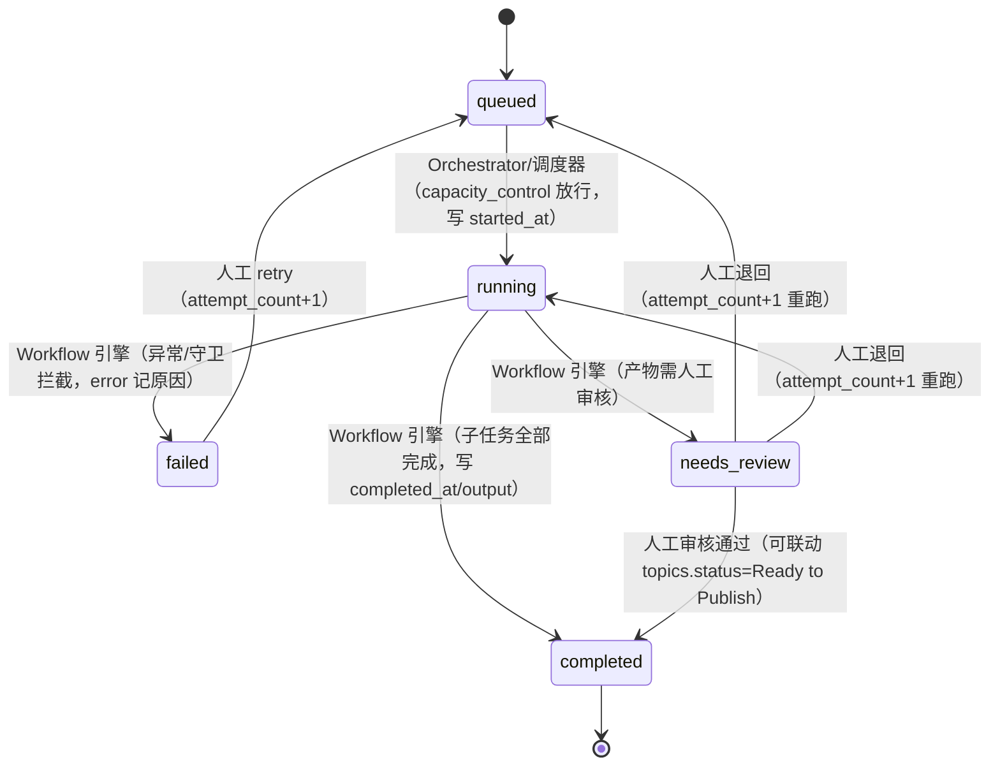

# 08 · 状态机（State Machines）

> **状态**：本文件是**正式文档第 08 份**，定义系统全部状态机的权威落地契约——7 个实体状态机（Topic / Source 核验 / Knowledge / Content Asset / Publication / GitHub Snapshot / Deep Dive 蓝图）与执行级状态机（Workflow Run / Batch / Task），以及非法转移清单与人工审核闸门汇总。
> **唯一事实源**：数据字段、表、枚举一律以 `_canonical-data-model.md` 为裁决依据；状态迁移、触发者、守卫、产能约束以 `_canonical-workflow.md` 为裁决依据；页面/路由/UI 落点以 `_canonical-ia.md` 为裁决依据；MVP 范围与任务拆分以 `_canonical-roadmap.md` 为裁决依据；需求原文为 `_requirements.md`。本文件**不新增、不改写任何表字段与枚举取值**，所有迁移表仅为基线行为契约的转写与归类；基线未明示的迁移一律标注推导依据或列入 Open Questions。
> **技术基线**：Next.js + TypeScript strict + Drizzle ORM + PostgreSQL 15+（Supabase）；枚举 V1 推荐 `text + CHECK`；所有状态迁移写 `audit_log`（`actor = 用户标识 或 ai:run-xxx`）。
> **对齐阶段**：M1（D3-D8）落地 Topic 守卫函数与人工审核基础操作；M2（D9）落地 run/batch 状态机；M3（D10-D13）贯通全链路（roadmap §2）。

---

## 1. 总览

### 1.1 状态机清单

| # | 状态机 | 所属枚举 | 状态数 | 权威定义处 | 本章 |
|---|---|---|---|---|---|
| 1 | Topic 全局状态机 | `topic_status` | 9 | 数据模型 §1.1、工作流 §7 | §2 |
| 2 | Workflow Run 状态机 | `workflow_run_status` | 5 | 数据模型 §1.3、工作流 §4.1 | §3.1 |
| 3 | Batch 批次状态机 | `batch_status` | 6 | 数据模型 §1.3、工作流 §4.2 | §3.2 |
| 4 | Task 步骤状态机 | `workflow_task_status` | 5 | 数据模型 §1.3、工作流 §5 | §3.3 |
| 5 | Source 核验状态机 | `source_verification_status` | 5 | 数据模型 §1.2 / §3.2、工作流 §5 | §4 |
| 6 | Knowledge 覆盖状态机 | `knowledge_status` | 6 | 数据模型 §1.4、工作流 §8.3 | §5.1 |
| 7 | Knowledge 内容状态机 | `knowledge_content_status` | 8 | 数据模型 §1.4、工作流 §8.3 | §5.2 |
| 8 | Deep Dive 蓝图状态机 | `deep_dive_plan_status` | 5 | 数据模型 §1.5 / §3.6、工作流 §8.4 | §5.3 |
| 9 | Content Asset 状态机 | `asset_status` | 7 | 数据模型 §1.6 / §3.7、工作流 §7 | §6 |
| 10 | Publication 状态机 | `publication_status` | 4 | 数据模型 §1.7 / §3.8、工作流 §7 | §7 |
| 11 | GitHub Snapshot 状态机 | `github_snapshot_status` | 2 | 数据模型 §1.8 / §2.4、工作流 §8.2 | §8 |
| 12 | 辅助状态 | `selection_status` / `history_dedupe_status` / `topic_cluster_status` / `image_source_status` | 3/6/3/6 | 数据模型 §1.1 / §1.5 | §2.4 / §4.3 / 附录 |

### 1.2 全局约定（本文件所有状态机共同遵守）

1. **审计留痕**：任何人工审核动作与状态变更写 `audit_log`（`entity_type` / `entity_id` / `action` / `from_status` / `to_status` / `actor` / `workflow_run_id` / `note`）；`topic_status_history` = 对 `audit_log WHERE entity_type='topic' AND action='status_changed'` 的视图（数据模型 §3.9）。
2. **人工门禁硬性原则**（数据模型 §2.8）：V1 绝不自动发布；`publications.status='published'` 仅人工触发；`workflow_runs.status='needs_review'` 为 run 级门禁吸收态；`topics.status='Published'` 仅人工确认且必须存在 `publications` 记录。
3. **触发者三分类**：`AI`（workflow 引擎 / Provider 调用结果，落 `workflow_runs` 留痕）；`人工`（UI 审核/操作，写 `audit_log`，`actor` 为用户标识）；`Orchestrator`（`workflow_type='orchestrator'` 的 run，其裁决同样落 `workflow_runs` 与 `audit_log`）。
4. **守卫前置**：所有迁移表列的"守卫/前置条件"不满足时，迁移必须被拒绝（守卫函数 / CHECK / 触发器 / UNIQUE），拒绝本身记 `audit_log`（如 `budget_denied`）。
5. **迁移矩阵覆盖原则**：基线明确列出的迁移为**权威迁移**；本章"非法转移"（§9）列出基线未定义或基线明令禁止的迁移，两者合计应为该状态机的全排列覆盖。

---

## 2. Topic 全局状态机（`topic_status`，9 态）

Topic 是系统最核心实体，其 9 态为**全局唯一状态机**（需求一；数据模型 §1.1；工作流 §7）。`content_assets.status` 为其子集（见 §6）。

```
Draft → Researching → Ready for Production → Producing → Review
    → Needs Revision → Ready to Publish → Published → Archived
```

```mermaid
stateDiagram-v2
    [*] --> Draft
    Draft --> Researching: Orchestrator/AI 候选提升或人工建 Topic
    Researching --> "Ready for Production": 人工（或 Orchestrator 自动评估）；证据包≥verified + primary_cta 必填
    "Ready for Production" --> Producing: 人工「确认并开始生产」或 Orchestrator 派发
    Producing --> Review: AI 子 workflow 完成（run=completed/needs_review）
    Review --> "Needs Revision": 人工审核不通过
    "Needs Revision" --> Producing: 人工（退回原因已确认）
    Review --> "Ready to Publish": 人工审核通过
    "Ready to Publish" --> Published: 人工发布（需 publications 记录）
    "Ready to Publish" --> "Needs Revision": 人工发布前复核不通过
    Published --> Archived: 人工
    "Ready to Publish" --> Archived: 人工（放弃）
    Draft --> Archived: 人工（放弃）
    Researching --> Archived: 人工（放弃）
    Producing --> Archived: 人工（放弃）
    Review --> Archived: 人工（放弃）
    "Needs Revision" --> Archived: 人工（放弃）
    Archived --> [*]
```

### 2.1 权威迁移表（from → to → 触发者 → 动作）

| from | to | 触发者 | 守卫 / 前置条件 | 动作说明 |
|---|---|---|---|---|
| `Draft` | `Researching` | Orchestrator / AI | `source_packet_id` 可空 | 候选提升为 Topic（`event_pool.derived_topic_id` 回填）或人工建 Topic 后进入调研；证据包开始聚合 |
| `Researching` | `Ready for Production` | **人工**（或 Orchestrator 自动评估） | 证据包核验 ≥ `verified`；`primary_cta` **必填**（守卫校验）；五维评分 + `priority` 已定 | 事实核验完成、选题定案，可进入生产 |
| `Ready for Production` | `Producing` | **人工**（确认并开始生产）或 Orchestrator 派发 | 路由规则已命中、产能放行 | 子 workflow 开始生产内容资产 |
| `Producing` | `Review` | AI（子 workflow 完成） | `workflow_runs.status = completed` 或 `needs_review`；产物已落 `workflow_outputs` | 生产完成，进入人工审核门禁 |
| `Review` | `Needs Revision` | **人工** | 审核不通过 | 退回修改；`workflow_runs.attempt_count + 1` 重跑，或 Deep Dive 蓝图置 `needs_revision` |
| `Needs Revision` | `Producing` | **人工** | 退回原因已确认 | 重新生产（同 run 重跑或新 run） |
| `Review` | `Ready to Publish` | **人工** | 审核通过；资产状态同步为 `Ready to Publish` | 待发布，等待 Publication Center 排期 |
| `Ready to Publish` | `Published` | **人工** | **必须存在 `publications` 记录**（DB 触发器 / 应用层禁止 workflow 直写 `published`） | 发布成功，回填 `published_date / published_url / published_by` |
| `Ready to Publish` | `Needs Revision` | **人工** | 发布前复核不通过 | 退回生产 / 修改 |
| `Published` | `Archived` | **人工** | — | 内容下架 / 归档，写 `archived_at` |
| `Ready to Publish`（或任意非 Published 态） | `Archived` | **人工** | — | 放弃 / 停止推进，直接归档 |

### 2.2 关键门禁（继承数据模型 §2.8）

1. **V1 绝不自动发布**：`topics.status = Published` 只能人工确认且需存在 `publications` 记录；系统 / 工作流只生成 `planned → ready`。
2. `primary_cta` 在 `Ready for Production` 前必填（守卫校验，`topics.primary_cta` FK→`ctas.id` 单值）。
3. 所有状态迁移写 `audit_log`；`topic_status_history` = 对 `audit_log` 的视图，供 `/topics/[id]` 历史记录区块（Timeline，IA §3.14）渲染。

### 2.3 跨实体联动（Topic 迁移的依赖事实）

| Topic 迁移 | 依赖实体 | 联动规则 |
|---|---|---|
| `Producing → Review` | `workflow_runs` | 须存在关联 run（`workflow_runs.topic_id = topics.id`）且 `status ∈ {completed, needs_review}` |
| `Ready to Publish → Published` | `publications` | 须存在 `publications` 记录（`topic_id` 关联）；回填 `published_date / published_url / published_by` |
| `Researching → Ready for Production` | `source_packets` / `ctas` | 包级 `verification_status = verified`；`primary_cta` 非空 |

### 2.4 Topic 侧辅助状态（非 topic_status 但参与选题流转）

- `history_dedupe_status`（候选查重）：`not_checked → unique / clustered / duplicate / merged / review_required`（Orchestrator `history_dedupe` 步骤推进，工作流 §2.1 第 2 步）；`review_required` 需**人工裁决**。
- `selection_status`（`event_pool` 入选状态）：`pending → selected / eliminated`（AI Weekly / GitHub Weekly 的 `select` 步骤推进；`eliminated` 时 `elimination_reason` 必填）。
- `topic_cluster_status`：`open → resolved / merged`（Orchestrator `topic_clustering` 步骤管理，数据模型 §1.1）。

---

## 3. 执行级状态机：Workflow Run / Batch / Task

### 3.1 Workflow Run 状态机（`workflow_run_status`，5 态）

```
queued → running → completed
        running → failed
        running → needs_review（人工门禁吸收态）
needs_review → completed（人工通过）
needs_review → queued / running（人工退回，同 run 重跑 attempt_count+1）
failed → queued（人工 retry，attempt_count 递增）
```



**权威迁移表**（工作流 §4.1）：

| from | to | 触发者 | 动作 |
|---|---|---|---|
| `queued` | `running` | Orchestrator / 调度器 | `capacity_control` 放行；写 `started_at` |
| `running` | `completed` | Workflow 引擎 | 全部子任务完成，`completed_at` 落库，`output` 汇总 |
| `running` | `failed` | Workflow 引擎 | 异常 / 守卫拦截；`error`（jsonb）记原因；可 retry |
| `running` | `needs_review` | Workflow 引擎 | 产物需人工审核（如低候选 `low_candidate`、`review_required` 查重、Deep Dive 蓝图、涉敏感信息） |
| `needs_review` | `completed` | **人工** | 审核通过；可联动 `topics.status = Ready to Publish` |
| `needs_review` | `queued` / `running` | **人工** | 审核退回：同 run 重跑（`attempt_count + 1`，不新建 run） |
| `failed` | `queued` | **人工** | retry（重跑递增 `attempt_count`，模板 / 输入不变） |

**语义要点**：
- `attempt_count` 同 run 重跑递增不新建；同一批重跑如需新批次则新建 `workflow_batches`（`batch_id` 追加 `-NN`，如 `2026W36-AI-WEEKLY-02`）。
- `run_number` 唯一（`2026W36-AI-WEEKLY-R01`）；run 快照 `template_id + template_version` 保证历史可复现。
- 子 run 经 `parent_run_id` 挂父 Orchestrator run，形成可审计调用树；所有迁移写 `audit_log`。

### 3.2 Batch 批次状态机（`batch_status`，6 态）

| from | to | 触发者 | 动作 |
|---|---|---|---|
| `planned` | `dispatching` | **人工**（确认并开始生产） | Orchestrator 评分定级后生成批次；`dispatching` 为派发前夜态 |
| `dispatching` | `in_progress` | Orchestrator | 子 run 派发中（`parent_run_id` 挂父 run） |
| `in_progress` | `completed` | Orchestrator / 引擎 | 全部子 run 结束，无待审产物 |
| `in_progress` | `needs_review` | Orchestrator / 引擎 | 含待审产物（如 `low_candidate` 提示） |
| `in_progress` | `failed` | Orchestrator / 引擎 | 异常，批次失败 |
| `needs_review` | `completed` | **人工** | 待审产物全部处理（通过 / 退回后重跑）后收官 |
| `failed` | `planned` | **人工** | 重跑；或新建批次（`batch_id` 追加 `-NN`） |

> 说明：`planned`（Orchestrator 第 1-6 步产出 `production_plan` 后生成）→ `dispatching`（对应 CTA「确认并开始生产」）→ `in_progress`（子 run 派发中）→ `completed` / `needs_review` / `failed`（工作流 §4.2、roadmap D9）。`needs_review → completed` 为人工门禁路径。

### 3.3 Task 步骤状态机（`workflow_task_status`，5 态）

`queued / running / completed / failed / skipped`（比 run 多 `skipped`：前置失败或条件不满足时跳过并记原因，工作流 §5）。

| from | to | 触发者 | 动作 |
|---|---|---|---|
| `queued` | `running` | 执行器 | 按 `UNIQUE(run_id, sequence)` 顺序取出，写 `started_at` |
| `running` | `completed` | 执行器 | 步骤产出写 `workflow_outputs`（`output_ref` 回填） |
| `running` | `failed` | 执行器 | `error` 记失败原因；run 可能整体 `failed` |
| `queued` / `running` | `skipped` | 执行器 | 前置失败或条件不满足，跳过并记原因 |

---

## 4. Source 核验状态机（`source_verification_status`，5 态）

### 4.1 三层模型与状态归属（数据模型 §3.2）

| 层 | 表 | 状态字段 | 规则 |
|---|---|---|---|
| 注册层 | `sources` | 无核验状态（仅 `source_quality_score` 1-5 信任分） | 核验状态不放在 sources 层，避免跨 Topic 复用来源被单 Topic 核验动作污染全局 |
| 明细层 | `source_packet_items` | `item_verification_status`（逐条） | `fact_check` 任务执行 `number_test_conditions` 断言数组，逐条更新 |
| 聚合层 | `source_packets` | `verification_status`（包级） | **由明细 rollup 得出，禁止手填与明细不一致** |

### 4.2 包级 rollup 优先级（数据模型 §3.2，唯一权威规则）

```
存在任何 conflict 项   → 包 = conflict
存在任何 needs_update 项 → 包 = needs_update
全部 verified          → 包 = verified
部分 verified          → 包 = partially_verified
其余（全部 unverified 或混合未验证） → 包 = unverified
```

即优先级：`conflict > needs_update > verified > partially_verified > unverified`（roadmap D6 同述）。

### 4.3 明细项迁移表（from → to → 触发者 → 动作）

| from | to | 触发者 | 守卫 / 动作 |
|---|---|---|---|
| `unverified` | `partially_verified` | AI（`fact_check`）/ 人工 | 部分核心事实 / 关键数字核验通过（`number_test_conditions` 部分通过）；`verified_by / verified_at` 落库 |
| `unverified` | `verified` | AI（`fact_check`）/ 人工 | 全部事实与数字测试通过 |
| `unverified` / `partially_verified` / `verified` | `conflict` | AI（`fact_check`）/ 人工 | 来源数据冲突（数字不一致 / 事实矛盾），`source_consistency = conflict` |
| `unverified` / `partially_verified` / `verified` | `needs_update` | AI / 人工 | 事实过时 / 来源更新，需重新核验 |
| `conflict` | `verified` | **人工** | 冲突裁决（`/sources` 冲突处理面板，写 `audit_log`，`action='conflict_resolved'`）；裁决后逐条修正 |
| `conflict` | `needs_update` | **人工** | 冲突裁决后判定需补证 / 更新来源 |
| `needs_update` | `verified` | AI / 人工 | 重新核验通过 |
| `needs_update` | `partially_verified` | AI / 人工 | 重新核验部分通过 |
| 任一态 | `unverified` | **人工**（受控） | 仅人工主动作废核验结论（如来源真实性存疑回退）；写 `audit_log` |

### 4.4 来源一致性（`source_consistency`）

- `consistent`（默认）：来源间无冲突。
- `conflict`：来源数据冲突（需求三要求冲突置 `Conflict`）；包级 `conflict_fact_ids` 记录冲突涉及的事实项 id 列表。
- `partial`：部分事实冲突（数据模型追加值）。
- 一致性判定与核验状态同步更新；`conflict` 时 UI 展开逐条裁决（IA §2.10 冲突处理面板），全部裁决写 `audit_log`。

---

## 5. Knowledge 状态机（`knowledge_status` 6 态 + `knowledge_content_status` 8 态）

### 5.1 知识覆盖深度（`knowledge_status`）

`uncovered / partial / basic_explanation / deep_explanation / needs_update / mature`（数据模型 §1.4；工作流 §8.3 给出推进方向）。

| from | to | 触发者 | 动作 |
|---|---|---|---|
| `uncovered` | `partial` | Evergreen Knowledge workflow（`select` → `fact_check`） | 概念初步调研，部分材料就绪 |
| `partial` | `basic_explanation` | Evergreen Knowledge workflow | 产出基础讲解内容 |
| `basic_explanation` | `deep_explanation` | Evergreen Knowledge workflow | 产出深度讲解 / 公众号深度内容 |
| `deep_explanation` | `mature` | **人工**（运营评估） | 内容体系完善、长期稳定 |
| `mature` | `needs_update` | AI / 人工 | 技术演进 / 事实过时触发更新 |
| `needs_update` | `basic_explanation` / `deep_explanation` | Evergreen Knowledge workflow | 重新开采后回填 |

> 说明：`uncovered → partial → basic_explanation → deep_explanation → needs_update → mature` 为基线推进方向（工作流 §8.3）；`mature → needs_update` 与 `needs_update → basic_explanation / deep_explanation` 为对方向的转写（基线未给逐条表，见 Open Questions OQ-SM-06）。

### 5.2 知识内容生产进度（`knowledge_content_status`）

`to_research / to_produce / script_done / wechat_done / graphic_done / published / high_performing / needs_remake`（数据模型 §1.4）。

| from | to | 触发者 | 动作 |
|---|---|---|---|
| `to_research` | `to_produce` | Evergreen Knowledge workflow | 调研完成，进入生产 |
| `to_produce` | `script_done` | Evergreen Knowledge workflow | 口播脚本产出（人工审核通过后提升 `content_assets`） |
| `script_done` | `wechat_done` | Evergreen Knowledge workflow | 公众号 / 深度文章产出 |
| `wechat_done` | `graphic_done` | Evergreen Knowledge workflow / 人工 | 图文 / 配图完成 |
| `graphic_done` | `published` | **人工** | 内容发布（联动 `publications.status = published` 人工回填） |
| `published` | `high_performing` | **人工**（运营评估，M5） | 指标表现优异（`content_metrics` 聚合） |
| `published` / `high_performing` | `needs_remake` | AI / 人工 | 表现不佳或事实过时，需重制 |
| `needs_remake` | `to_produce` | Evergreen Knowledge workflow / 人工 | 重制开工 |

> **权威约束**：`knowledge_topic_bank.content_status` 为聚合进度，**逐资产真实状态以 `content_asset_versions.status` 为准**（数据模型 §3.5）；8 态推进由 Evergreen Knowledge workflow 驱动（工作流 §8.3）。衍生预算：每 run 恰 1 个主 Topic（`knowledge_derivations.main_topic_id`），完成后最多新增 3 个衍生（`round_index ∈ 1..3`），数据库 `UNIQUE(workflow_run_id, round_index)` + 应用层守卫 `checkDerivedTopicBudget` 双保险，超限拦截记 `audit_log`（`action='budget_denied'`）。

### 5.3 Deep Dive 蓝图状态机（`deep_dive_plan_status`，5 态）

`drafting / review / needs_revision / approved / archived`（工作流 §8.4）：

| from | to | 触发者 | 守卫 / 动作 |
|---|---|---|---|
| `drafting` | `review` | AI（WeChat Deep Dive workflow） | 蓝图产出（Content Role / 12 段结构 / Target User / Core User Problem / Decision User Needs to Make / Primary CTA / 配图计划）后提交审核 |
| `review` | `needs_revision` | **人工** | 审核不通过，退回重做（蓝图 `version` 递增） |
| `needs_revision` | `review` | AI / 人工 | 修改后重新提交审核 |
| `review` | `approved` | **人工** | 审核通过；**校验项：`plan.primary_cta == topic.primary_cta`**（默认继承，人工确认）；`content_role` 单值 CHECK 已满足 |
| `approved` | `archived` | **人工** | 蓝图弃用 |
| `drafting` / `needs_revision` | `archived` | **人工** | 放弃蓝图 |

> 联动：`approved` 后产出 `content_assets(wechat_article)`，进入 §6 资产状态机 / §2 Topic 全局状态机（`Producing → Review → …`，工作流 §8.4）。

---

## 6. Content Asset 状态机（`asset_status`，7 态）

`asset_status = topic_status` 子集：`Draft / Producing / Review / Needs Revision / Ready to Publish / Published / Archived`（数据模型 §1.6；工作流 §7）。**Topic 与 Content Asset 数据层严格分离**（`content_assets.topic_id → topics.id` 单向引用），资产生命周期独立于单个 Topic。

### 6.1 提升边界（硬性）

- **AI 原始产出一律先进 `workflow_outputs` 留痕（`output_type='content_asset'`，`applied=false`），仅人工审核通过后提升为 `content_assets`**（`asset_id` 回填 `workflow_outputs`；工作流 §6、roadmap 判据三）。
- `content_assets` 为逻辑资产标识（`asset_key = {topic_id}:{asset_type}:{platform}` 跨版本不变），`current_version_id` 指向当前版本；`content_asset_versions` 历史全保留（`UNIQUE(asset_id, version)`，从 1 递增，不做覆盖删除）。

### 6.2 迁移表（与 Topic 对应迁移同语义投影）

| from | to | 触发者 | 动作 |
|---|---|---|---|
| `Draft` | `Producing` | AI（生产）/ **人工**（编辑修改） | 资产开始生产（含审核通过后从 `workflow_outputs` 提升落地为 Draft 后进入生产） |
| `Producing` | `Review` | AI（子 workflow 完成）或 **人工**（提交审核） | 提交人工审核 |
| `Review` | `Needs Revision` | **人工** | 审核不通过；版本重做（`content_asset_versions` 新版本） |
| `Needs Revision` | `Producing` | **人工** | 重新生产 / 修改 |
| `Review` | `Ready to Publish` | **人工** | 审核通过（Approve）；与 Topic 状态同步 |
| `Ready to Publish` | `Needs Revision` | **人工** | 发布前复核不通过 |
| `Ready to Publish` | `Published` | **人工** | 发布成功（联动 `publications` 人工回填；`content_asset_versions.is_current` 标记当前版） |
| `Published` | `Archived` | **人工** | 下架 / 归档 |
| 任意非 Published 态 | `Archived` | **人工** | 放弃 |

> 说明：`asset_status` 枚举为基线值；逐条迁移为对 Topic 迁移的投影（基线未单独定义资产迁移表，见 Open Questions OQ-SM-05）。审核操作（Approve / Needs Revision / Ready to Publish）落 `audit_log`（roadmap D8）。

---

## 7. Publication 状态机（`publication_status`，4 态）

`planned / ready / published / failed`（需求十二；数据模型 §1.7 / §3.8）。粒度 = 资产 × 平台 × 一次发布（`publications`：`topic_id` / `asset_id` / `asset_version_id` / `platform` / `scheduled_date` / `published_date` / `published_url` / `published_by`）。

| from | to | 触发者 | 守卫 / 动作 |
|---|---|---|---|
| `planned` | `ready` | 系统 / 工作流（编排）或 **人工** | 排期就绪（`scheduled_date` 已定）；**系统 / 工作流只生成 `planned → ready`** |
| `planned` | `failed` | **人工** | 排期放弃 / 发布条件不满足 |
| `ready` | `published` | **人工（唯一路径）** | 发布成功，回填 `published_date / published_url / published_by`；`published` **仅人工触发**（DB 触发器 / 应用层权限禁止 workflow 直接写入）；写 `audit_log`（`action='published'`） |
| `ready` | `failed` | **人工** | 发布失败（平台错误 / 素材问题），可重新编排新发布记录 |
| `published` | （终态） | — | 已发布不可回退；如需修正，新建发布记录 |

**硬约束**（数据模型 §3.8 / §2.8）：
1. `published` 仅人工触发——DB 触发器或应用层权限禁止 workflow 直写。
2. 联动：`publications` 存在 `published` 记录是 `topics.status = Published` 的前置条件。
3. M4（D14）落地 `/publications` 页：`planned / ready` 编排 + 人工发布操作。

---

## 8. GitHub Snapshot 状态机（`github_snapshot_status`，2 态）

`captured / frozen`（数据模型 §1.8；工作流 §8.2）：

| from | to | 触发者 | 守卫 / 动作 |
|---|---|---|---|
| `captured` | `frozen` | **人工**（`/github-weekly` 定稿操作；定稿时机基线未明示，见 OQ-SM-01） | 快照定稿；定稿后触发器禁改删 |
| `frozen` | （不可迁移） | — | 触发器 `BEFORE UPDATE OR DELETE` 当 `status='frozen'` 时 `RAISE EXCEPTION` |

**三重不可变保障 + 按字段域冻结**（数据模型 §2.4）：

1. **唯一约束**：`UNIQUE(week, snapshot_type, selection_basis)`——同口径同周只能一个快照。
2. **状态 + 触发器**：`status='frozen'` 后拒绝任何 UPDATE / DELETE（快照行及其 items 一并冻结）；**不提供物理删除，仅允许新增 Replay 行**。
3. **Replay 语义**：`snapshot_type='replay'` 一律新建行，`source_item_id` 指向 Original 行，**永不覆盖 / 更新 Original**。
4. **按字段域冻结**：
   - 捕获列（不可变）：`rank / repository / project_name / weekly_growth / total_stars / repo_url`；
   - 运营列（可变更，核验发生在捕获之后）：`verification_status / selected / elimination_reason`，变更记 `audit_log`。

> 关联：`github_snapshot_items.selected=true` → 落 `topics`（`topic_type='technical_project' / 'trend'`，`topic_id` 回填）；`verification_status` 复用全局 `source_verification_status` 枚举（禁止另造）。

---

## 9. 非法转移总表（Illegal Transitions）

> 规则：基线未定义、或基线明令禁止的迁移一律**非法**；实现层以守卫函数 / CHECK / 触发器 / UNIQUE 拦截，拦截动作记 `audit_log`。

### 9.1 Topic（`topic_status`）

| 非法迁移 | 拦截机制 | 原因 |
|---|---|---|
| 任何态 → `Published`（由 workflow / AI 直写） | DB 触发器 / 应用层权限 | 硬性原则 6：`Published` 仅人工且需 `publications` 记录 |
| `Draft → Producing`（跳过 Researching / Ready for Production） | 守卫函数 | 跳过选题定案与 CTA 守卫 |
| `Producing → Ready to Publish`（跳过 Review） | 守卫函数 | 必须经过人工审核门禁 |
| `Review → Producing` | 守卫函数 | 退回必须经 `Needs Revision` 显式表态 |
| `Review → Published` | 守卫函数 | 跳过 `Ready to Publish` 与 `publications` 记录 |
| `Needs Revision → Ready to Publish` | 守卫函数 | 退回后必须先重新生产（`Needs Revision → Producing`） |
| `Ready to Publish → Producing` | 守卫函数 | 基线仅定义 `Ready to Publish → Needs Revision / Published / Archived` |
| `Archived → 任意活跃态` | 守卫函数 | 归档为终态；复活需人工建新 Topic（见 OQ-SM-04） |
| `Researching → Ready for Production`（守卫不满足时） | 守卫函数 | `primary_cta` 未填 / 证据包未达 `verified` / 评分未定 |

### 9.2 Workflow Run / Batch / Task

| 非法迁移 | 拦截机制 | 原因 |
|---|---|---|
| `queued → completed / needs_review`（跳过 running） | 执行器校验 | 必须先 `running` |
| `running → queued` | 执行器校验 | 基线仅定义 `failed → queued` retry 路径 |
| `completed → 任意态` | 执行器校验 | `completed` 为终态；重跑 = 新 run（`attempt_count` 语义仅适用于退回 / retry） |
| `needs_review → failed` | 执行器校验 | 人工退回应走 `needs_review → queued / running` |
| `failed → running / completed`（跳过 queued） | 执行器校验 | retry 必须先入队 |
| `failed → completed`（人工直接标记通过，无重跑） | 守卫函数 | 失败原因未消除不得通过 |
| Batch：`completed → 任意态` | 守卫函数 | 批次终态；重跑新建批次（`batch_id` 追加 `-NN`） |
| Task：`queued → completed`（跳过 running） | 执行器校验 | 步骤必须实际执行（或 `skipped`） |
| 任何 run / batch / task 迁移不写 `audit_log` | 审计服务 | 硬性原则 5：执行留痕 |

### 9.3 Source 核验

| 非法迁移 | 拦截机制 | 原因 |
|---|---|---|
| `source_packets.verification_status` 手填与明细 rollup 不一致 | 包级状态只读（rollup 服务） | 包级五态**由明细 rollup 得出，禁止手填与明细不一致**（数据模型 §3.2） |
| `conflict → verified`（未经人工裁决） | 守卫函数 | 冲突必须人工裁决（写 `audit_log`） |
| `verified → unverified`（无人工作废动作） | 守卫函数 | 核验结论不得随意降级；通过 `needs_update` / 人工作废路径 |
| 机密来源（`sources.is_confidential=true`）进入 AI 成文 / 送审白名单 | 白名单校验 | 机密来源不进入 AI 成文 / 送审（数据模型 §3.2） |

### 9.4 Knowledge / Deep Dive

| 非法迁移 | 拦截机制 | 原因 |
|---|---|---|
| 单 run 产出 > 1 个主 Topic | 数据库 `knowledge_derivations` 结构 + 守卫 | 一次生产恰 1 个主 Topic（数据模型 §2.7） |
| 衍生 Topic > 3 个 | `UNIQUE(workflow_run_id, round_index)`（CHECK 1-3）+ `checkDerivedTopicBudget` | 超限拦截并记 `audit_log`（`action='budget_denied'`） |
| `mature → uncovered`（直接降级） | 守卫函数 | 知识状态回退必须经 `needs_update` |
| `deep_dive_plans` 无 `content_role` 进入写作 | `CHECK` 单值约束 | Content Role 写作前必选且只选一个（需求八） |
| `plan.primary_cta != topic.primary_cta` 时 `review → approved` | 审核校验项 | 每篇仅一个主 CTA（数据模型 §2.6） |
| `approved → drafting` | 守卫函数 | 蓝图退回重做经 `needs_revision`（`version` 递增） |
| Logo 被 AI 重绘（配图 `image_type='real_product_screenshot'/'real_ui'` 未走 `from_brand_asset` / `from_verified_source`） | `image_source_status` 校验 + `brand_assets` CHECK | 真实截图 / UI 必须来自品牌库或核验来源；`type='logo'` 强制 `ai_policy='reference_only'` |

### 9.5 Publication / GitHub Snapshot

| 非法迁移 | 拦截机制 | 原因 |
|---|---|---|
| `published` 由 workflow / 系统直写 | DB 触发器 / 应用层权限 | 硬性原则 6：`published` 仅人工触发 |
| `published → ready / planned` | 触发器 / 应用层 | 已发布为终态；修正走新建发布记录 |
| `planned → published`（跳过 ready，基线未定义） | 见 OQ-SM-02 | 基线仅定义系统生成 `planned → ready` + 人工 `ready → published` |
| frozen 快照 UPDATE / DELETE | `BEFORE UPDATE OR DELETE` 触发器 `RAISE EXCEPTION` | 快照不可变（数据模型 §2.4） |
| 同 `(week, snapshot_type, selection_basis)` 重复建快照 | `UNIQUE` 约束 | 同口径同周仅一快照 |
| Replay 覆盖 / 更新 Original | 应用层强制新建行 | Replay 语义（`source_item_id` 血缘，永不覆盖） |

---

## 10. 人工审核闸门汇总（Human Review Gates）

> 全站人工门禁：**任何内容产出必须经过人工审核，不存在绕过 `audit_log` 的状态变更路径**（roadmap §1.3 判据二）。UI 上所有审核 / 发布动作需有显性"人工"标识并关联 `audit_log`，不得提供绕过路径（IA §6-5）。

| # | 闸门 | 实体 | 人工动作 | 进入该闸门的前置状态 | 人工动作后的去向 | UI 落点 | `audit_log.action` 示例 |
|---|---|---|---|---|---|---|---|
| G1 | 选题定案 | `topics` | 确认选题（或 Orchestrator 自动评估） | `Researching` | → `Ready for Production` | `/topics/[id]` | `status_changed` |
| G2 | 开始生产 | `topics` | 确认并开始生产 | `Ready for Production` | → `Producing` | `/dashboard` CTA「确认并开始生产」 | `status_changed` |
| G3 | 内容审核 | `topics` / `content_assets` | Approve / Needs Revision | `Review`（Topic 或资产） | → `Ready to Publish` / `Needs Revision` | `/content/[id]` 审核操作区、待审核队列 | `review_approved` / `review_rejected` |
| G4 | 发布前复核 | `topics` / `content_assets` | 复核通过 / 退回 | `Ready to Publish` | → `Published` / `Needs Revision` | `/publications` 待发布队列 | `status_changed` |
| G5 | 发布执行 | `publications` | 人工发布 + 回填 | `ready` | → `published`（回填 `published_date / published_url / published_by`） | `/publications` | `published` |
| G6 | 归档 / 下架 | `topics` / `content_assets` / `deep_dive_plans` | 归档 | 任意非 Published 终态前的活跃态 | → `Archived` / `archived` | 列表行操作 | `status_changed` |
| G7 | Run 门禁吸收态 | `workflow_runs` | 通过 / 退回 / retry | `needs_review` / `failed` | → `completed` / `queued`(重跑) / `queued`(retry) | `/workflows/runs` 审查队列 | `review_approved` / `review_rejected` |
| G8 | 查重人工裁决 | `event_pool` / `topics` | 裁决 `review_required` 候选 | `history_dedupe_status='review_required'` | 置 `unique` / `merged` / `duplicate` | `/topics` 候选池 Drawer | `dedupe_merged` |
| G9 | 冲突裁决 | `source_packets` / `source_packet_items` | 逐条裁决冲突事实 | `source_consistency='conflict'` / `verification_status='conflict'` | → `verified` / `needs_update` | `/sources` 冲突处理面板、`/topics/[id]` Source Packet 区块 | `conflict_resolved` |
| G10 | Deep Dive 蓝图审核 | `deep_dive_plans` | 通过 / 退回 | `review` | → `approved` / `needs_revision`（`version` 递增） | `/content/[id]`（🔸 蓝图区块） | `review_approved` / `review_rejected` |
| G11 | 低候选提示 | `workflow_batches` | 确认按实际通过数发布 | 批次标 `low_candidate`（AI Weekly 不足 5 条） | run → `needs_review` → `completed` | `/workflows/runs` 审查队列 | `review_approved` |
| G12 | 快照定稿 | `github_snapshots` | 定稿（frozen） | `captured` | → `frozen`（触发器禁改删） | `/github-weekly` | `status_changed` |

**门禁禁止事项**（任何闸门不得提供绕过路径）：
- 禁止 workflow / AI 直接写 `publications.status='published'` 或 `topics.status='Published'`；
- 禁止绕过 `Review` 直接从 `Producing` 到 `Ready to Publish`；
- 禁止 `workflow_outputs` 未经审核直接提升为 `content_assets`；
- 禁止不写 `audit_log` 的状态变更。

---

## 11. 跨状态机联动（State Machine Coupling）

| 触发 | 源状态机 | 联动目标 | 联动规则 |
|---|---|---|---|
| run `running → completed` | Workflow Run | Topic | 关联 Topic `Producing → Review`（子 workflow 生产完成） |
| run `running → needs_review` | Workflow Run | Topic / Batch | Topic 进入 `Review` 或保持 `Producing`；批次 → `needs_review` |
| run `needs_review → completed`（人工通过） | Workflow Run | Topic | 可联动 `topics.status = Ready to Publish`（工作流 §4.1） |
| `deep_dive_plans.review → approved` | Deep Dive 蓝图 | Content Asset / Topic | 产出 `content_assets(wechat_article)`；Topic 进入 `Producing → Review` 链 |
| `publications.ready → published`（人工） | Publication | Topic / Asset | `topics.status → Published`（需 publications 记录）；资产 `Ready to Publish → Published` |
| `github_snapshot_items.selected=true` | GitHub Snapshot | Topic | 落 `topics`（`topic_type='technical_project'/'trend'`） |
| 包级 rollup 更新 | Source 核验 | Topic | `source_packets.verification_status = verified` 是 `Researching → Ready for Production` 前置 |
| `event_pool.selection_status → selected` | 辅助状态 | Topic | 提升生成 `topics`（`derived_topic_id` 回填） |
| 知识内容发布 | Knowledge | Publication / Asset | `content_status → published` 联动 `publications` 人工回填 |
| `workflow_outputs` 审核通过 | Workflow 产物 | Content Asset | 仅人工审核通过后提升（`asset_id` 回填，`applied=true` 幂等） |

---

## 12. Open Questions

> 编号 `OQ-SM-xx`；均为基线未明示、本文档按投影 / 转写给出的推导点，需实现前裁决。

| 编号 | 问题 | 影响范围 | 推荐方案 |
|---|---|---|---|
| OQ-SM-01 | `github_snapshots` 的 `captured → frozen` 触发者基线未明示（数据模型 §2.4 只定义了 frozen 后的禁改删）：由人工在 `/github-weekly` 定稿，还是 `github_weekly` run 核验完成后自动定稿？ | D7、`/github-weekly` | 推荐**人工定稿**（快照为对外正式榜单，定稿动作写 `audit_log`）；自动化定稿放 M5 后评估 |
| OQ-SM-02 | `publications` 的 `planned → published` 直接迁移基线未定义（§7 只定义系统生成 `planned → ready` + 人工 `ready → published`）：是否允许排期未就绪即直接人工发布？ | M4、`/publications` | 推荐**禁止**（一律经 `ready`），保证 `scheduled_date` 与审核流一致 |
| OQ-SM-03 | `publications` 的 `failed` 进入路径基线未细化：`planned → failed` 与 `ready → failed` 的触发者与回退语义（失败后是否自动生成新发布记录）？ | M4、D14 | 推荐：`ready → failed` 由人工标记（发布失败），失败后可人工新建发布记录；`failed` 不自动重试 |
| OQ-SM-04 | `topics` 的 `Archived` 复活策略基线未定义（§2 无任何从 `Archived` 出发的迁移）：归档后想重启同一选题怎么办？ | D3、Topic Detail | 推荐：不复活原行（保持血缘稳定），人工新建 Topic 并 `source_topic_ids` 指向原归档行 |
| OQ-SM-05 | `asset_status` 基线只有枚举与审核操作（Approve / Needs Revision / Ready to Publish），本文档 §6.2 迁移表为对 `topic_status` 的投影——资产级迁移是否允许 `Draft → Review`（人工编辑后直接提交，不经 Producing）？ | D8、`/content/[id]` | 推荐允许：人工手工编辑的资产 `Draft → Review` 直提审核；AI 生产资产严格走 `Producing → Review` |
| OQ-SM-06 | `knowledge_status` / `knowledge_content_status` 各态间逐条迁移的触发者基线仅给方向（工作流 §8.3），本文档 §5.1 / §5.2 为对方向的转写——是否所有推进都必须经 Evergreen Knowledge workflow，还是允许人工直接推进（如运营手工标记 `high_performing`）？ | D12、`/knowledge` | 推荐：`high_performing` / `needs_remake` 允许人工推进（M5），其余由 workflow 推进 |
| OQ-SM-07 | run 状态机 `needs_review → queued` 与 `needs_review → running` 的选择条件基线未细分（工作流 §4.1 两者并列）：何时回队尾等待、何时立即重跑？ | D9、审查队列 | 推荐：与批次的串行策略绑定——同批有未完成 run 时回 `queued` 排队，否则直接 `running` 重跑 |
| OQ-SM-08 | `source_packet_items` 明细项状态回退（如 `verified → unverified`）基线未定义路径：事实被推翻时是否允许直接回退，还是必须经 `needs_update`？ | D6、`/sources` | 推荐：仅人工可回退（§4.3 受控路径），AI 一律走 `needs_update` |
| OQ-SM-09 | 批次 `failed` 后的处理基线未细化（§3.2 表为转写）：批次失败是人工重试（`failed → planned`）还是必须新建批次？ | D9、`/workflows` | 推荐：`failed → planned` 允许人工重试（同批次语义不变），重跑全批才新建批次（`batch_id` 追加 `-NN`） |

---

## 附录 A：状态机枚举速查（英文 → 中文 → 状态数）

| 枚举 | 中文 | 取值 |
|---|---|---|
| `topic_status` | Topic 全局状态 | Draft / Researching / Ready for Production / Producing / Review / Needs Revision / Ready to Publish / Published / Archived（9） |
| `workflow_run_status` | Run 状态 | queued / running / completed / failed / needs_review（5） |
| `batch_status` | 批次状态 | planned / dispatching / in_progress / needs_review / completed / failed（6） |
| `workflow_task_status` | 步骤状态 | queued / running / completed / failed / skipped（5） |
| `source_verification_status` | 核验状态 | unverified / partially_verified / verified / conflict / needs_update（5） |
| `source_consistency` | 来源一致性 | consistent / conflict / partial（3） |
| `knowledge_status` | 知识覆盖 | uncovered / partial / basic_explanation / deep_explanation / needs_update / mature（6） |
| `knowledge_content_status` | 知识内容进度 | to_research / to_produce / script_done / wechat_done / graphic_done / published / high_performing / needs_remake（8） |
| `deep_dive_plan_status` | 蓝图状态 | drafting / review / needs_revision / approved / archived（5） |
| `asset_status` | 资产状态 | Draft / Producing / Review / Needs Revision / Ready to Publish / Published / Archived（7，topic_status 子集） |
| `publication_status` | 发布状态 | planned / ready / published / failed（4） |
| `github_snapshot_status` | 快照状态 | captured / frozen（2） |
| `selection_status` | 候选入选 | pending / selected / eliminated（3） |
| `history_dedupe_status` | 查重状态 | not_checked / unique / clustered / duplicate / merged / review_required（6） |
| `topic_cluster_status` | 聚类状态 | open / resolved / merged（3） |
| `image_source_status` | 配图来源 | suggested / pending / from_brand_asset / from_verified_source / confirmed / rejected（6） |

## 附录 B：守卫与约束索引（实现层落点）

| 约束 | 落点 | 出处 |
|---|---|---|
| `Published` 仅人工 + 需 publications 记录 | DB 触发器 / 应用层权限 | 数据模型 §2.8、§3.8 |
| `primary_cta` 于 `Ready for Production` 前必填 | 守卫函数（`topics` 写服务） | 数据模型 §2.6 |
| frozen 快照禁改删 | `BEFORE UPDATE OR DELETE` 触发器 `RAISE EXCEPTION` | 数据模型 §2.4 |
| 同口径同周快照唯一 | `UNIQUE(week, snapshot_type, selection_basis)` | 数据模型 §2.4 |
| 衍生 ≤3 | `UNIQUE(workflow_run_id, round_index)` + `checkDerivedTopicBudget` | 数据模型 §2.7 |
| 包级核验 rollup | rollup 服务（只读，禁手填） | 数据模型 §3.2 |
| 血缘防环 | 祖先路径检查 + `topic_relations` CHECK（`from_topic_id <> to_topic_id`） | 数据模型 §2.3 |
| Logo 禁止重绘 | `CHECK (type='logo' → ai_policy='reference_only')` | 数据模型 §3.7 |
| 步骤顺序 | `UNIQUE(run_id, sequence)` | 数据模型 §3.3 |
| 产物幂等消费 | `workflow_outputs.applied` + `applied_at` | 数据模型 §3.3 |
| 同 run 重跑不新建 | `attempt_count` 递增 | 工作流 §4.1 |
