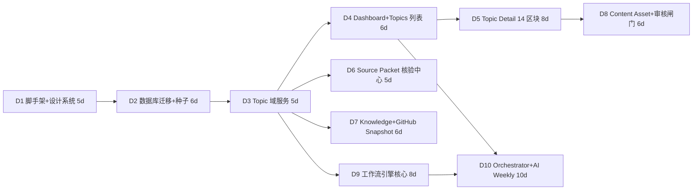

# 12. 开发路线图（Development Roadmap）

> **状态**：本文件是 13 份正式文档之一（`docs/12-roadmap.md`），主题为【开发路线图】——V1 MVP 范围、M0-M5 阶段划分、D1-D10 任务拆分、里程碑与退出标准、风险与依赖、后续迭代规划。
>
> **事实源引用**：本文件**不定义任何新字段/枚举/路由/状态**，全部引用 5 个基线文件：
>
> | 基线文件 | 引用范围 |
> |---|---|
> | `docs/_requirements.md` | 需求原文（项目定位、核心原则、18-20 节开发原则与当前任务） |
> | `docs/_canonical-data-model.md` | 数据模型（34 表、§1 全局枚举、§2 业务规则、§6 落库顺序） |
> | `docs/_canonical-workflow.md` | 工作流引擎与状态机（§2 Orchestrator 12 步、§4 run 状态机、§7 topic 9 态、§8 子工作流流转） |
> | `docs/_canonical-ia.md` | 信息架构与设计系统（14 路由、Topic Detail 14 区块、§4 设计 token） |
> | `docs/_canonical-roadmap.md` | **MVP 范围 / 阶段 / 任务拆分 / 决策日志 / 开放问题的唯一事实源**，本文件为其正式落地版 |
>
> **约定**：阶段编号 `M0`…`M5`；任务编号 `D1`…`D10`（D11+ 见 §7，确认后拆分）；决策编号 `DC-xx` 与开放问题 `OQ-xx` 以 `_canonical-roadmap.md` §4/§5 为准，本文件只引用不重复编号。估时单位为人日（person-day），单人全职估算；多人并行按依赖链重排。
>
> **本迭代（文档阶段）约束**（需求二十）：本迭代禁止实现完整 AI Workflow、禁止开始自动发布、禁止删减核心 Topic / Source / Workflow 数据模型。D1 起的代码执行须在用户确认（需求二十第 9 条）后启动。

---

## 1. V1 MVP Scope（In / Out）

> 对齐需求十八"第一阶段只实现"与"不要优先实现"；范围裁决唯一依据为 `_canonical-roadmap.md` §1。

### 1.1 In Scope（第一版必做）

| # | 中文 | 英文标识符 | 覆盖范围 | 所属阶段 |
|---|---|---|---|---|
| 1 | 内容总控台 Dashboard | `Dashboard` | `/dashboard` 六大区块：周概览 KPI 行、四大工作流状态卡（`ai_weekly` / `github_weekly` / `evergreen_knowledge` / `wechat_deep_dive`）、核心 CTA 区（`生成本周内容计划`、`确认并开始生产`，人工触发、落 `workflow_runs` 留痕）、待办审查队列、最近 Workflow Runs 时间线、趋势雷达图 | M1 |
| 2 | Topic 选题中心 | `Topic Center` | `/topics`：过滤栏（`status` / `priority` / `topic_type` / `content_week` / `history_dedupe_status` / 关键词搜索）、Topic 表格（含五维评分汇总条）、批量操作栏（批量改 priority / 批量归档 / 批量派发）、候选池 Drawer（`event_pool`，展示 `selection_status`） | M1 |
| 3 | Topic 详情 | `Topic Detail` | `/topics/[id]` 严格按 IA §3 的 **14 区块顺序**：基础信息 → 评分 → Priority → Tags → Parent → Source Topics → Lineage 可视化 → Source Packet → Workflow Runs → Content Assets → Derived Topics → Metrics → CTA → 历史记录 | M1 |
| 4 | Source Packet 证据包与核验 | `Source Packet` | `/sources` 三层管理（`sources` → `source_packet_items` → `source_packets`）、包级五态 rollup（`conflict` > `needs_update` > `verified` > `partially_verified` > `unverified`，禁止手填与明细不一致）、`source_consistency='conflict'` 冲突裁决面板（写 `audit_log`） | M1 |
| 5 | Workflow 基础结构 | `Workflow Foundation` | `workflow_types` / `workflow_templates` / `workflow_batches` / `workflow_runs` / `workflow_tasks` / `workflow_outputs` 引擎与状态机、AI 调用层抽象（`/lib/ai/providers` + `/lib/ai/orchestrator` + `/lib/ai/workflows`）、`/workflows` 与 `/workflows/runs` 页（含 Run 详情 Drawer） | M2 |
| 6 | Knowledge Topic Bank | `Knowledge Topic Bank` | `/knowledge`：知识网格/表格（`knowledge_status` / `content_status` 徽标）、concept 图（`upstream_concepts` / `related_concepts` / `downstream_concepts` 三向数组或 `knowledge_concept_edges` 边表）、衍生预算指示（`knowledge_derivations` `round_index ∈ 1..3`）、开采操作入口（落 `workflow_runs`） | M1 |
| 7 | GitHub Snapshot | `GitHub Snapshot` | `/github-weekly`：快照抓取（`snapshot_capture`）、不可变冻结（`github_snapshots.status='frozen'` 触发器禁 UPDATE/DELETE）、Replay 新建行（`source_item_id` 血缘，永不覆盖 Original）、`selected=true` 落 Topic（`topic_type='technical_project'` / `'trend'`） | M1 |
| 8 | Content Asset 基础管理 | `Content Asset Management` | `/content` 与 `/content/[id]`：`content_assets`（`asset_key` 逻辑标识）+ `content_asset_versions`（版本全保留、`is_current` 切换、`created_by_run_id` 审计）、编辑/预览、版本历史 Timeline、CTA 面板（单值覆盖，默认继承 `topics.primary_cta`）、待审核队列、批量操作 | M1 |
| 9 | 人工审核闸门 | `Human Review Gate` | 全局硬性原则落地：`workflow_runs.status='needs_review'` 吸收态、`Review` / `Needs Revision` 审核操作（Approve / Needs Revision / Ready to Publish）、`audit_log` 全量留痕（`actor = 用户标识 或 ai:run-xxx`）、**V1 绝不自动发布**（`publications.status='published'` 仅人工触发并回填 `published_date / published_url / published_by`） | M1 基础 / M3 贯通 |

> 🔸 **追加说明（继承基线）**：`/publications`（仅 `planned` / `ready` 编排 + 人工回填）与 `/analytics`（`content_metrics` 录入 + `conversion_funnel` 视图 + Leads 池）属于 **M4 阶段**，不在 MVP 首发范围（对齐需求十八第一阶段清单），但数据模型已全量建表。

### 1.2 Out of Scope（第一版明确不做）

| # | 中文 | 英文标识符 | 说明 | 再评估时机 |
|---|---|---|---|---|
| 1 | 自动发布 | `Auto Publishing` | V1 硬性原则：`published` 仅人工触发，系统/工作流只生成 `planned → ready`；DB 触发器/应用层禁止 workflow 直写 `published` | 不排期（需求硬性原则 6） |
| 2 | 复杂 CRM | `Complex CRM` | `leads` 仅基础列表与分类（`lead_type` / `lead_urgency` / `lead_status`），不做 CRM 工作流、集成、自动化跟进 | M5 后评估 |
| 3 | 视频生成 | `Video Generation` | `asset_type='short_video_script'` 仅产出脚本文本，不生成视频文件 | 后置评估 |
| 4 | 自动剪辑 | `Auto Editing` | 无任何自动剪辑/合成能力 | 后置评估 |
| 5 | 多租户 | `Multi-tenancy` | 单租户部署 | 后置评估 |
| 6 | 复杂 RBAC | `Complex RBAC` | V1 单用户；`/settings` 用户/权限区仅预留 | 后置评估 |
| 7 | 实时全网爬虫 | `Real-time Web Crawling` | 候选扫描**非实时**；V1 候选经人工录入或受限来源导入 `event_pool` | 需用户确认 V1 候选录入方式（OQ-02） |
| 8 | 🔸 定时自动调度 | `Scheduled Cron` | M3 以**手动触发** run 为主；每周一 09:00 定时器（`workflow_types.scheduling='weekly'`）放 M5 后启用（OQ-06） | M5 |
| 9 | 🔸 AI 自动生成配图/视频 | `AI Image/Video Gen` | `image_plan` 仅输出配图计划，不自动出图；真实截图/UI 必须 `from_brand_asset` / `from_verified_source`（Logo 禁止 AI 重绘，`ai_policy='reference_only'`） | M4 后评估 |

### 1.3 边界规则（In/Out 判据）

1. **判据一（范围）**：需求十八第一阶段清单（Dashboard、Topic Center、Topic Detail、Source Packet、Workflow 基础结构、Knowledge Topic Bank、GitHub Snapshot、Content Asset 基础管理 + 人工审核闸门）为 V1 MVP 首发范围；超出项进入 M4/M5 或 Out 清单。
2. **判据二（门禁）**：任何内容产出必须经过人工审核；不存在绕过 `audit_log` 的状态变更路径（继承数据模型 §2.8）。UI 上所有发布/审核动作需有显性"人工"标识。
3. **判据三（产物边界）**：AI 原始产出一律先进 `workflow_outputs` 留痕（`output_type ∈ {production_plan, selected_events, trend_report, secondary_candidates, derived_topics, content_asset, source_packet_update, outline, knowledge_topic, deep_dive_plan, image_plan}`），**仅人工审核通过后提升为 `content_assets`**（`applied` 幂等回写）。
4. **判据四（执行时机）**：数据模型在 M0 全量建表（34 表，零删减）；完整 AI Workflow 逻辑到 **M3** 才实现——本迭代（文档阶段）禁止实现完整 AI Workflow（需求二十）。

---

## 2. Roadmap 阶段（M0 → M5）

### 2.0 阶段总览

| 阶段 | 名称 | 核心目标 | 主要交付 | 任务 | 退出状态 |
|---|---|---|---|---|---|
| M0 | 地基 Foundation | 工程可运行、数据层完备、设计语言统一 | 脚手架 + 34 表迁移 + 种子数据 + CI | D1、D2 | 可 build、可查询 |
| M1 | 数据模型 + 基础页面 | 核心实体 CRUD 与重点页面真实数据渲染 | 8 个页面 + 域服务 + 审核基础操作 | D3-D8 | MS-1 |
| M2 | 工作流引擎 Workflow Engine | 通用可执行、可重跑、可审计的引擎 | run/batch/task/outputs 状态机 + AI 三层抽象 | D9 | MS-2 |
| M3 | 四个工作流 4 Workflows | Orchestrator + 4 子工作流跑通，门禁全链路贯通 | 12 步流水线 + 4 子工作流 + Prompt 模板 | D10（首切）→ D11-D13 | **MS-3（MVP Exit）** |
| M4 | 发布与指标 | 人工发布闭环与数据回填可视化 | `/publications` + `/analytics` + 指标录入 | D14+ | MS-4 |
| M5 | 优化闭环 | 数据反哺下一轮选题 | 趋势雷达跨周 + 定时调度 + 权重调优 | D15+ | MS-5 |

### 2.1 M0 地基（Foundation）

- **目标**：工程可运行、数据层完备、设计语言统一。后续所有阶段的地基。
- **交付物**：
  - Next.js（App Router）+ TypeScript strict + Tailwind CSS + shadcn/ui 工程；
  - 设计 token（`--color-*` / `--space-*` / `--radius-*` / `--shadow-*`，IA §4.1-4.3）与三层 AppShell（Sidebar 240px / Topbar 56px / Content，IA §4.4）；**14 条路由占位页**（`/dashboard`、`/topics`、`/topics/[id]`、`/workflows`、`/workflows/runs`、`/content`、`/content/[id]`、`/knowledge`、`/github-weekly`、`/sources`、`/assets`、`/publications`、`/analytics`、`/settings`）；
  - **34 张表全量迁移**（数据模型 §6 落库顺序）与种子数据：`ctas`（`book_demo` / `download_whitepaper` / `join_community` / `contact_sales` / `follow_account` / `signup_newsletter` 等）、`workflow_types`（5 类）、`workflow_templates` v1、`ai_prompt_templates`、`system_settings`（`scoring.weights.default/hot/evergreen/conversion`、`scoring.threshold.p0/p1/p2`、`capacity.global_concurrency`）、`image_type_priorities`（7 类 1-7 级）、`workflow_routing_rules` 默认映射（`hot/trend→ai_weekly`、`technical_project→github_weekly`、`knowledge/evergreen→evergreen_knowledge`、`scenario/product/conversion→wechat_deep_dive`）；
  - 关键触发器：`github_snapshots` frozen 禁改删、`publications.published` 仅人工；
  - CI（lint / typecheck / build）。
- **验收要点**：`npm run build` 绿；34 表可查询且约束生效；AppShell 三态（Skeleton / EmptyState / Error）就绪。
- **任务**：D1、D2。

### 2.2 M1 数据模型 + 基础页面（Data Model & Base Pages）

- **目标**：核心实体 CRUD 与重点页面用**真实数据**渲染；人工审核基础操作可用。
- **交付物**：
  - 域服务：`topic_id` 业务 ID 生成器（`2026W36-001`，目标内容周语义、周内递增不回收、正则 `^[0-9]{4}W[0-9]{2}-[0-9]{3}$`）、`lineage service`（血缘权威读写 + 祖先路径防环 + `WITH RECURSIVE` 读取，深度 3-5 层）、`audit_log` 统一落点、`source_packets` 包级五态 rollup；
  - 页面：`/dashboard`、`/topics`、`/topics/[id]`（14 区块）、`/sources`、`/knowledge`、`/github-weekly`、`/content`、`/content/[id]`；
  - 人工审核基础操作（审核队列、Approve / Needs Revision，写 `audit_log`）；`primary_cta` 在 `Ready for Production` 前必填守卫。
- **验收要点**：页面字段名引用数据模型列名；Topic Detail 14 区块顺序不重排不删节；审核动作全部留痕；`topic_status` 迁移由守卫函数把关。
- **任务**：D3-D8。

### 2.3 M2 工作流引擎（Workflow Engine）

- **目标**：通用、可执行、可重跑、可审计的工作流引擎（Workflow 基础结构）。
- **交付物**：
  - `workflow_runs` 生命周期状态机（`queued → running → completed / failed / needs_review`；`needs_review → completed` 人工通过 / `needs_review → queued|running` 人工退回同 run 重跑 `attempt_count+1`；`failed → queued` retry）与 `workflow_batches` 批次状态机（`planned → dispatching → in_progress → needs_review / completed / failed`）；
  - `workflow_tasks` 步骤执行器（`UNIQUE(run_id, sequence)`，`workflow_task_status ∈ {queued, running, completed, failed, skipped}`）、`workflow_outputs` 幂等回写（`applied` / `applied_at`）；
  - AI 调用层抽象：`/lib/ai/providers`（统一 `call()` 接口：`AIProvider` / `AIRequest` / `AIResponse`，含 mock provider）、`/lib/ai/orchestrator`（`runOrchestrator` 编排入口）、`/lib/ai/workflows`（`SubWorkflowRunner` 目录骨架）；
  - `ai_prompt_templates` 注册表读取链路（Prompt 单一来源 `UNIQUE(key, version)`，禁止写死在页面）；
  - `/workflows` 与 `/workflows/runs` 页（Run 详情 Drawer：tasks 时间线、outputs 产物、`parent_run_id` 调用树、`error`）。
- **验收要点**：用 mock provider 跑通一个模板 run 的完整生命周期；`needs_review → completed` 人工通过路径可用；同一产物只 `applied` 一次；调用树正确。
- **任务**：D9。

### 2.4 M3 四个工作流（4 Workflows）

- **目标**：内容总控台 Orchestrator + 4 个子工作流全部可跑通，人工门禁全链路贯通。
- **交付物**：
  - Orchestrator 流水线 12 步（workflow 基线 §2.1）：

    | 序号 | 职责 | 英文标识符 | task_type |
    |---|---|---|---|
    | 1 | 候选接收 | `candidate_reception` | `fact_check` |
    | 2 | 历史查重 | `history_dedupe` | `dedupe` |
    | 3 | 聚类 | `topic_clustering` | `cluster` |
    | 4 | Topic ID 分配 | `topic_id_assignment` | `id_assign` |
    | 5 | 评分 | `scoring` | `score` |
    | 6 | 优先级 | `priority_assignment` | `score`（同步） |
    | 7 | Workflow 路由 | `workflow_routing` | `route` |
    | 8 | 产能控制 | `capacity_control` | `capacity_check` |
    | 9 | CTA 判断 | `cta_assignment` | `cta_assign` |
    | 10 | 趋势雷达 | `trend_radar_management` | `trend_radar`（管理态） |
    | 11 | 衍生管理 | `derived_topic_management` | `derived_topic_manage` |
    | 12 | Return 回写 | `return_writeback` | `return_writeback` |

    （第 1-6 步 =「生成本周内容计划」；第 7-12 步 =「确认并开始生产」派发与回写，两段可一次 run 或拆两次 run。）
  - `ai_weekly`：上一完整自然周口径（`week_start` / `week_end` 显式存 `workflow_batches`）、入池过滤键 `event_pool.event_date`、选 5-8 条（不足 5 条按实际通过数发布并标 `low_candidate` 触发 `needs_review`）、90 秒中文口播、极简提纲、趋势雷达、二次候选、Return；
  - `github_weekly`：`snapshot_capture` → `fact_check` → `select` → 图文卡片 → Return；快照不可变 + Replay；
  - `evergreen_knowledge`：一次一主 + 最多 3 衍生（`knowledge_derivations` `UNIQUE(workflow_run_id, round_index)` + 守卫 `checkDerivedTopicBudget` 双保险）；
  - `wechat_deep_dive`：单值 `content_role`（CHECK 强制）、单主 CTA（`deep_dive_plans.primary_cta == topics.primary_cta` 审核校验项）、12 段蓝图、配图计划（`image_type_priorities` 约束）；
  - 各工作流 Prompt 模板全部落 `ai_prompt_templates`（版本化）。
- **验收要点**：Dashboard 两 CTA 端到端可用；`event_pool` 候选 → 查重聚类 → 提升 `topics`（`derived_topic_id` 回填）链路正确；快照冻结不可变；衍生预算超限被拦截并记 `audit_log`（`action='budget_denied'`）；无自动发布路径。
- **任务**：D10（Orchestrator + `ai_weekly` 首个垂直切片）→ D11-D13（见 §7）。

### 2.5 M4 发布与指标（Publication & Metrics）

- **目标**：人工发布闭环与数据回填可视化。
- **交付物**：
  - `/publications`：`planned` / `ready` 编排、人工发布操作（回填 `published_date` / `published_url` / `published_by`，落 `audit_log`；`publication_status ∈ {planned, ready, published, failed}`，`published` 仅人工触发）；
  - `content_metrics` 录入（需求十三 18 字段全量保留：`impressions` / `views` / `reads` / `completion_rate` / `five_second_retention` / `save_count` / `share_count` / `comment_count` / `profile_visits` / `cta_clicks` / `dm_count` / `registrations` / `material_downloads` / `demo_requests` / `consultations` / `sales_leads` / `deals` / `revenue`，强制绑定 `topic_id`）；
  - `/analytics`：KPI 概览、Conversion Funnel（SQL 视图 `conversion_funnel`：Read → CTA Click → Lead → Registration → Demo → Sales Lead → Deal → Revenue）、平台/周维度下钻（`publication_platform` × `metric_date`）、Leads 池（`leads`：`lead_type` / `lead_urgency` / `lead_status`，`suggested_reply` 仅建议不自动回复）。
- **验收要点**：`published` 仅人工触发；指标全部绑定 `topic_id`；漏斗视图正确。
- **任务**：D14+（见 §7，确认后拆分）。

### 2.6 M5 优化闭环（Optimization Loop）

- **目标**：数据反哺下一轮选题，形成"生产 → 发布 → 回填 → 优化 → 再选题"闭环（需求最终目标）。
- **交付物**：
  - 趋势雷达跨周对比（`trend_radar` `radar_week` 维度）与 `secondary_candidates` 回写 `event_pool`；
  - `knowledge_topic_bank.next_action` 驱动开采（Orchestrator 路由）；
  - 评分权重经 `system_settings` 配置调优（不硬编码）；
  - 知识状态推进（`knowledge_status` → `mature`、`content_status` → `high_performing` / `needs_remake`，逐资产真实状态以 `content_asset_versions.status` 为准）；
  - 每周一 09:00 定时调度（`workflow_types.scheduling='weekly'`）。
- **验收要点**：演示完整周循环闭环——"生成本周内容计划 → 审核 → 生产 → 审核 → 发布 → 回填 → 下一周选题可见数据反馈"。
- **任务**：D15+（见 §7，确认后拆分）。

---

## 3. 前 10 个 Development Tasks（D1-D10）

> 估时按单人全职人日；合计 **65 人日**。依赖链见 §3.11。每个任务包含：标题 / 目标 / 范围 / 验收标准 / 依赖 / 估时。

### 3.1 任务总览

| 任务 | 标题 | 阶段 | 依赖 | 估时（人日） |
|---|---|---|---|---|
| D1 | 项目脚手架与设计系统基线落地 | M0 | — | 5 |
| D2 | 数据库 Schema 全量迁移与种子数据 | M0 | D1 | 6 |
| D3 | Topic 域服务：业务 ID、血缘与审计 | M1 | D2 | 5 |
| D4 | Dashboard 与 Topic 列表页 | M1 | D3 | 6 |
| D5 | Topic Detail 页（14 区块） | M1 | D3、D4 | 8 |
| D6 | Source Packet 三层管理与核验中心 | M1 | D3 | 5 |
| D7 | Knowledge Topic Bank 与 GitHub Snapshot 页 | M1 | D2、D3 | 6 |
| D8 | Content Asset 基础管理与人工审核闸门 | M1 | D3、D5 | 6 |
| D9 | Workflow 引擎核心与 AI 抽象层 | M2 | D2、D3 | 8 |
| D10 | Orchestrator 流水线与 AI Weekly 端到端贯通 | M3 | D4、D9 | 10 |
| **合计** | | | | **65** |

### 3.2 D1 项目脚手架与设计系统基线落地

- **标题**：Project Scaffold & Design System Baseline
- **目标**：建立可运行的 Next.js 工程与全站统一的视觉/导航骨架。
- **范围**：Next.js App Router + TypeScript strict + Tailwind CSS + shadcn/ui 初始化；设计 token（`--color-*` / `--space-*` / `--radius-*` / `--shadow-*`，IA §4.1-4.3：三色体系白/深灰/蓝，P0 红 `#DC2626` / P1 橙 `#EA580C` / P2 蓝 `#2563EB` / P3 灰 `#64748B`）；三层 AppShell（Sidebar 240px / Topbar 56px / Content，IA §4.4）；**14 条路由占位页**；⌘K Command Menu 骨架；CI（lint / typecheck / build）。
- **验收标准**：14 条路由全部可访问且无报错；token 值与 IA 基线一致；`npm run build` 通过；三态约定（Skeleton / EmptyState / Error）在占位页生效，无空白页。
- **依赖**：无。
- **估时**：5 人日。

### 3.3 D2 数据库 Schema 全量迁移与种子数据

- **标题**：Database Schema Migration & Seed Data
- **目标**：按数据模型基线把 34 张表完整落库（不删减任何需求字段）。
- **范围**：Drizzle schema（枚举以 `text + CHECK` 落地，便于迁移回滚；索引；触发器）；建表顺序按数据模型 §6（1 `ctas` → 34 `audit_log`）；循环引用列 `topics.source_packet_id` 建表后 `ALTER TABLE ADD COLUMN` 后补；触发器：`github_snapshots` `status='frozen'` 时 `BEFORE UPDATE/DELETE` 拒绝任何修改/删除、`publications` 禁止 workflow 直写 `published`；种子数据：`ctas` 受控词表、`workflow_types`（5 类 + `capacity_rules`：Orchestrator `{concurrency_limit:1, serial_mode:true}`、AI Weekly `{concurrency_limit:1, weekly_quota:{min:5,max:8}, serial_mode:true}`、其余 `{concurrency_limit:1, serial_mode:true}`）、`workflow_templates` v1、`ai_prompt_templates` 初版、`system_settings` 评分权重（默认 `0.20/0.20/0.25/0.20/0.15` 等）、`image_type_priorities`（真实产品截图=1 … 装饰图=7）、`workflow_routing_rules` 默认映射。
- **验收标准**：迁移可重复执行（含回滚）；34 张表齐全且约束生效；frozen 快照 UPDATE/DELETE 触发异常；种子数据可查询。
- **依赖**：D1。
- **估时**：6 人日。

### 3.4 D3 Topic 域服务：业务 ID、血缘与审计

- **标题**：Topic Domain Services（ID / Lineage / Audit）
- **目标**：Topic 核心服务的正确性——这是 Topic Detail 页与工作流回写的地基。
- **范围**：`topic_id` 生成器（目标内容周 `YYYY Www - NNN`、正例 `2026W36-001`、周内递增、删除不回收、正则 `^[0-9]{4}W[0-9]{2}-[0-9]{3}$` 校验、`content_week` 显式存储避免 ISO 跨年漂移）；`lineage service`（同一事务写 `topics.parent_topic_id` + `topics.source_topic_ids` + `topic_relations` 边，祖先路径防环——新增父/源 Topic 的祖先集合包含自身即拒绝，`topic_relations` 层 CHECK `from_topic_id <> to_topic_id`，`WITH RECURSIVE` 读取，深度 3-5 层）；`audit_log` 服务（状态变更/人工动作统一落点，`actor = 用户标识 或 ai:run-xxx`）；`score_rationale`（jsonb）写服务。
- **验收标准**：单测覆盖 topic_id 跨 ISO 周漂移（如 2026-12-28 属 `2027W01`）与不回收；血缘递归查询双向正确（parent/source 上下行）；新增父/源指向自身被拒；所有状态迁移写 `audit_log`。
- **依赖**：D2。
- **估时**：5 人日。

### 3.5 D4 Dashboard 与 Topic 列表页

- **标题**：Dashboard & Topic Center
- **目标**：内容总控台单屏总览与选题中心真实数据渲染。
- **范围**：`/dashboard` 六区块——① 周概览 KPI 行（当前 `content_week`、P0 Topic 数、P1 Topic 数、待审核内容、待发布内容、已发布内容、本周 Leads、Demo 数、Consultation 数）；② 四大工作流状态卡（`ai_weekly` / `github_weekly` / `evergreen_knowledge` / `wechat_deep_dive`，读 `workflow_batches.status` + `workflow_runs.status`）；③ 核心 CTA 区——`生成本周内容计划`、`确认并开始生产` 按钮可用并创建 `workflow_runs`（`workflow_type='orchestrator'`，`status='queued'`）落库留痕；④ 待办审查队列（`needs_review` run、`Review` 态资产、`conflict` 证据包、`review_required` 查重项）；⑤ 最近 runs 时间线（父子调用树）；⑥ 趋势雷达图（`trend_radar` `signal_strength` / `velocity` / `novelty_score` 按周聚合）；`/topics`（过滤栏、表格含五维评分汇总条、批量操作栏、候选池 Drawer 展示 `event_pool.selection_status`）。
- **验收标准**：页面使用真实数据渲染；CTA 触发 orchestrator run 落库留痕；过滤/排序生效；三态完备（无空白页）。
- **依赖**：D3。
- **估时**：6 人日。

### 3.6 D5 Topic Detail 页（14 区块）

- **标题**：Topic Detail Page（14 Sections）
- **目标**：重点页面 `/topics/[id]` 全量实现。
- **范围**：严格按 IA §3 顺序实现 14 区块：① 基础信息（`topic_id` / `content_week` / `title` / `description` / `topic_type` / `status` 徽标）→ ② 评分（五维条 + `business_relevance` 门控独立显示"不参与加权" + `score_rationale` + `score_version`）→ ③ Priority（P0/P1/P2/P3 语义色徽标，展开显示分档依据 P0≥8.0 / P1≥6.5 / P2≥5.0 / P3<5.0）→ ④ Tags（`trend_tags`）→ ⑤ Parent（`parent_topic_id`）→ ⑥ Source Topics（`source_topic_ids`）→ ⑦ Lineage 可视化（`LineageGraph` 有向图：parent 实线 / source 虚线，递归 CTE 双向 3-5 层）→ ⑧ Source Packet（包级头 + 明细 + 冲突入口）→ ⑨ Workflow Runs（父子调用树 + outputs + applied）→ ⑩ Content Assets → ⑪ Derived Topics（`WHERE parent_topic_id = 本 Topic.id`）→ ⑫ Metrics（`content_metrics` 18 字段 + `conversion_funnel` 聚合）→ ⑬ CTA（`primary_cta` → `ctas` + 资产覆盖）→ ⑭ 历史记录（`topic_status_history` 视图 Timeline：`audit_log WHERE entity_type='topic' AND action='status_changed'`）。
- **验收标准**：14 区块顺序与 IA 完全一致且不删节；血缘图双向 3-5 层；历史时间线数据来自 `audit_log`；展示字段名引用数据模型列名。
- **依赖**：D3、D4。
- **估时**：8 人日。

### 3.7 D6 Source Packet 三层管理与核验中心

- **标题**：Source Packet & Verification Center
- **目标**：来源三层模型的完整管理与核验闭环。
- **范围**：`sources`（`source_type` 7 类、`source_quality_score` 1-5、`is_confidential`）/ `source_packets` / `source_packet_items` CRUD；包级五态 rollup（`conflict` > `needs_update` > `verified` > `partially_verified` > `unverified`，禁止手填与明细不一致）；`key_numbers` 与 `number_test_conditions`（`[{"key","operator","expected","unit","tolerance","note"}]` 断言数组）展示与逐条执行入口；`source_consistency='conflict'` 冲突裁决面板（写 `audit_log`，`action='conflict_resolved'`）；`/sources` 页四区块（来源主档列表、证据包列表/聚合、核验明细表、冲突处理面板）。
- **验收标准**：rollup 规则单元测试通过；conflict 时 UI 展开逐条裁决；核验记录进 `audit_log`；`sources.source_quality_score`（来源级信任）与包级核验状态分层不混用。
- **依赖**：D3。
- **估时**：5 人日。

### 3.8 D7 Knowledge Topic Bank 与 GitHub Snapshot 页

- **标题**：Knowledge Topic Bank & GitHub Snapshot Pages
- **目标**：`/knowledge` 与 `/github-weekly` 两页 + 衍生预算守卫。
- **范围**：`knowledge_topic_bank` 网格/表格（`knowledge_status` 6 态 / `content_status` 8 态徽标、`category`、`user_learning_cost`、`current_heat`、`next_action`）、concept 图（`upstream_concepts` / `related_concepts` / `downstream_concepts` 三向数组 + `knowledge_concept_edges` 边表备用）、衍生预算条（`knowledge_derivations` `round_index ∈ 1..3`）；`github_snapshots` 列表（`snapshot_id` 如 `2026W36-GH-ORIGINAL-PURE`、`snapshot_type` original/replay、`selection_basis` pure_weekly_rank/value_filtered/mixed、`status` captured/frozen 锁标识）、`github_snapshot_items` 表（捕获列 `rank/repository/project_name/weekly_growth/total_stars/repo_url` 冻结只读；运营列 `verification_status/selected/elimination_reason` 可编辑并记 `audit_log`）、Original / Replay 管理（Replay 新建行 + `source_item_id` 血缘，永不覆盖 Original）、`selected=true` 落 Topic（`topic_type='technical_project'` / `'trend'`）；应用层守卫函数 `checkDerivedTopicBudget`（超限拦截 + `audit_log` `action='budget_denied'`）。
- **验收标准**：知识状态/内容状态徽标正确；frozen 快照 UI 锁标识且后端拒绝修改/删除；Replay 新建行不覆盖 Original；衍生预算超限被拦截。
- **依赖**：D2、D3。
- **估时**：6 人日。

### 3.9 D8 Content Asset 基础管理与人工审核闸门

- **标题**：Content Asset Management & Human Review Gate
- **目标**：资产与版本管理 + 审核操作闭环（人工门禁可视化）。
- **范围**：`content_assets`（`asset_key` 逻辑标识 `{topic_id}:{asset_type}:{platform}` 跨版本不变）+ `content_asset_versions`（版本全保留、`is_current` 切换、`created_by_run_id` 审计、`UNIQUE(asset_id, version)`）CRUD；`/content` 列表（过滤栏 `asset_type` / `platform` / `status` / `content_role`、待审核队列、批量操作）与 `/content/[id]`（编辑/预览、版本历史 Timeline 可回滚/对比、CTA 面板单值覆盖、发布状态、审核操作）；审核动作（Approve / Needs Revision / Ready to Publish）落 `audit_log` 且 UI 显性"人工"标识；`primary_cta` 在 `Ready for Production` 前必填守卫（`topics.primary_cta` FK→`ctas.id`）。
- **验收标准**：版本历史全保留可回滚/对比；审核动作均写 `audit_log` 且 UI 显性"人工"标识；无绕过路径；`Ready to Publish` 前 CTA 校验生效。
- **依赖**：D3、D5。
- **估时**：6 人日。

### 3.10 D9 Workflow 引擎核心与 AI 抽象层

- **标题**：Workflow Engine Core & AI Provider Abstraction
- **目标**：通用工作流引擎（Workflow 基础结构）——可执行、可重跑、可审计。
- **范围**：`workflow_runs` 生命周期状态机（`queued → running → completed / failed / needs_review`；`needs_review → completed` 人工通过；`needs_review → queued|running` 人工退回同 run 重跑 `attempt_count+1`；`failed → queued` retry；每次迁移写 `audit_log`）；`workflow_batches` 批次状态机（`planned → dispatching → in_progress → needs_review / completed / failed`，`batch_id` 重跑追加 `-NN` 如 `2026W36-AI-WEEKLY-02`，`run_number` 如 `2026W36-AI-WEEKLY-R01`）；`workflow_tasks` 步骤执行器（`UNIQUE(run_id, sequence)`、`skipped` 语义）；`workflow_outputs` 幂等回写（`applied` / `applied_at`，同一产物只消费一次）；`/lib/ai/providers` 统一 `call()` 接口（`AIProvider` / `AIRequest`{`promptKey`、`params`、`outputSchema`、`maxTokens`、`temperature`} / `AIResponse`{`content`、`usage`{`promptTokens`、`completionTokens`、`costCents`}}，含 mock provider）+ `/lib/ai/orchestrator`（`runOrchestrator` 入口）/ `/lib/ai/workflows`（`SubWorkflowRunner` / `RunContext` 类型契约）目录骨架；`ai_prompt_templates` 读取链路（`UNIQUE(key, version)`，Prompt 单一来源）；`/workflows` 与 `/workflows/runs` 页（Run 详情 Drawer：tasks 时间线、outputs 产物、`parent_run_id` 调用树、`error`）。
- **验收标准**：用 mock provider 跑通一个模板 run 的 `queued → running → completed` 全生命周期；`needs_review → completed` 人工通过路径可用；同一产物仅 `applied` 一次；子 run 的 `parent_run_id` 调用树正确；审计全覆盖。
- **依赖**：D2、D3。
- **估时**：8 人日。

### 3.11 D10 Orchestrator 流水线与 AI Weekly 端到端贯通

- **标题**：Orchestrator Pipeline & AI Weekly End-to-End（首个垂直切片）
- **目标**：跑通 MVP 最小闭环——"生成本周内容计划 → 审核 Topic → 确认并开始生产 → AI 周报生产 → 人工审核 → Ready to Publish"。
- **范围**：Orchestrator 流水线 12 步实现（`candidate_reception` / `history_dedupe` / `topic_clustering` / `topic_id_assignment` / `scoring` / `priority_assignment` / `workflow_routing` / `capacity_control` / `cta_assignment` / `trend_radar_management` / `derived_topic_management` / `return_writeback`，每步落 `workflow_tasks` + 关键裁决落 `workflow_outputs`）；`ai_weekly` 工作流（`fact_check` → `score` → `select` 5-8 条 → `script_generate` 90 秒中文口播 → `outline_generate` → `trend_radar` → `secondary_candidates` → `return_writeback`）；事件必达字段落 `event_pool`（`candidate_id` 如 `2026W36-AI-CAND-001`、`event_date` 入池过滤键、`industry_impact` / `user_perception` / `tech_change` / `application_value` / `propagation_potential` 五维评估、`selection_status`、`elimination_reason`，同时以 `event_assessment` jsonb 挂 `source_packet_items`）；Prompt 模板全部落 `ai_prompt_templates`；`/lib/ai/workflows/ai-weekly.ts` 子工作流入口；不足 5 条按实际通过数发布并在批次标 `low_candidate` 触发 `needs_review`。
- **验收标准**：Dashboard 两 CTA 端到端可用；`event_pool` 候选 → 查重聚类（`topic_clusters`）→ 提升 `topics`（`derived_topic_id` 回填）链路正确；口播脚本产出进 `workflow_outputs`，**人工审核通过后**提升 `content_assets`（`asset_type='ai_weekly_script'`）；所有迁移写 `audit_log`；无自动发布路径。
- **依赖**：D4、D9。
- **估时**：10 人日。

### 3.12 依赖图与关键路径

- **关键路径（单人串行，合计 65 人日）**：D1(5) → D2(6) → D3(5) → D4(6) → D5(8) → D8(6)，以及 D3 → D9(8) → D10(10)，汇合于 D10。串行总长 = 5+6+5+6+8+6+10 = 46 人日（到 MVP Exit 的最长链为 D1→D2→D3→D4→D10 与 D1→D2→D3→D9→D10 取大：5+6+5+6+10=32 vs 5+6+5+8+10=34）。
- **可并行分支**：D6（D3 后）、D7（D2、D3 后）、D9（D2、D3 后）与 D4/D5/D8 链路无相互依赖，多人并行时可压缩日历时间，但 D10 依赖 D4 + D9 两条汇合。
- **里程碑对应**：D1-D2 → M0；D3-D8 → M1；D9 → M2；D10 → M3（MVP Exit）。

---

## 4. 里程碑与退出标准（Milestones & Exit Criteria）

### 4.1 里程碑清单

| 里程碑 | 内容 | 退出标准 |
|---|---|---|
| MS-1 | M1 结束 | 全部基础页面（Dashboard / Topics / Topic Detail / Sources / Knowledge / GitHub Weekly / Content）用真实数据渲染；Topic Detail 14 区块顺序合规；人工审核基础操作可用且全部落 `audit_log` |
| MS-2 | M2 结束 | mock provider 可跑通 run 全生命周期；`needs_review` 门禁路径与 `applied` 幂等验证通过；Runs 页可审计 |
| MS-3 | **M3 结束（MVP Exit）** | 端到端最小闭环可演示：**生成本周内容计划 → 审核 Topic → 确认并开始生产 → AI 周报生产（90 秒中文口播脚本）→ 人工审核 → Ready to Publish**；无自动发布路径；`event_pool` → `topics` 提升链路正确 |
| MS-4 | M4 结束 | 人工发布闭环（`planned` / `ready` + 人工回填 `published`）与指标录入/漏斗视图可用 |
| MS-5 | M5 结束 | 完整周循环闭环演示：发布 → 数据回填 → 下一周选题可见数据反馈 |

### 4.2 硬性 Exit 约束（任何阶段不得违反）

1. 不存在绕过人工审核的发布路径（`publications.status='published'` 仅人工触发，触发器/应用层禁止 workflow 直写）。
2. 所有评分、定级、查重、聚类、CTA 判断、路由、状态迁移均有 `workflow_runs` 留痕（Orchestrator 作为 `workflow_type='orchestrator'` 的 run 落库，子 workflow 经 `parent_run_id` 挂父 run）。
3. 数据模型 34 表全量落库，需求字段零删减。

### 4.3 里程碑验收核对清单（落地检查项）

| 检查项 | MS-1 | MS-2 | MS-3 | MS-4 | MS-5 |
|---|---|---|---|---|---|
| `npm run build` / CI 绿 | ✓ | ✓ | ✓ | ✓ | ✓ |
| 34 表 + 约束 + 触发器 | ✓ | ✓ | ✓ | ✓ | ✓ |
| `audit_log` 全量留痕可追溯 | ✓ | ✓ | ✓ | ✓ | ✓ |
| mock provider 全生命周期 | — | ✓ | — | — | — |
| 真实 Provider（OQ-01 定案后） | — | — | ✓ | ✓ | ✓ |
| Dashboard 双 CTA 端到端 | — | — | ✓ | ✓ | ✓ |
| 人工发布回填 | — | — | — | ✓ | ✓ |
| 定时调度（OQ-06 定案后） | — | — | — | — | ✓ |

---

## 5. 风险与依赖

> 风险登记册为本文档基于基线 OQ 与依赖链整理的执行风险；风险缓解方案均不改变基线定义。

### 5.1 风险登记册

| 编号 | 风险 | 等级 | 影响 | 触发时机 | 缓解措施 | 关联 |
|---|---|---|---|---|---|---|
| R-01 | **LLM Provider 未定**：无 key / 无预算 / 选型未定，D10 无法接真实 Provider | 高 | D9、D10、MS-3 演示 | D9 验收前 | D9 以 mock provider 验收（基线已定）；D10 前定案并注入 `AIProvider`；`/lib/ai/providers` 保持可插拔，业务层不直接 import 供应商 SDK | OQ-01 |
| R-02 | **候选事件数据源缺失**：`event_pool` 无录入渠道，Orchestrator 候选接收步无数据可跑 | 高 | D4、D10、M1 候选池 Drawer | M1 页面上线时 | V1 推荐手动录入 + 受限源半自动导入（如 Newsletter/订阅）；Dashboard/候选池提供录入 UI | OQ-02 |
| R-03 | **GitHub Trending 数据源不可靠**：官方 API 不提供 Trending，`snapshot_capture` 抓取失败或口径漂移 | 中 | D7、D11、`github_weekly` | 每周快照抓取时 | V1 人工粘贴 + 半自动解析；`snapshot_type='replay'` 允许同周重生成（新行不覆盖）；失败不阻断其余工作流 | OQ-03 |
| R-04 | **依赖链延期**：D1-D2 延迟沿关键路径传导（D3 → D9 → D10 汇合点） | 中 | MS-3 日期 | D1/D2/D3 任一延期 | 关键路径识别（§3.12）；D6/D7 与 D4/D5 链路可并行；预留缓冲 10% | §3.12 |
| R-05 | **AI Weekly 候选不足 5 条**：选不满足额，批次需人工裁决 | 低 | D10、周报生产 | 每周一生产 | 基线已定：按实际通过数发布 + 批次标 `low_candidate` 触发 `needs_review` 人工确认 | 数据模型 §2.10 |
| R-06 | **快照/审计数据被绕过**：绕过 `audit_log` 直改状态、frozen 快照被改 | 高 | 全局合规 | 任意阶段 | DB 触发器（frozen 禁改删、`published` 仅人工）+ 应用层守卫 + UI 无绕过路径；验收核对清单强制检查 | 硬性 Exit 约束 |
| R-07 | **Supabase 环境未就绪**：无项目 / 无 URL / key，D2 迁移无法执行 | 中 | D2 起全部任务 | M0 启动时 | 推荐新建 Supabase 项目 + `drizzle-kit` 迁移；本地 `docker postgres` 备选 | OQ-05 |
| R-08 | **Prompt 模板散落**：Prompt 写死在页面/组件，破坏单一来源与版本化 | 中 | D9、D10、后续调优 | M2/M3 | 强制 `ai_prompt_templates`（`UNIQUE(key, version)`）为唯一来源，`workflow_templates.prompt_refs` 引用；code review 检查 | DC-31 |
| R-09 | **估时偏差**：65 人日按单人全职估算，实际并行/中断损耗 | 中 | 全部排期 | 全周期 | 任务粒度可独立验收（DC-43）；OQ-11 确认单人/多人安排后重排依赖链 | OQ-11 |
| R-10 | **种子数据不足以验收**：空数据库下页面/流程无法演示三态与真实渲染 | 低 | D2、D4、D7 | M1 验收 | 提供 `demo-seed`（模拟两周 topics、一个 frozen 快照、若干 `event_pool` 候选），可一键清空 | OQ-10 |

### 5.2 任务级依赖（开发顺序强制约束）

| 约束 | 原因 |
|---|---|
| D2 必须在 D3 前 | 域服务依赖 34 表结构与约束（`topics` / `topic_relations` / `audit_log`） |
| D3 是 D4-D9 的共同前置 | `topic_id` 生成、血缘、审计是列表/详情/引擎/页面的公共地基 |
| D9 与 D5 并行可行 | 引擎（D9）只依赖 D2/D3，与页面链路（D4/D5/D8）无耦合 |
| D10 依赖 D4 + D9 汇合 | CTA 入口在 Dashboard（D4），引擎执行在 D9 |
| D8 依赖 D5 而非 D9 | 人工审核闸门在 M1 即可用真实手工数据验收，不必等引擎 |

---

## 6. 后续迭代规划（D11+ 概要）

> 本迭代只拆分 D1-D10；以下为后续阶段的任务概要，用户确认 MVP（需求二十第 9 条）后按 MS-3 里程碑拆分详细任务（标题/目标/范围/验收标准/依赖/估时），拆分时以实际验收标准重新核定估时。

| 阶段 | 规划任务 | 概要 | 估时（人日，预估） |
|---|---|---|---|
| M3 | D11 `github_weekly` 工作流 | `snapshot_capture` → `fact_check` → `select` → 图文卡片生成（`asset_type='github_card'`）→ Return；快照不可变 + Replay 全链路 | 6 |
| M3 | D12 `evergreen_knowledge` 工作流 | 概念开采（按 `knowledge_topic_bank.next_action`）→ `knowledge_topic` 建库（1:1 topics 行）→ 内容生产 → 衍生 ≤3 → Return；`checkDerivedTopicBudget` 全链路 | 6 |
| M3 | D13 `wechat_deep_dive` 工作流 | Content Role 定义（单值）→ 12 段蓝图（`deep_dive_plans`）→ 配图计划（`deep_dive_image_plans`）→ 成文 → Return；蓝图审核状态机（`drafting → review → needs_revision ⇄ → approved → archived`） | 7 |
| M4 | D14 `/publications` 发布中心 | 发布编排（`planned` / `ready`）+ 人工发布操作（回填 `published_date` / `published_url` / `published_by`）+ `audit_log` | 4 |
| M4 | D15 指标录入与 `/analytics` | `content_metrics` 18 字段录入（表单/导入）、`conversion_funnel` 视图、Leads 池 | 6 |
| M5 | D16 趋势雷达与二次候选回写 | 跨周对比（`trend_radar`）、`secondary_candidates` → `event_pool`、`trend_radar` 管理闭环 | 4 |
| M5 | D17 优化闭环与定时调度 | `next_action` 驱动开采、评分权重调优 UI（`system_settings`）、`scheduling='weekly'` 定时器（每周一 09:00） | 5 |
| M5 | D18 知识状态推进 | `high_performing` / `needs_remake` 联动、`content_status` 聚合视图校准（逐资产真实状态以 `content_asset_versions.status` 为准） | 3 |

> 备注：D11-D18 估时为概要预估，拆分时重新核定。D14-D15（M4）与 D16-D18（M5）均依赖 MS-3（MVP Exit）验收通过。

---

## 7. 设计决策日志引用（DC 速查）

> 决策日志完整定义见 `_canonical-roadmap.md` §4（DC-01 … DC-45），本文件不重复编号、只引用与本路线图执行直接相关的决策：

| 决策 | 对本路线图的影响 |
|---|---|
| DC-02 V1 MVP 范围 | 决定 §1 In/Out 清单（8 项 In + 9 项 Out） |
| DC-04 阶段划分 M0-M5 | 决定 §2 阶段结构 |
| DC-05 首个垂直切片 | 决定 D10 = Orchestrator + `ai_weekly`，其余 3 工作流 D11-D13 |
| DC-09/DC-10 ID 规则 | 决定 D3 中 `topic_id` / `batch_id` / `run_number` 生成规则 |
| DC-11 血缘混合建模 | 决定 D3 `lineage service` 单事务写 + 递归 CTE 读 |
| DC-12 快照不可变 | 决定 D7 / D11 中 frozen 触发器与 Replay 语义 |
| DC-13 评分映射 | 决定 D3 `score_rationale` 与 D10 `scoring` / `priority_assignment` 步 |
| DC-15 一次一主 ≤3 衍生 | 决定 D7 守卫函数与 D12 衍生记账 |
| DC-27 run 状态机 | 决定 D9 状态机实现与 `attempt_count` 重跑语义 |
| DC-28 产物边界 | 决定 D9 `applied` 幂等与 D10 审核后提升资产 |
| DC-31 Prompt 单一来源 | 决定 D9/D10 Prompt 落 `ai_prompt_templates` |
| DC-32 AI 三层抽象 | 决定 D9 `/lib/ai/providers` / `orchestrator` / `workflows` 目录契约 |
| DC-43 任务拆分粒度 | 决定 D1-D10 按"可独立验收的里程碑"拆分 |
| DC-44 估时口径 | 决定 65 人日单人全职估算 |
| DC-45 本迭代边界 | 决定文档阶段禁止实现完整 AI Workflow，D1 起执行须用户确认 |

---

## 8. Open Questions（开放问题）

> 基线 `_canonical-roadmap.md` §5 定义了 OQ-01 … OQ-11（唯一事实源），本文件全量转列并附执行影响；OQ-12/OQ-13 为本文档在执行落地中追加的悬而未决问题，**需要用户确认**。

| 编号 | 问题 | 影响范围 | 推荐方案 |
|---|---|---|---|
| OQ-01 | LLM Provider 选型与接入：MVP 用哪个供应商（Anthropic / DeepSeek / OpenAI / 自托管）？API Key 与成本预算是否就绪？D9 是否先以 mock provider 验收、D10 换真实 Provider？ | D9、D10、成本 | D9 用 mock 验收；D10 前确认真实 Provider 与 key；`/lib/ai/providers` 保持可插拔 |
| OQ-02 | 候选事件池数据来源：V1 不做实时全网爬虫，"联网扫描后的候选事件"由谁录入 `event_pool`？（手动录入 / RSS / 邮件导入 / 受限源半自动采集） | D4、D10、M1 候选池 Drawer | V1 推荐手动录入 + 受限源（如 Newsletter/订阅）半自动导入 |
| OQ-03 | GitHub Trending 抓取方式：GitHub 官方 API 不直接提供 Trending 数据，`snapshot_capture` 用哪个数据源？（RSSHub / 第三方接口 / 网页解析 / 人工粘贴 CSV） | D7、D10、`github_weekly` | 推荐 V1 人工粘贴 + 半自动解析，D11（github_weekly）时再定 |
| OQ-04 | 认证与单用户：V1 是否启用 Supabase Auth 登录，还是本地单用户无鉴权（`actor` 用固定标识）？ | D1、`audit_log.actor` | V1 推荐 Supabase Auth 单账号登录，`actor` 用用户标识；否则固定 `manual-user` |
| OQ-05 | 部署环境：Supabase 项目是否已存在？本地开发数据库还是云端？URL / key 是否可用？ | D2 起全部任务 | 推荐新建 Supabase 项目，`drizzle-kit` 迁移；本地 `docker postgres` 备选 |
| OQ-06 | 定时调度启用时机：AI Weekly / GitHub Weekly 的 `scheduling='weekly'`（每周一 09:00）在哪个阶段启用？ | M3（D10）vs M5 | 推荐 M3 以手动触发为主、M5 启用定时器 |
| OQ-07 | 内容语言：确认口播/文章/图文默认中文（90 秒中文口播、公众号中文）？ | D10、Prompt 模板 | 推荐默认中文，Prompt 模板显式声明 |
| OQ-08 | 发布渠道接入：确认 V1 公众号等平台**人工发布 + 回填链接**（不接平台 OpenAPI）？ | M4、`/publications` | 推荐人工发布回填（需求十二、数据模型 §2.8） |
| OQ-09 | 趋势雷达图表粒度与刷新策略：Dashboard 按周/跨周展示？刷新时机？ | D4、M5 | 推荐 Dashboard 当前周 + M5 增加跨周对比 |
| OQ-10 | 演示/验收数据：是否需要种子演示数据（模拟两周 topics / 一个 frozen 快照 / 若干 `event_pool` 候选）用于页面验收？ | D2、D4、D7 | 推荐提供 `demo-seed`（可一键清空），避免空态验收 |
| OQ-11 | 排期与规模：D1-D10 合计 65 人日的安排是否可接受？单人串行还是多人并行（并行需重排依赖链）？M4/M5（D11+）是否在 MVP 验收后立即拆分？ | 全部 | 推荐 MVP 验收后按本文件 §6 拆分 D11+ |
| OQ-12 🔸 | D10 首个垂直切片的验收环境：真实 Provider 未就绪时，是否允许以 mock provider + `demo-seed` 完成 MS-3 演示，待 OQ-01 定案后切换真实 Provider？ | MS-3 时间线 | 推荐允许——mock 跑通全链路优先，真实 Provider 作为 D10 验收项之一而非前置 |
| OQ-13 🔸 | 风险 R-03 的落地依赖 OQ-03：若 V1 选人工粘贴 + 半自动解析，`github_weekly`（D11）的抓取任务是否拆分"粘贴导入"与"自动抓取"两步？ | D11 拆分 | 推荐拆分：D11 先做粘贴导入（人工 + 解析），自动抓取按 OQ-03 定案后追加 |

---

## 9. 执行入口（D1 启动前置条件）

| # | 前置条件 | 对应确认项 |
|---|---|---|
| 1 | 用户确认需求分析、docs、IA、ERD、状态机、MVP Scope、Roadmap、D1-D10 拆分（需求二十第 9 条） | 本文件整体 + `_canonical-roadmap.md` |
| 2 | OQ-04（认证）与 OQ-05（部署环境）定案 | 影响 D1 脚手架配置与 D2 迁移目标 |
| 3 | 排期方式确认（OQ-11）：单人串行（65 人日）或多人并行（重排依赖链 §3.12） | 影响整体日历时间 |
| 4 | 本文件 §8 中 OQ-12/OQ-13 等执行期开放问题确认 | 影响 MS-3 验收口径与 D11 拆分 |
