# 权威数据模型基线（Canonical Data Model）

> **状态**：本文件是项目的**唯一事实源（Single Source of Truth）**。后续 13 份正式文档（00-product-vision … 12-roadmap）、ERD、状态机、页面数据契约均引用本文件。
> **原则**：字段命名、类型、枚举取值以本文件为准；任何冲突以本文件为裁决依据；需求明文字段**一律保留，只追加不删减**。
> **技术基线**：PostgreSQL 15+（Supabase）、Drizzle ORM、TypeScript strict。所有主键 `uuid PK DEFAULT gen_random_uuid()`，所有时间戳 `timestamptz DEFAULT now()`。

---

## 0. 命名与书写约定

- 表名、列名、枚举取值一律小写下划线（snake_case）。
- 枚举在 `§1 全局枚举` 统一定义，表中用类型名引用（如 `topic_type`），落库实现为 `CREATE TYPE` 或 `text + CHECK`，二选一由 Drizzle schema 决定（V1 推荐 `text + CHECK`，便于迁移回滚）。
- 时间一律 `timestamptz`；纯日历日（无时区语义）用 `date`。
- `jsonb` 用于动态结构（评分依据、产物载荷、配置），禁止在 jsonb 内嵌关键外键做业务联查主路径。
- 人工审核门禁（硬性原则 6）与执行留痕（硬性原则 5）为全局约束，见 `§2 业务规则`。

---

## 1. 全局枚举（全量取值）

### 1.1 Topic 域

| 枚举名 | 取值 | 说明 |
|---|---|---|
| `topic_type` | `hot` / `evergreen` / `technical_project` / `scenario` / `product` / `conversion` / `trend` / `knowledge` | 8 类，表示 Topic 性质/来源（需求二）；与 `content_role` 正交 |
| `topic_status` | `Draft` / `Researching` / `Ready for Production` / `Producing` / `Review` / `Needs Revision` / `Ready to Publish` / `Published` / `Archived` | 需求一全局 9 态状态机 |
| `priority` | `P0` / `P1` / `P2` / `P3` | 由五维评分按类型权重推导，见 §2.5 |
| `history_dedupe_status` | `not_checked` / `unique` / `clustered` / `duplicate` / `merged` / `review_required` | 历史查重聚类结果（需求二字段的枚举化） |
| `topic_cluster_status` | `open` / `resolved` / `merged` | 聚类组生命周期 |
| `cta_type` | `sales` / `content` / `community` / `brand` | CTA 受控词表分类 |
| `selection_status` | `pending` / `selected` / `eliminated` | 候选事件入选状态（需求五） |
| `topic_relation_type` | `parent` / `source` | 血缘边类型：parent=单父衍生链；source=多源促成 |

### 1.2 Source 域

| 枚举名 | 取值 | 说明 |
|---|---|---|
| `source_type` | `official` / `github` / `official_docs` / `authoritative_media` / `tech_media` / `community` / `internal` | 7 类来源类型（需求三） |
| `source_verification_status` | `unverified` / `partially_verified` / `verified` / `conflict` / `needs_update` | 全局核验五态（需求三）；GitHub/AI Weekly 复用同一枚举，禁止另造 |
| `source_consistency` | `consistent` / `conflict` / `partial` | 来源一致性；需求三要求冲突置 `Conflict`，`partial` 为部分事实冲突的追加值 |

### 1.3 Workflow 域

| 枚举名 | 取值 | 说明 |
|---|---|---|
| `workflow_type` | `orchestrator` / `ai_weekly` / `github_weekly` / `evergreen_knowledge` / `wechat_deep_dive` | 4 子 Workflow + Orchestrator（需求四/九） |
| `workflow_run_status` | `queued` / `running` / `completed` / `failed` / `needs_review` | run 状态（需求九）；`needs_review` 为人工门禁吸收态 |
| `workflow_task_status` | `queued` / `running` / `completed` / `failed` / `skipped` | 步骤级状态 |
| `workflow_output_type` | `production_plan` / `selected_events` / `trend_report` / `secondary_candidates` / `derived_topics` / `content_asset` / `source_packet_update` / `outline` / `knowledge_topic` / `deep_dive_plan` / `image_plan` | 类型化产物，Orchestrator 回写契约 |
| `batch_status` | `planned` / `dispatching` / `in_progress` / `needs_review` / `completed` / `failed` | 批次生命周期 |

### 1.4 Knowledge 域（需求七）

| 枚举名 | 取值 | 说明 |
|---|---|---|
| `knowledge_status` | `uncovered` / `partial` / `basic_explanation` / `deep_explanation` / `needs_update` / `mature` | 知识覆盖深度 6 态 |
| `knowledge_content_status` | `to_research` / `to_produce` / `script_done` / `wechat_done` / `graphic_done` / `published` / `high_performing` / `needs_remake` | 内容生产进度聚合 8 态 |
| `knowledge_category` | `ai_technology` / `ai_product` / `methodology` / `industry_practice` / `tool_tutorial` | 知识分类（需求未枚举，追加建议） |
| `learning_cost` | `low` / `medium` / `high` | 用户学习成本 |
| `current_heat` | `cold` / `warming` / `hot` / `cooling` | 当前热度 |
| `knowledge_edge_type` | `upstream` / `related` / `downstream` | concept 图边类型 |

### 1.5 Deep Dive 域（需求八）

| 枚举名 | 取值 | 说明 |
|---|---|---|
| `content_role` | `traffic` / `cognition` / `scenario` / `product` / `conversion` | 写作前必选、单值（需求八）；全系统唯一 Content Role 定义 |
| `deep_dive_plan_status` | `drafting` / `review` / `needs_revision` / `approved` / `archived` | 蓝图审核状态，衔接人工审核 |
| `image_type` | `real_product_screenshot` / `real_ui` / `structure_infographic` / `flow_diagram` / `data_chart` / `concept_diagram` / `decorative` | 7 类配图类型（需求八） |
| `image_source_status` | `suggested` / `pending` / `from_brand_asset` / `from_verified_source` / `confirmed` / `rejected` | 配图来源链；真实截图/UI 必须 `from_brand_asset` 或 `from_verified_source` |

### 1.6 Content / Asset 域（需求十/十一）

| 枚举名 | 取值 | 说明 |
|---|---|---|
| `asset_type` | `ai_weekly_script` / `short_video_script` / `wechat_article` / `github_card` / `xiaohongshu` / `sales_material` / `infographic` / `cover` | 8 类（需求十） |
| `asset_status` | `Draft` / `Producing` / `Review` / `Needs Revision` / `Ready to Publish` / `Published` / `Archived` | 资产制作/审核状态 = `topic_status` 子集 |
| `brand_asset_type` | `logo` / `template` / `product_screenshot` / `background` / `cta_card` / `ui_screenshot` / `visual_reference` | 品牌素材类型（需求十一） |
| `ai_policy` | `allow_remix` / `reference_only` / `prohibited` | AI 取用策略；`type='logo'` 强制 `reference_only`（禁止重绘） |
| `asset_brand_usage` | `logo_composition` / `background` / `template` / `reference` | 品牌素材使用用途（审计） |

### 1.7 Publication / Metrics 域（需求十二/十三）

| 枚举名 | 取值 | 说明 |
|---|---|---|
| `publication_platform` | `wechat` / `douyin` / `xiaohongshu` / `bilibili` / `wechat_video` | 统一平台枚举（5 个，全表共用） |
| `publication_status` | `planned` / `ready` / `published` / `failed` | 发布执行状态（需求十二）；`published` 仅人工回填 |
| `lead_type` | `product_inquiry` / `feature_request` / `usage_issue` / `cooperation` / `industry_opinion` / `negative` / `invalid` | 评论线索分类 |
| `lead_urgency` | `low` / `medium` / `high` | 线索紧急度 |
| `lead_status` | `new` / `assigned` / `contacted` / `closed` | 线索状态 |

### 1.8 GitHub 快照域（需求六）

| 枚举名 | 取值 | 说明 |
|---|---|---|
| `snapshot_type` | `original` / `replay` | Original=首次抓取；Replay=同周重生成（新行，绝不覆盖） |
| `selection_basis` | `pure_weekly_rank` / `value_filtered` / `mixed` | 正式榜单口径（需求六 `Selection_Basis`） |
| `github_snapshot_status` | `captured` / `frozen` | captured=抓取中；frozen=已定稿（触发器禁改） |

### 1.9 趋势雷达域

| 枚举名 | 取值 | 说明 |
|---|---|---|
| `trend_source` | `ai_weekly` / `github_weekly` / `evergreen_knowledge` / `manual` | 信号来源 |
| 强度指标 | `signal_strength` / `velocity` / `novelty_score` 均为 `smallint CHECK (1-10)` | 三信号分量（非枚举） |

---

## 2. 业务规则（全局约束）

### 2.1 `topic_id` 业务 ID 生成规则

- 格式：`YYYY Www - NNN`，正例 `2026W36-001`，正则 `^[0-9]{4}W[0-9]{2}-[0-9]{3}$`。
- 组成部分：`{ISO 内容周} + 周内 3 位序号`（000-999）。
- **周语义**：取"目标内容周"（与 `batch_id` 前缀一致，便于 Dashboard 当前周对齐），**不取创建周**；同时显式存 `content_week` 列，避免跨 ISO 年漂移（如 2026-12-28 属 2027W01）。
- 序号**按周唯一**，周内递增分配，**删除不回收**，保证血缘与历史引用稳定。
- 分配由 Orchestrator 的 ID 分配职责执行，回写 `topics.topic_id`；同批 Topic_ID_List 即本周分配的 ID 集合。

### 2.2 `batch_id` 格式

- `{ISO周}-{WORKFLOW_KIND}`，如 `2026W36-AI-WEEKLY`。
- `WORKFLOW_KIND ∈ {AI-WEEKLY, GITHUB, EVERGREEN, WECHAT, ORCHESTRATOR}`。
- **同周重跑/多批**追加 `-NN` 序号后缀：`2026W36-AI-WEEKLY-02`。
- `run_number` 追加批次内序号：`2026W36-AI-WEEKLY-R01`。
- 快照 `snapshot_id`：`2026W36-GH-ORIGINAL-PURE`（周-类型-口径）；候选 `candidate_id`：`2026W36-AI-CAND-001`；证据包 `packet_id`：`2026W36-001-SP`。

### 2.3 Topic 血缘建模（决策）

- **采用"自引用列 + 规范化边表"混合方案**，不合并为单一方案。
- `topics.parent_topic_id`（单 FK 自引用）承载"单父衍生树"（需求三：一个主 Topic 最多新增 3 个衍生 Topic）。
- `topics.source_topic_ids`（`uuid[]`）承载"多对多来源血缘"（需求三 `Source_Topic_IDs`）。
- **`topic_relations` 是血缘的权威图存储**（FK 背书的规范化边表）：每次写血缘时，由唯一 `lineage service` 在同一事务内写 `topics` 两列 + `topic_relations` 边；读取血缘一律走 `topic_relations` + `WITH RECURSIVE` 递归 CTE。两条路径单写入口保证一致，禁止绕过服务直接写边。
- **防环**：应用层祖先路径检查（新增父/源 Topic 的祖先集合包含自身即拒绝）；数据库层 `topic_relations` 加 CHECK（`from_topic_id <> to_topic_id`）。
- 血缘深度 V1 限制 3-5 层（递归 CTE 足够，不引入图数据库）。

### 2.4 GitHub 快照不可变（三重保障 + 按字段域冻结）

1. **唯一约束**：`github_snapshots UNIQUE(week, snapshot_type, selection_basis)` —— 同口径同周只能一个快照。
2. **状态 + 触发器**：`status='frozen'` 后，`BEFORE UPDATE / BEFORE DELETE` 触发器拒绝任何修改/删除（快照行及其 items 一并冻结）。**软删除策略：不提供物理删除，仅允许新增 Replay 行**。
3. **Replay 语义**：`snapshot_type='replay'` 一律**新建行**，`source_item_id` 指向 Original 行，**永不覆盖/更新 Original**。
4. **按字段域冻结**：捕获列（`rank/repository/project_name/weekly_growth/total_stars/repo_url`）不可变；运营列（`verification_status/selected/elimination_reason`）可变更（核验发生在捕获之后）并记入 `audit_log`。

### 2.5 五维评分 → priority 映射（决策）

- 五维：`b2b_relevance` / `traffic_potential` / `conversion_potential` / `timeliness` / `content_value`，均 1-10。
- **加权**：`priority_score = w1*b2b_relevance + w2*traffic_potential + w3*conversion_potential + w4*timeliness + w5*content_value`，权重按 `topic_type` 使用**不同权重画像**（配置驱动，存 `system_settings`，不硬编码）：
  - 通用默认：`0.20 / 0.20 / 0.25 / 0.20 / 0.15`；
  - `hot`/`trend`：`timeliness` 提权（如 0.35）；
  - `evergreen`/`knowledge`：`content_value` 提权（如 0.35）；
  - `conversion`/`product`：`conversion_potential` 提权（如 0.40）。
- **分档**：`P0 ≥ 8.0`；`P1 ≥ 6.5`；`P2 ≥ 5.0`；`P3 < 5.0`。
- **门控与兜底**：`business_relevance`（与本公司产品/销售目标对齐度，1-10）作为门控**不参与线性加权**——低分（< 4）且非 `product`/`conversion` 型**封顶 P2**；`hot`/`trend` 型 `timeliness = 10` 时兜底至少 `P1`。
- **审计**：计算结果落 `topics.priority`，推导依据落 `topics.score_rationale`（jsonb，含各维分值、权重、阈值判定、business_relevance 门控结论），版本号 `score_version` 变更即递增。变更由 Orchestrator 评分职责执行并写 `workflow_runs` 留痕。

### 2.6 单一主 CTA

- `topics.primary_cta` 为话题级唯一主 CTA，`uuid FK → ctas.id`（受控词表：`book_demo` / `download_whitepaper` / `join_community` / `contact_sales` / `follow_account` / `signup_newsletter` 等）。
- 进入 `Ready for Production` 前 `primary_cta` 必填（守卫校验）。
- `content_assets.cta` 默认继承 `topic.primary_cta`，允许资产级覆盖（改文案不改动作），但**每资产仅一个主 CTA**（单值 FK，非数组）。
- Deep Dive 蓝图 `deep_dive_plans.primary_cta` 默认继承 topic，审核时人工确认；"plan.primary_cta == topic.primary_cta" 作为审核校验项。
- 漏斗指标经 `content_metrics.cta_clicks` 按 `topic_id` 聚合到 Topic。

### 2.7 一次生产一个主 Topic，最多 3 个衍生

- "一次生产"的边界 = **一个 `workflow_runs` run**（Orchestrator 每次调用 Evergreen Knowledge Workflow 产出 1 个主 Topic）。
- 每 run 恰 1 个主 Topic；完成后最多新增 3 个衍生 Topic（`parent_topic_id = main_topic_id`）。
- 强制机制：`knowledge_derivations` 表 `round_index ∈ 1..3` 且 `UNIQUE(workflow_run_id, round_index)`（数据库兜底） + Orchestrator 守卫函数 `checkDerivedTopicBudget`（应用层拦截超限并记 `audit_log`）。双保险。

### 2.8 人工审核门禁与执行留痕（硬性原则 5/6）

- **V1 绝不自动发布**：`publications.status` 只能由人工触发置为 `published` 并回填 `published_date / published_url / published_by`；系统/工作流只生成 `planned → ready`，DB 触发器或应用层权限禁止写 `published`。
- `topics.status` 的 `Published` 仅由人工确认（需存在 `publications` 记录）后进入。
- 所有评分、定级、查重、聚类、CTA 判断、路由、状态迁移均由 Orchestrator 作为 `workflow_type='orchestrator'` 的 run 落库（`workflow_runs`），子 workflow 经 `parent_run_id` 挂父 run，形成可审计调用树。
- 任何人工审核动作与状态变更写 `audit_log`（`actor = 用户标识 或 ai:run-xxx`）。

### 2.9 查重聚类（Orchestrator 职责落地）

- 候选入池 `history_dedupe_status = not_checked` → Orchestrator 查重：`unique`（独立）/ `clustered`（并入簇）/ `duplicate` / `merged`（并入既有 Topic）/ `review_required`（人工裁决）。
- `topic_clusters` 收敛多个相似候选到一个 `canonical_topic_id`；`topics.dedupe_cluster_id` 指向所属簇；`topics.dedupe_matched_topic_id` 记录被并入的既有 Topic。

### 2.10 AI Weekly 统计口径

- 上一完整自然周：周一 00:00 – 周日 23:59（`week_start` / `week_end` 显式存 `workflow_batches`），每周一生产。
- 入池过滤键：`event_pool.event_date`（事件原始发生/披露时间，与 Source Packet 的 `Event_Date` 对齐），不用 `created_at`。
- 选 5-8 条；V1 不足 5 条时按实际通过数发布并在批次标注 `low_candidate` 提示人工（需用户确认）。
- 入选事件的五个评估字段（行业影响/用户感知/技术变化/应用价值/传播潜力）落在 `event_pool`（需求五必达），同时以 `event_assessment` jsonb 挂 `source_packet_items` 使评估与证据同源。

---

## 3. 表定义（按域）

> 类型写法：`uuid` / `text` / `timestamptz` / `date` / `jsonb` / `text[]` / `uuid[]` / `smallint` / `bigint` / `numeric` / `boolean`。
> 所有表含 `id uuid PK DEFAULT gen_random_uuid()`（除非另有说明）；所有表含 `created_at timestamptz NOT NULL DEFAULT now()`。

### 3.1 Domain A — Topic 域

#### `topics` — 系统核心枢纽表（需求二/十五）

| 列名 | 类型 | 约束 | 说明 |
|---|---|---|---|
| `id` | `uuid` | PK | 内部主键，稳定不变，血缘引用此键 |
| `topic_id` | `text` | NOT NULL, UNIQUE | 业务 ID `2026W36-001`，规则见 §2.1 |
| `content_week` | `text` | NOT NULL, CHECK（`^[0-9]{4}W[0-9]{2}$`） | 目标内容周 `2026W36`；显式存避免 ISO 跨年漂移 |
| `title` | `text` | NOT NULL | 主题标题 |
| `description` | `text` | | 主题描述/选题说明 |
| `topic_type` | `topic_type` | NOT NULL | 8 类 |
| `trend_tags` | `text[]` | NOT NULL DEFAULT '{}' | 趋势标签 |
| `parent_topic_id` | `uuid` | NULL, FK→`topics.id` | 单一直接父 Topic（衍生链单父树） |
| `source_topic_ids` | `uuid[]` | NOT NULL DEFAULT '{}' | 多对多来源血缘；FK 语义经 `topic_relations` 保证 |
| `b2b_relevance` | `smallint` | NOT NULL, CHECK 1-10 | 面向 B2B 受众/行业关联度（五维之一） |
| `traffic_potential` | `smallint` | NOT NULL, CHECK 1-10 | 流量潜力 |
| `conversion_potential` | `smallint` | NOT NULL, CHECK 1-10 | 线索转化潜力 |
| `timeliness` | `smallint` | NOT NULL, CHECK 1-10 | 时效性 |
| `content_value` | `smallint` | NOT NULL, CHECK 1-10 | 内容价值/深度 |
| `business_relevance` | `smallint` | CHECK 1-10 | 与本公司产品/销售对齐度；**priority 门控**，不参与加权（与 `b2b_relevance` 严格区分） |
| `priority` | `priority` | NOT NULL | P0-P3，推导见 §2.5 |
| `status` | `topic_status` | NOT NULL DEFAULT 'Draft' | 全局 9 态状态机 |
| `primary_cta` | `uuid` | NULL, FK→`ctas.id` | 唯一主 CTA；`Ready for Production` 前必填 |
| `history_dedupe_status` | `history_dedupe_status` | NOT NULL DEFAULT 'not_checked' | 查重聚类结果 |
| `dedupe_cluster_id` | `uuid` | NULL, FK→`topic_clusters.id` | 所属聚类簇 |
| `dedupe_matched_topic_id` | `uuid` | NULL, FK→`topics.id` | 被并入的既有 Topic |
| `score_version` | `integer` | NOT NULL DEFAULT 1 | 评分版本号 |
| `score_rationale` | `jsonb` | | 各维评分依据 + priority 推导理由 |
| `source_packet_id` | `uuid` | NULL, FK→`source_packets.id` | 当前生效证据包指针（见 §3.2 循环引用决策） |
| `created_by_run_id` | `uuid` | NULL, FK→`workflow_runs.id` | 创建此 Topic 的 workflow run（审计） |
| `created_at` / `updated_at` | `timestamptz` | NOT NULL | 审计时间 |
| `archived_at` | `timestamptz` | NULL | 归档时间（补充） |

索引：`UNIQUE(topic_id)`；`INDEX(status)`；`INDEX(priority)`；`INDEX(topic_type)`；`INDEX(content_week)`；`INDEX(parent_topic_id)`；`GIN(trend_tags)`。

#### `topic_relations` — 血缘权威图存储（决策：自引用列 + 规范化边表）

| 列名 | 类型 | 约束 | 说明 |
|---|---|---|---|
| `id` | `uuid` | PK | |
| `from_topic_id` | `uuid` | NOT NULL, FK→`topics.id`, CHECK（`<> to_topic_id`） | 血缘起点 |
| `to_topic_id` | `uuid` | NOT NULL, FK→`topics.id` | 血缘终点 |
| `relation_type` | `topic_relation_type` | NOT NULL | `parent`=单父衍生边；`source`=多源促成边 |
| `created_at` | `timestamptz` | NOT NULL | |

索引：`UNIQUE(from_topic_id, to_topic_id, relation_type)`；`INDEX(to_topic_id)`（反向遍历）；`INDEX(relation_type)`。
说明：Lineage 查询 = `WITH RECURSIVE` 从某 Topic 沿 `parent`/`source` 边上下遍历；`topics.parent_topic_id` 与 `topics.source_topic_ids` 是需求必填的投影列，由 `lineage service` 单事务同写。

#### `event_pool` — 候选事件池（决策：不并入 topics）

| 列名 | 类型 | 约束 | 说明 |
|---|---|---|---|
| `id` | `uuid` | PK | |
| `candidate_id` | `text` | NOT NULL, UNIQUE | `2026W36-AI-CAND-001` |
| `batch_id` | `uuid` | NULL, FK→`workflow_batches.id` | 所属批次（AI Weekly 按批次筛选） |
| `week` | `text` | NOT NULL | 对应内容周 |
| `title` | `text` | NOT NULL | 候选标题 |
| `description` | `text` | | 候选描述 |
| `source_name` | `text` | | 来源名称 |
| `source_url` | `text` | | 来源 URL |
| `source_type` | `source_type` | | 来源类型 |
| `published_at` | `timestamptz` | | 来源发布时间 |
| `event_date` | `timestamptz` | | 事件实际发生/披露时间（入池过滤键，需求五"发布时间"） |
| `disclosure_date` | `timestamptz` | | 对外披露时间 |
| `industry_impact` | `text` | | 行业影响（需求五） |
| `user_perception` | `text` | | 用户感知（需求五） |
| `tech_change` | `text` | | 技术变化（需求五） |
| `application_value` | `text` | | 应用价值（需求五） |
| `propagation_potential` | `text` | | 传播潜力（需求五） |
| `selection_status` | `selection_status` | NOT NULL DEFAULT 'pending' | 入选状态（需求五） |
| `elimination_reason` | `text` | | 淘汰原因（需求五，eliminated 时必填） |
| `history_dedupe_status` | `history_dedupe_status` | NOT NULL DEFAULT 'not_checked' | 候选阶段查重结果 |
| `cluster_id` | `uuid` | NULL, FK→`topic_clusters.id` | 候选聚类归属 |
| `source_packet_id` | `uuid` | NULL, FK→`source_packets.id` | 关联事实核验包 |
| `derived_topic_id` | `uuid` | NULL, FK→`topics.id` | 入选后提升生成的正式 Topic |
| `created_by_run_id` | `uuid` | NULL, FK→`workflow_runs.id` | 来源 workflow run |
| `created_at` / `updated_at` | `timestamptz` | NOT NULL | |

索引：`INDEX(batch_id)`；`INDEX(week)`；`INDEX(selection_status)`；`INDEX(cluster_id)`。
**决策依据**：需求五的 9 个候选字段 + 淘汰原因若写入 topics 会污染核心表与周序号；候选先行、入选提升为 Topic，与 Orchestrator"候选接收→查重→聚类→ID→评分"流程对齐。未入选/淘汰候选保留于此（含淘汰原因）。

#### `topic_clusters` — 查重聚类组

| 列名 | 类型 | 约束 | 说明 |
|---|---|---|---|
| `id` | `uuid` | PK | |
| `cluster_key` | `text` | NOT NULL | 归一化标题/来源哈希或 embedding 相似键 |
| `week` | `text` | | ISO 周 |
| `cluster_name` | `text` | | 聚类名，如 "Agent Skills 趋势" |
| `canonical_topic_id` | `uuid` | NULL, FK→`topics.id` | 簇内收敛的正式 Topic |
| `status` | `topic_cluster_status` | NOT NULL DEFAULT 'open' | open/resolved/merged |
| `created_at` / `updated_at` | `timestamptz` | NOT NULL | |

索引：`UNIQUE(cluster_key, week)`。

#### `ctas` — 主 CTA 受控词表

| 列名 | 类型 | 约束 | 说明 |
|---|---|---|---|
| `id` | `uuid` | PK | |
| `key` | `text` | NOT NULL, UNIQUE | `book_demo` / `download_whitepaper` / `join_community` / `contact_sales` / `follow_account` / `signup_newsletter` |
| `label` | `text` | NOT NULL | 中文展示文案 |
| `cta_type` | `cta_type` | NOT NULL | sales/content/community/brand |
| `target_url_template` | `text` | | 跳转模板；可与 Brand Asset Library CTA 卡片绑定 |
| `active` | `boolean` | NOT NULL DEFAULT true | 是否启用 |

### 3.2 Domain B — Source 域（需求三，三层模型：注册 / 聚合 / 明细）

#### `sources` — 来源主档（注册层，跨 Topic 复用）

| 列名 | 类型 | 约束 | 说明 |
|---|---|---|---|
| `id` | `uuid` | PK | |
| `source_name` | `text` | NOT NULL | 来源名称 |
| `source_url` | `text` | NOT NULL | 规范化 URL |
| `source_type` | `source_type` | NOT NULL | 7 类 |
| `published_at` | `timestamptz` | NULL | 来源文章发布时间（需求三"发布时间"） |
| `event_date` | `timestamptz` | NULL | 事件实际发生日期 |
| `disclosure_date` | `timestamptz` | NULL | 对外披露日期；与 event_date 之差用于时效/趋势 |
| `is_confidential` | `boolean` | NOT NULL DEFAULT false | internal 类是否机密；机密来源不进入 AI 成文/送审白名单 |
| `source_quality_score` | `smallint` | CHECK 1-5 | 信任/质量分（稳定属性，非易变状态） |
| `notes` | `text` | | 备注 |
| `created_by` | `text` | | 录入人标识 |
| `created_at` / `updated_at` | `timestamptz` | NOT NULL | |

索引：`UNIQUE(source_url, source_type)`。
说明：**核验状态不放在 sources 层**（避免跨 Topic 复用来源被单 Topic 核验动作污染全局）；来源级信任用 `source_quality_score`。

#### `source_packets` — 证据包（聚合层，每 Topic 一主包）

| 列名 | 类型 | 约束 | 说明 |
|---|---|---|---|
| `id` | `uuid` | PK | |
| `packet_id` | `text` | NOT NULL, UNIQUE | `2026W36-001-SP` |
| `topic_id` | `uuid` | NOT NULL, FK→`topics.id` | 包归属 Topic（必填归属键） |
| `verification_status` | `source_verification_status` | NOT NULL DEFAULT 'unverified' | 包级核验五态，**由明细 rollup 得出，禁止手填与明细不一致** |
| `source_consistency` | `source_consistency` | NOT NULL DEFAULT 'consistent' | 来源一致性；冲突置 `conflict` |
| `conflict_fact_ids` | `jsonb` | | 冲突涉及的事实项 id 列表 |
| `verified_by` | `text` | | 最近核验人（用户 ID 或 `ai:...`） |
| `verified_at` | `timestamptz` | | 最近核验时间 |
| `notes` | `text` | | 备注/核验结论摘要 |
| `created_at` / `updated_at` | `timestamptz` | NOT NULL | |

索引：`UNIQUE(packet_id)`；`INDEX(topic_id)`。
**循环引用决策**：`source_packets.topic_id` 为必填归属键，`topics.source_packet_id` 允许 NULL（先建 Topic → 再建包 → 回填主包指针，事务保证一致）。方向语义固定为"包归属 Topic、Topic 指向主包"。
**rollup 优先级**：存在任何 `conflict` 项 → 包=`conflict`；任何 `needs_update` 项 → 包=`needs_update`；全部 `verified` → `verified`；部分 → `partially_verified`；否则 `unverified`。

#### `source_packet_items` — 核验明细层（来源 × 单条核心事实）

| 列名 | 类型 | 约束 | 说明 |
|---|---|---|---|
| `id` | `uuid` | PK | |
| `packet_id` | `uuid` | NOT NULL, FK→`source_packets.id` | 所属证据包 |
| `source_id` | `uuid` | NOT NULL, FK→`sources.id` | 本条事实取自的来源 |
| `core_fact` | `text` | NOT NULL | 单条核心事实/主张（需求三"核心事实"） |
| `key_numbers` | `jsonb` | | 结构化关键数字数组：`[{"label","value","unit","scope","captured_at","source_url"}]`（需求三"关键数字"） |
| `number_test_conditions` | `jsonb` | | 数字测试条件断言数组：`[{"key","operator","expected","unit","tolerance","note"}]`（需求三"数字测试条件"），供核验工作流逐条执行 |
| `item_verification_status` | `source_verification_status` | NOT NULL DEFAULT 'unverified' | 逐条核验状态（包级由此 rollup） |
| `verified_by` | `text` | | 本条核验人 |
| `verified_at` | `timestamptz` | | 本条核验时间 |
| `notes` | `text` | | 本条备注（口径差异/驳回原因） |
| `event_assessment` | `jsonb` | | AI Weekly 五维评估：`{"industry_impact":{score,rationale},"user_perception":{},"technical_change":{},"application_value":{},"propagation_potential":{},"assessed_by","assessed_at"}`；评估与证据同源 |
| `created_at` / `updated_at` | `timestamptz` | NOT NULL | |

索引：`INDEX(packet_id)`；`INDEX(source_id)`。

### 3.3 Domain C — Workflow 域（需求四/九）

#### `workflow_types` — 工作流注册表

| 列名 | 类型 | 约束 | 说明 |
|---|---|---|---|
| `id` | `uuid` | PK | |
| `key` | `workflow_type` | NOT NULL, UNIQUE | `orchestrator` / `ai_weekly` / `github_weekly` / `evergreen_knowledge` / `wechat_deep_dive` |
| `name` | `text` | NOT NULL | 中文名 |
| `description` | `text` | | 职责描述 |
| `default_template_version` | `integer` | | 当前生效模板版本 |
| `scheduling` | `text` | | 触发方式（每周一 09:00 / manual） |
| `capacity_rules` | `jsonb` | | `{concurrency_limit, weekly_quota, serial_mode}`；AI Weekly quota 5-8，Evergreen serial_mode=true |
| `enabled` | `boolean` | NOT NULL DEFAULT true | |
| `created_at` / `updated_at` | `timestamptz` | NOT NULL | |

#### `workflow_templates` — 工作流定义模板（版本化，Prompt 不内联）

| 列名 | 类型 | 约束 | 说明 |
|---|---|---|---|
| `id` | `uuid` | PK | |
| `workflow_type_key` | `workflow_type` | NOT NULL, FK→`workflow_types.key` | |
| `version` | `integer` | NOT NULL | 模板版本号 |
| `name` | `text` | NOT NULL | |
| `description` | `text` | | |
| `input_schema` | `jsonb` | | 输入契约（batch_id、topic_id_list、source_packet_id） |
| `output_schema` | `jsonb` | | 输出契约（output_type 白名单） |
| `prompt_refs` | `jsonb` | | 步骤→`ai_prompt_templates.key` 或 `/ai-prompts` 文件路径映射；Prompt 不写死在页面/模板 |
| `step_definition` | `jsonb` | | 有序步骤：task_type、provider_class、参数 |
| `active` | `boolean` | NOT NULL DEFAULT true | 当前生效 |
| `created_at` / `updated_at` | `timestamptz` | NOT NULL | |

索引：`UNIQUE(workflow_type_key, version)`。

#### `workflow_batches` — 批次聚合根（Batch_ID 生命周期）

| 列名 | 类型 | 约束 | 说明 |
|---|---|---|---|
| `id` | `uuid` | PK | |
| `batch_id` | `text` | NOT NULL, UNIQUE | `2026W36-AI-WEEKLY`；同周重跑加 `-02` 后缀 |
| `workflow_type` | `workflow_type` | NOT NULL | |
| `week` | `text` | NOT NULL | ISO 周 |
| `week_start` | `date` | NOT NULL | 统计口径起点（上一自然周周一 00:00） |
| `week_end` | `date` | NOT NULL | 统计口径终点（周日 23:59） |
| `status` | `batch_status` | NOT NULL DEFAULT 'planned' | planned/dispatching/in_progress/needs_review/completed/failed |
| `orchestrator_run_id` | `uuid` | NULL, FK→`workflow_runs.id` | 生成该批次的 Orchestrator run |
| `topic_ids` | `jsonb` | | `Topic_ID_List`（需求五） |
| `created_at` / `completed_at` | `timestamptz` | NOT NULL / NULL | |

#### `workflow_runs` — 工作流执行记录（需求九核心）

| 列名 | 类型 | 约束 | 说明 |
|---|---|---|---|
| `id` | `uuid` | PK | |
| `run_number` | `text` | NOT NULL, UNIQUE | `2026W36-AI-WEEKLY-R01` |
| `workflow_type_key` | `workflow_type` | NOT NULL, FK→`workflow_types.key` | |
| `template_id` | `uuid` | NOT NULL, FK→`workflow_templates.id` | 模板快照 |
| `template_version` | `integer` | NOT NULL | 版本快照 |
| `batch_id` | `uuid` | NULL, FK→`workflow_batches.id` | 批次粒度 |
| `topic_id` | `uuid` | NULL, FK→`topics.id` | Topic 粒度（Orchestrator/候选池级 run 可空） |
| `parent_run_id` | `uuid` | NULL, FK→`workflow_runs.id` | 子 workflow 指向其 Orchestrator run（调用树） |
| `input_payload` | `jsonb` | | 输入：Topic_ID_List、source_packet 引用、参数 |
| `source_packet_id` | `uuid` | NULL, FK→`source_packets.id` | 使用的证据包 |
| `status` | `workflow_run_status` | NOT NULL DEFAULT 'queued' | queued/running/completed/failed/needs_review |
| `attempt_count` | `integer` | NOT NULL DEFAULT 1 | 重跑次数；重跑同 run 递增不新建 |
| `started_at` | `timestamptz` | NULL | |
| `completed_at` | `timestamptz` | NULL | |
| `output` | `jsonb` | | 汇总输出 |
| `error` | `jsonb` | | 失败/需复核原因 |
| `created_at` / `updated_at` | `timestamptz` | NOT NULL | |

索引：`INDEX(status)`；`INDEX(batch_id)`；`INDEX(topic_id)`；`INDEX(parent_run_id)`；`INDEX(workflow_type_key)`。
**needs_review 迁移路径**：人工通过 → `completed`（可联动 `topics.status = Ready to Publish`）；人工退回 → 同 run 重跑（`attempt_count+1`）或标记 `needs_revision`；失败可 retry。

#### `workflow_tasks` — 步骤级执行记录

| 列名 | 类型 | 约束 | 说明 |
|---|---|---|---|
| `id` | `uuid` | PK | |
| `run_id` | `uuid` | NOT NULL, FK→`workflow_runs.id` | |
| `task_type` | `text` | NOT NULL | `fact_check` / `score` / `select` / `script_generate` / `outline_generate` / `trend_radar` / `secondary_candidates` / `return_writeback` / `snapshot_capture` / `image_plan` 等 |
| `sequence` | `integer` | NOT NULL | 步骤序号 |
| `status` | `workflow_task_status` | NOT NULL DEFAULT 'queued' | |
| `input` | `jsonb` | | 本步骤输入 |
| `output_ref` | `jsonb` | | 指向 `workflow_outputs.id` 的引用数组 |
| `provider_class` | `text` | | Provider 适配器类（成本/延迟审计） |
| `started_at` / `completed_at` | `timestamptz` | NULL | |
| `error` | `text` | | 失败原因 |
| `created_at` | `timestamptz` | NOT NULL | |

索引：`UNIQUE(run_id, sequence)`；`INDEX(run_id)`。

#### `workflow_outputs` — 类型化产物（Workflow Return 回写契约）

| 列名 | 类型 | 约束 | 说明 |
|---|---|---|---|
| `id` | `uuid` | PK | |
| `run_id` | `uuid` | NOT NULL, FK→`workflow_runs.id` | |
| `task_id` | `uuid` | NULL, FK→`workflow_tasks.id` | |
| `output_type` | `workflow_output_type` | NOT NULL | production_plan / selected_events / trend_report / secondary_candidates / derived_topics / content_asset / source_packet_update / outline / knowledge_topic / deep_dive_plan / image_plan |
| `content` | `jsonb` | | 产物内容（事件列表、趋势报告、脚本、提纲等） |
| `topic_id` | `uuid` | NULL, FK→`topics.id` | 产物所属 Topic |
| `asset_id` | `uuid` | NULL, FK→`content_assets.id` | 若产物已提升为资产 |
| `applied` | `boolean` | NOT NULL DEFAULT false | Orchestrator 是否已回写消费（幂等） |
| `applied_at` | `timestamptz` | NULL | |
| `created_at` | `timestamptz` | NOT NULL | |

索引：`INDEX(run_id)`；`INDEX(output_type)`；`INDEX(applied)`。
说明：AI 原始产出一律先进此表（留痕），**仅人工审核通过后提升为 `content_assets`**（见 §3.6），两表边界 = "原始产出 vs 审核后资产"。

#### `workflow_routing_rules` — 可审计路由规则表

| 列名 | 类型 | 约束 | 说明 |
|---|---|---|---|
| `id` | `uuid` | PK | |
| `match_field` | `text` | NOT NULL | `topic_type` 或 `trend_tag` |
| `match_value` | `text` | NOT NULL | hot/trend→ai_weekly；technical_project→github_weekly；knowledge/evergreen→evergreen_knowledge；scenario/product/conversion→wechat_deep_dive |
| `workflow_type_key` | `workflow_type` | NOT NULL, FK→`workflow_types.key` | |
| `priority` | `integer` | | 规则优先级 |
| `overridable` | `boolean` | NOT NULL DEFAULT true | 是否允许人工覆盖路由 |
| `active` | `boolean` | NOT NULL DEFAULT true | |
| `created_at` | `timestamptz` | NOT NULL | |

#### `ai_prompt_templates` — Prompt 注册表（DB 版本化）

| 列名 | 类型 | 约束 | 说明 |
|---|---|---|---|
| `id` | `uuid` | PK | |
| `key` | `text` | NOT NULL, UNIQUE | `ai-weekly/event-assessment/v1` |
| `workflow_type` | `workflow_type` | NOT NULL | |
| `name` | `text` | NOT NULL | |
| `system_prompt` | `text` | NOT NULL | 系统提示词 |
| `user_prompt_template` | `text` | NOT NULL | 用户提示词模板 |
| `params_schema` | `jsonb` | | 参数契约 |
| `version` | `integer` | NOT NULL | 版本号 |
| `active` | `boolean` | NOT NULL DEFAULT true | |
| `created_at` / `updated_at` | `timestamptz` | NOT NULL | |

索引：`UNIQUE(key, version)`。
说明：Prompt 单一来源 = `ai_prompt_templates`（DB），`/ai-prompts/*.md` 为源文件导入来源；`workflow_templates.prompt_refs` 引用本表 key 或文件路径。**禁止把 Prompt 写死在页面组件。**

### 3.4 Domain D — 周报工作流专属（需求五/六）

#### `github_snapshots` — GitHub 周榜快照头（不可变）

| 列名 | 类型 | 约束 | 说明 |
|---|---|---|---|
| `id` | `uuid` | PK | |
| `snapshot_id` | `text` | NOT NULL, UNIQUE | `2026W36-GH-ORIGINAL-PURE` |
| `snapshot_type` | `snapshot_type` | NOT NULL | original / replay |
| `week` | `text` | NOT NULL | 统计周 |
| `capture_time` | `timestamptz` | NOT NULL | 抓取时间（冻结） |
| `selection_basis` | `selection_basis` | NOT NULL | pure_weekly_rank / value_filtered / mixed |
| `status` | `github_snapshot_status` | NOT NULL DEFAULT 'captured' | captured → frozen（触发器冻结） |
| `created_at` / `updated_at` | `timestamptz` | NOT NULL | |

索引：`UNIQUE(week, snapshot_type, selection_basis)`（三重保障之 1）。
触发器：`BEFORE UPDATE OR DELETE` 当 `status='frozen'` 时 `RAISE EXCEPTION`（三重保障之 2）。

#### `github_snapshot_items` — 快照明细（捕获列冻结 + 运营列可变更）

| 列名 | 类型 | 约束 | 说明 |
|---|---|---|---|
| `id` | `uuid` | PK | |
| `snapshot_id` | `uuid` | NOT NULL, FK→`github_snapshots.id`（ON DELETE RESTRICT） | |
| `source_item_id` | `uuid` | NULL, FK→`github_snapshot_items.id` | 派生快照指向 Original 行的血缘（Replay 血缘） |
| `rank` | `integer` | NOT NULL（冻结） | 榜单名次 |
| `repository` | `text` | NOT NULL（冻结） | `owner/repo` |
| `project_name` | `text` | （冻结） | 项目名 |
| `weekly_growth` | `numeric` | （冻结） | 周 star 增量 |
| `total_stars` | `bigint` | （冻结） | 累计 star 数 |
| `repo_url` | `text` | （冻结） | 仓库链接 |
| `verification_status` | `source_verification_status` | NOT NULL DEFAULT 'unverified'（可变更） | 复用全局核验枚举 |
| `selected` | `boolean` | NOT NULL DEFAULT false（可变更） | 是否入选正式榜单 |
| `elimination_reason` | `text` | （可变更） | 淘汰原因（selected=false 时建议填写） |
| `topic_id` | `uuid` | NULL, FK→`topics.id` | 选中项落 Topic（topic_type='technical_project'/'trend'） |
| `created_at` | `timestamptz` | NOT NULL | |

索引：`UNIQUE(snapshot_id, rank)`；`INDEX(snapshot_id)`；`INDEX(topic_id)`。

### 3.5 Domain E — Knowledge 域（需求七）

#### `knowledge_topic_bank` — AI Knowledge Topic Bank（1:1 关联 topics）

| 列名 | 类型 | 约束 | 说明 |
|---|---|---|---|
| `id` | `uuid` | PK | |
| `topic_id` | `uuid` | NOT NULL, UNIQUE, FK→`topics.id` | 对应 canonical topics 行（`topic_type='knowledge'`），开采时创建该行 |
| `concept` | `text` | NOT NULL | 概念名，如 "Agent Skills Library" |
| `category` | `knowledge_category` | NOT NULL | 知识分类 |
| `knowledge_status` | `knowledge_status` | NOT NULL DEFAULT 'uncovered' | 知识覆盖深度 6 态 |
| `content_status` | `knowledge_content_status` | NOT NULL DEFAULT 'to_research' | 内容生产进度聚合 8 态（逐资产真实状态看 `content_asset_versions.status`） |
| `b2b_relevance` | `smallint` | CHECK 1-10 | 银行视图冗余，单一数据源在 `topics.b2b_relevance`（由视图暴露，避免双写发散） |
| `user_learning_cost` | `learning_cost` | NOT NULL DEFAULT 'medium' | 用户学习成本 |
| `long_term_value` | `smallint` | CHECK 1-10 | 长期价值 |
| `current_heat` | `current_heat` | NOT NULL DEFAULT 'warming' | 当前热度 |
| `upstream_concepts` | `uuid[]` | NOT NULL DEFAULT '{}' | 上游概念（`knowledge_topic_bank.id` 列表） |
| `related_concepts` | `uuid[]` | NOT NULL DEFAULT '{}' | 相关概念 |
| `downstream_concepts` | `uuid[]` | NOT NULL DEFAULT '{}' | 下游概念 |
| `existing_content` | `jsonb` | | `[{asset_id, asset_type, title, status}]` 已产出内容 |
| `next_action` | `text` | | 下一步行动建议，供 Orchestrator 路由 |
| `created_at` / `updated_at` | `timestamptz` | NOT NULL | |

索引：`UNIQUE(topic_id)`；`INDEX(knowledge_status)`；`INDEX(content_status)`；`GIN(upstream_concepts)`。
说明：concept 图（知识前置关系）与 `topics.parent_topic_id/source_topic_ids`（选题/内容衍生关系）是**两套独立边，不互写**。

#### `knowledge_concept_edges` — concept 图规范化边表（V1 可选，图遍历启用）

| 列名 | 类型 | 约束 | 说明 |
|---|---|---|---|
| `id` | `uuid` | PK | |
| `source_concept_id` | `uuid` | NOT NULL, FK→`knowledge_topic_bank.id` | 上游概念 |
| `target_concept_id` | `uuid` | NOT NULL, FK→`knowledge_topic_bank.id` | 下游/相关概念 |
| `edge_type` | `knowledge_edge_type` | NOT NULL | upstream / related / downstream |
| `created_at` | `timestamptz` | NOT NULL | |

索引：`UNIQUE(source_concept_id, target_concept_id, edge_type)`。

#### `knowledge_derivations` — 衍生预算记账（一次一主 + 最多 3 衍生）

| 列名 | 类型 | 约束 | 说明 |
|---|---|---|---|
| `id` | `uuid` | PK | |
| `workflow_run_id` | `uuid` | NOT NULL, FK→`workflow_runs.id` | "一次生产"边界 |
| `knowledge_topic_id` | `uuid` | NOT NULL, FK→`knowledge_topic_bank.id` | 被开采概念 |
| `main_topic_id` | `uuid` | NOT NULL, FK→`topics.id` | 本次 run 主 Topic（每 run 恰 1 个） |
| `derived_topic_id` | `uuid` | NOT NULL, FK→`topics.id` | 衍生 Topic（parent_topic_id = main_topic_id） |
| `round_index` | `integer` | NOT NULL, CHECK 1-3 | 本 run 内衍生序号 |
| `created_at` | `timestamptz` | NOT NULL | |

索引：`UNIQUE(workflow_run_id, round_index)`（数据库兜底 ≤3）。

### 3.6 Domain F — Deep Dive 域（需求八）

#### `deep_dive_plans` — 公众号/深度专题蓝图（plan/asset 分离）

| 列名 | 类型 | 约束 | 说明 |
|---|---|---|---|
| `id` | `uuid` | PK | |
| `topic_id` | `uuid` | NOT NULL, FK→`topics.id` | 锚定 Topic |
| `content_role` | `content_role` | NOT NULL | 单值（单值列 + CHECK 强制"只选一个"） |
| `target_user` | `text` | NOT NULL | 目标用户 |
| `core_user_problem` | `text` | NOT NULL | 核心用户问题 |
| `decision_user_needs_to_make` | `text` | NOT NULL | 用户需要做的决策 |
| `primary_cta` | `uuid` | NOT NULL, FK→`ctas.id` | 每篇一个主 CTA；默认继承 topics.primary_cta 需人工确认 |
| `section_structure` | `jsonb` | NOT NULL | 12 段默认模板：Title/Intro/User Problem/Why It Happens/What Changed/Why Existing Solution Fails/Core Problem/Framework-Solution/Real Product Path/Who It Fits/Conclusion/CTA；配置化可调 |
| `status` | `deep_dive_plan_status` | NOT NULL DEFAULT 'drafting' | drafting/review/needs_revision/approved/archived |
| `version` | `integer` | NOT NULL DEFAULT 1 | 退回重做递增 |
| `source_packet_id` | `uuid` | NULL, FK→`source_packets.id` | 事实来源绑定 |
| `created_at` / `updated_at` | `timestamptz` | NOT NULL | |

索引：`INDEX(topic_id)`；`INDEX(status)`。

#### `deep_dive_image_plans` — 配图计划（每段配图 + 来源链）

| 列名 | 类型 | 约束 | 说明 |
|---|---|---|---|
| `id` | `uuid` | PK | |
| `deep_dive_plan_id` | `uuid` | NOT NULL, FK→`deep_dive_plans.id` | |
| `section_key` | `text` | | 对应 12 段中某段 |
| `sequence` | `integer` | | 文内位置顺序 |
| `image_type` | `image_type` | NOT NULL | 7 类 |
| `image_priority_rank` | `integer` | CHECK 1-7 | 由 `image_type_priorities` 映射 |
| `description` | `text` | | 配图描述/建议提示 |
| `image_purpose` | `text` | | 该图服务的论据 |
| `source_status` | `image_source_status` | NOT NULL DEFAULT 'suggested' | 真实截图/UI 必须 `from_brand_asset`/`from_verified_source` |
| `source_ref_id` | `uuid` | NULL | FK→`brand_assets.id` 或 `source_packet_items.id`（版权来源） |
| `produced_asset_id` | `uuid` | NULL, FK→`content_assets.id` | 成品图 |
| `created_at` / `updated_at` | `timestamptz` | NOT NULL | |

#### `image_type_priorities` — 配图类型优先级查找表

| 列名 | 类型 | 约束 | 说明 |
|---|---|---|---|
| `image_type` | `image_type` | PK | 7 类 |
| `priority_rank` | `integer` | NOT NULL, CHECK 1-7 | 真实产品截图=1 > 真实UI=2 > 结构信息图=3 > 流程图=4 > 数据图=5 > 概念图=6 > 装饰图=7 |
| `created_at` | `timestamptz` | NOT NULL | |

### 3.7 Domain G — Content / Asset 域（需求十/十一）

#### `content_assets` — 内容资产（逻辑资产标识，版本分离）

| 列名 | 类型 | 约束 | 说明 |
|---|---|---|---|
| `id` | `uuid` | PK | |
| `asset_key` | `text` | NOT NULL, UNIQUE | 逻辑标识 `{topic_id}:{asset_type}:{platform}`，跨版本不变 |
| `topic_id` | `uuid` | NOT NULL, FK→`topics.id` | 资产严格归属 Topic（与 Topic 分开存储） |
| `asset_type` | `asset_type` | NOT NULL | 8 类 |
| `platform` | `publication_platform` | NULL | 主要面向平台；NULL = 通用/多平台资产（infographic/cover/sales_material） |
| `content_role` | `content_role` | NULL | 全系统唯一 Content Role；`asset_type='wechat_article'` 时必填（CHECK） |
| `cta` | `uuid` | NULL, FK→`ctas.id` | 每资产仅一个主 CTA；默认继承 topic.primary_cta |
| `status` | `asset_status` | NOT NULL DEFAULT 'Draft' | 当前版本状态（需求十"status"） |
| `current_version_id` | `uuid` | NULL, FK→`content_asset_versions.id` | 当前生效版本指针 |
| `created_at` / `updated_at` | `timestamptz` | NOT NULL | |

索引：`INDEX(topic_id)`；`INDEX(asset_type)`；`INDEX(status)`；`GIN(asset_key)`。

#### `content_asset_versions` — 内容资产版本（历史全保留，不做覆盖删除）

| 列名 | 类型 | 约束 | 说明 |
|---|---|---|---|
| `id` | `uuid` | PK | |
| `asset_id` | `uuid` | NOT NULL, FK→`content_assets.id` | |
| `version` | `integer` | NOT NULL | 从 1 递增；每次修改/AI 重生成产生新版本 |
| `title` | `text` | | 资产标题 |
| `content` | `text` | | 正文/脚本/图文内容 |
| `status` | `asset_status` | NOT NULL DEFAULT 'Draft' | 该版本状态 |
| `created_by_run_id` | `uuid` | NULL, FK→`workflow_runs.id` | 生成该版本的 workflow run（审计） |
| `is_current` | `boolean` | NOT NULL DEFAULT false | 是否当前有效版本 |
| `created_at` / `updated_at` | `timestamptz` | NOT NULL | |

索引：`UNIQUE(asset_id, version)`；`INDEX(asset_id)`；`INDEX(created_by_run_id)`。

#### `brand_assets` — 品牌素材库（Logo 禁止重绘，数据层强制）

| 列名 | 类型 | 约束 | 说明 |
|---|---|---|---|
| `id` | `uuid` | PK | |
| `name` | `text` | NOT NULL | 素材名称（需求十一） |
| `type` | `brand_asset_type` | NOT NULL | logo/template/product_screenshot/background/cta_card/ui_screenshot/visual_reference |
| `file_url` | `text` | NOT NULL | 存 Supabase Storage（需求十一） |
| `version` | `text` | | 素材版本 |
| `usage_notes` | `text` | | 使用规范/版权说明（需求十一） |
| `active` | `boolean` | NOT NULL DEFAULT true | 是否启用；仅 active=true 允许 AI 工作流取用（需求十一） |
| `ai_policy` | `ai_policy` | NOT NULL DEFAULT 'allow_remix' | 数据层 AI 取用策略 |
| `is_primary_logo` | `boolean` | NOT NULL DEFAULT false | 是否默认官方 Logo（全局唯一） |
| `created_at` / `updated_at` | `timestamptz` | NOT NULL | |

约束：`CHECK (type = 'logo' → ai_policy = 'reference_only')`。
索引：`INDEX(type)`；`INDEX(active)`；`PARTIAL UNIQUE (is_primary_logo) WHERE is_primary_logo = true`。

#### `asset_brand_usages` — 品牌素材使用审计

| 列名 | 类型 | 约束 | 说明 |
|---|---|---|---|
| `id` | `uuid` | PK | |
| `content_asset_id` | `uuid` | NOT NULL, FK→`content_assets.id` | |
| `brand_asset_id` | `uuid` | NOT NULL, FK→`brand_assets.id` | |
| `usage_kind` | `asset_brand_usage` | NOT NULL | logo_composition/background/template/reference |
| `created_at` | `timestamptz` | NOT NULL | |

索引：`INDEX(content_asset_id)`；`INDEX(brand_asset_id)`。

### 3.8 Domain H — Publication / Metrics / Leads 域（需求十二/十三）

#### `publications` — 发布中心（粒度 = 资产 × 平台 × 一次发布）

| 列名 | 类型 | 约束 | 说明 |
|---|---|---|---|
| `id` | `uuid` | PK | |
| `topic_id` | `uuid` | NOT NULL, FK→`topics.id` | 需求字段 |
| `asset_id` | `uuid` | NOT NULL, FK→`content_assets.id` | 被发布资产（指向逻辑资产） |
| `asset_version_id` | `uuid` | NULL, FK→`content_asset_versions.id` | 精确到被发布版本（审计） |
| `platform` | `publication_platform` | NOT NULL | 5 枚举（需求十二） |
| `scheduled_date` | `timestamptz` | NULL | 计划发布时间（需求十二） |
| `published_date` | `timestamptz` | NULL | 实际发布时间（人工回填） |
| `published_url` | `text` | NULL | 作品链接（人工回填） |
| `published_by` | `text` | NULL | 人工发布操作者标识 |
| `status` | `publication_status` | NOT NULL DEFAULT 'planned' | planned/ready/published/failed（需求十二） |
| `created_at` / `updated_at` | `timestamptz` | NOT NULL | |

索引：`INDEX(topic_id)`；`INDEX(status)`；`INDEX(platform)`；`INDEX(asset_id)`。
约束：**`published` 仅人工触发**，触发器/应用层禁止 workflow 直接写入。

#### `content_metrics` — 指标事实表（需求十三 18 字段全量保留）

| 列名 | 类型 | 约束 | 说明 |
|---|---|---|---|
| `id` | `uuid` | PK | |
| `topic_id` | `uuid` | NOT NULL, FK→`topics.id` | 强制绑定 Topic_ID（需求十三） |
| `publication_id` | `uuid` | NULL, FK→`publications.id` | 关联具体发布（可空，数据回填） |
| `asset_id` | `uuid` | NULL, FK→`content_assets.id` | 关联资产（可空） |
| `platform` | `publication_platform` | NOT NULL | 指标来源平台 |
| `metric_date` | `date` | NOT NULL | 统计日期 |
| `impressions` | `bigint` | NOT NULL DEFAULT 0 | 曝光量 |
| `views` | `bigint` | NOT NULL DEFAULT 0 | 播放/浏览量 |
| `reads` | `bigint` | NOT NULL DEFAULT 0 | 阅读/打开量 |
| `completion_rate` | `numeric(5,4)` | | 完播率（0-1 小数） |
| `five_second_retention` | `numeric(5,4)` | | 前 5 秒留存率 |
| `save_count` | `bigint` | NOT NULL DEFAULT 0 | 收藏数 |
| `share_count` | `bigint` | NOT NULL DEFAULT 0 | 分享数 |
| `comment_count` | `bigint` | NOT NULL DEFAULT 0 | 评论数 |
| `profile_visits` | `bigint` | NOT NULL DEFAULT 0 | 主页访问数 |
| `cta_clicks` | `bigint` | NOT NULL DEFAULT 0 | CTA 点击数 |
| `dm_count` | `bigint` | NOT NULL DEFAULT 0 | 私信数 |
| `registrations` | `bigint` | NOT NULL DEFAULT 0 | 注册数 |
| `material_downloads` | `bigint` | NOT NULL DEFAULT 0 | 资料下载数 |
| `demo_requests` | `bigint` | NOT NULL DEFAULT 0 | Demo 请求数 |
| `consultations` | `bigint` | NOT NULL DEFAULT 0 | 咨询/约谈数 |
| `sales_leads` | `bigint` | NOT NULL DEFAULT 0 | 销售线索数 |
| `deals` | `bigint` | NOT NULL DEFAULT 0 | 成交数 |
| `revenue` | `numeric(12,2)` | NOT NULL DEFAULT 0 | 营收金额 |
| `created_at` / `updated_at` | `timestamptz` | NOT NULL | |

索引：`INDEX(topic_id)`；`INDEX(platform)`；`INDEX(metric_date)`；`INDEX(publication_id)`；`UNIQUE(topic_id, asset_id, platform, metric_date, COALESCE(publication_id::text, ''))`（PG15 可改用 `UNIQUE NULLS NOT DISTINCT`）。
**Conversion Funnel 派生（SQL 视图 `conversion_funnel`）**：`Read=reads`（视频另看 `views`）→ `CTA Click=cta_clicks` → `Lead=registrations + dm_count` → `Registration=registrations` → `Demo=demo_requests` → `Sales Lead=sales_leads` → `Deal=deals` → `Revenue=revenue`。不新增非需求字段，映射固化在视图。

#### `trend_radar` — 趋势雷达数据（需求四/五，新增结构）

| 列名 | 类型 | 约束 | 说明 |
|---|---|---|---|
| `id` | `uuid` | PK | |
| `radar_week` | `text` | NOT NULL | ISO 周 |
| `topic_id` | `uuid` | NOT NULL, FK→`topics.id` | 信号对应 Topic |
| `source_workflow` | `trend_source` | NOT NULL | 信号来源 |
| `signal_strength` | `smallint` | CHECK 1-10 | 信号强度 |
| `velocity` | `smallint` | CHECK 1-10 | 趋势速度 |
| `novelty_score` | `smallint` | CHECK 1-10 | 新颖度 |
| `b2b_angle` | `text` | | B2B 切入角度 |
| `note` | `text` | | 备注 |
| `created_at` | `timestamptz` | NOT NULL | |

索引：`INDEX(radar_week)`；`INDEX(topic_id)`。
说明：趋势雷达生成是 AI Weekly 的 `workflow_tasks.task_type='trend_radar'`（产出 `workflow_outputs.output_type='trend_report'`），Orchestrator 负责管理结果——二次候选回写 `event_pool`、更新 `topic_clusters`。**生成在 workflow，管理在 orchestrator。**

#### `leads` — 评论线索/Leads 池（需求四 Dashboard 数据源，新增）

| 列名 | 类型 | 约束 | 说明 |
|---|---|---|---|
| `id` | `uuid` | PK | |
| `topic_id` | `uuid` | NOT NULL, FK→`topics.id` | |
| `asset_id` | `uuid` | NULL, FK→`content_assets.id` | 关联作品 |
| `source_platform` | `publication_platform` | NOT NULL | 来源平台 |
| `source_comment` | `text` | | 评论原文/私信 |
| `user_profile` | `text` | | 用户主页信息 |
| `lead_type` | `lead_type` | NOT NULL | 分类 |
| `intent` | `text` | | 意向描述 |
| `urgency` | `lead_urgency` | NOT NULL DEFAULT 'low' | 紧急度 |
| `status` | `lead_status` | NOT NULL DEFAULT 'new' | new/assigned/contacted/closed |
| `owner` | `text` | | 负责人 |
| `suggested_reply` | `text` | | AI 建议回复（仅建议，不自动回复） |
| `created_at` / `updated_at` | `timestamptz` | NOT NULL | |

索引：`INDEX(topic_id)`；`INDEX(status)`；`INDEX(lead_type)`。

### 3.9 Domain I — 审计与配置

#### `audit_log` — 审计日志（人工审核/状态变更/动作留痕，全局）

| 列名 | 类型 | 约束 | 说明 |
|---|---|---|---|
| `id` | `uuid` | PK | |
| `entity_type` | `text` | NOT NULL | topic / content_asset / content_asset_version / source_packet / source_packet_item / workflow_run / publication / event_pool / knowledge_topic_bank / github_snapshot / github_snapshot_item / deep_dive_plan / leads 等 |
| `entity_id` | `uuid` | NOT NULL | 目标实体 id |
| `action` | `text` | NOT NULL | status_changed / created / updated / review_approved / review_rejected / published / conflict_resolved / dedupe_merged / budget_denied 等 |
| `from_status` | `text` | NULL | 流转前状态 |
| `to_status` | `text` | NULL | 流转后状态 |
| `actor` | `text` | NOT NULL | 人工用户标识或 `ai:run-xxx` |
| `workflow_run_id` | `uuid` | NULL, FK→`workflow_runs.id` | 触发工作流 |
| `note` | `text` | | 备注/守卫判定说明 |
| `created_at` | `timestamptz` | NOT NULL | |

索引：`INDEX(entity_type, entity_id)`；`INDEX(created_at)`；`INDEX(workflow_run_id)`。
说明：`topic_status_history`（Topic Detail 历史记录 Timeline）= 对 `audit_log WHERE entity_type='topic' AND action='status_changed'` 的视图；`source_packet_verifications` = 对 `entity_type='source_packet'/'source_packet_item'` 的过滤视图。**审计表为统一落点，不另建重复表。**

#### `system_settings` — 系统配置（权重/阈值/产能，配置驱动）

| 列名 | 类型 | 约束 | 说明 |
|---|---|---|---|
| `id` | `uuid` | PK | |
| `key` | `text` | NOT NULL, UNIQUE | `scoring.weights.default` / `scoring.weights.hot` / `scoring.weights.evergreen` / `scoring.weights.conversion` / `scoring.threshold.p0` / `scoring.threshold.p1` / `scoring.threshold.p2` / `capacity.global_concurrency` 等 |
| `value` | `jsonb` | NOT NULL | 配置值 |
| `description` | `text` | | 说明 |
| `updated_at` | `timestamptz` | NOT NULL | |

---

## 4. Mermaid ER 图

```mermaid
erDiagram
    topics ||--o{ topic_relations : "血缘边(from)"
    topics ||--o{ topic_relations : "血缘边(to)"
    topics ||--o{ content_assets : "衍生"
    topics ||--o{ publications : "发布"
    topics ||--o{ content_metrics : "指标"
    topics ||--o{ event_pool : "入选生成"
    topics ||--o{ workflow_runs : "执行"
    topics }o--|| ctas : "primary_cta"
    topics }o--o| topic_clusters : "dedupe_cluster"
    topics }o--o| source_packets : "主证据包"

    event_pool }o--o| topic_clusters : "cluster"
    event_pool }o--o| workflow_batches : "batch"
    event_pool }o--o| source_packets : "source_packet"
    event_pool }o--o| topics : "derived_topic"

    sources ||--o{ source_packet_items : "来源主档"
    source_packets ||--o{ source_packet_items : "包内明细"
    source_packets ||--o| topics : "topic_id"

    workflow_types ||--o{ workflow_templates : "模板"
    workflow_types ||--o{ workflow_runs : "运行"
    workflow_types ||--o{ workflow_routing_rules : "路由"
    workflow_templates ||--o{ workflow_runs : "快照"
    workflow_batches ||--o{ workflow_runs : "批次"
    workflow_runs ||--o{ workflow_runs : "parent_run"
    workflow_runs ||--o{ workflow_tasks : "步骤"
    workflow_runs ||--o{ workflow_outputs : "产物"
    workflow_runs ||--o{ knowledge_derivations : "衍生记账"
    workflow_runs ||--o{ audit_log : "审计"

    github_snapshots ||--o{ github_snapshot_items : "明细"
    github_snapshot_items }o--o| topics : "落Topic"
    github_snapshot_items }o--o| github_snapshot_items : "source_item(Replay血缘)"

    topics ||--o| knowledge_topic_bank : "1:1 canonical"
    knowledge_topic_bank ||--o{ knowledge_concept_edges : "概念图"
    knowledge_topic_bank ||--o{ knowledge_derivations : "被开采"

    topics ||--o{ deep_dive_plans : "蓝图"
    deep_dive_plans ||--o{ deep_dive_image_plans : "配图计划"
    image_type_priorities ||--o{ deep_dive_image_plans : "优先级映射"
    deep_dive_plans }o--o| ctas : "primary_cta"

    content_assets ||--o{ content_asset_versions : "版本"
    content_assets }o--o| topics : "topic_id"
    content_assets }o--o{ brand_assets : "经 asset_brand_usages"
    publications }o--|| content_assets : "asset_id"
    publications }o--o| content_asset_versions : "asset_version_id"
    publications ||--o{ content_metrics : "publication_id"
    content_metrics }o--|| topics : "topic_id"

    brand_assets ||--o{ asset_brand_usages : "被使用"
    asset_brand_usages }o--|| content_assets : "生成方"

    topics ||--o{ trend_radar : "信号"
    topics ||--o{ leads : "线索"
    audit_log }o--|| workflow_runs : "触发(可空)"
```

## 5. 关系文字说明

- **Topic 为唯一核心实体**：`topics` 与 `content_assets` 数据层严格分离，仅 `content_assets.topic_id → topics.id` 单向引用；一个 Topic 可衍生 8 类资产（ai_weekly_script / short_video_script / wechat_article / github_card / xiaohongshu / sales_material / infographic / cover）。Topic 生命周期独立于单个资产。
- **血缘**：`topic_relations` 是权威图存储，`topics.parent_topic_id`（单父树）+ `topics.source_topic_ids`（多对多数组）为需求必填投影；Lineage 查询经递归 CTE。
- **Source 三层**：`sources`（注册，跨 Topic 复用）→ `source_packet_items`（来源×核心事实，逐条核验 + key_numbers + 数字测试）→ `source_packets`（Topic 级聚合结论，包级五态由明细 rollup）。`source_packets.topic_id` 归属 Topic，`topics.source_packet_id` 回指主包（可空，破环）。
- **候选提升链路**：`event_pool`（候选/事件，携带需求五九字段 + 入选/淘汰）→ Orchestrator 查重聚类（`topic_clusters`）→ 入选提升为 `topics`（`derived_topic_id`）。
- **Workflow 执行树**：`workflow_types`（注册表）→ `workflow_templates`（版本化定义 + prompt_refs → `ai_prompt_templates`）→ `workflow_batches`（批次）→ `workflow_runs`（父 Orchestrator run + 子 run，`parent_run_id`）→ `workflow_tasks`（步骤）→ `workflow_outputs`（类型化产物，`applied` 幂等回写）。
- **快照**：`github_snapshots`（UNIQUE(week, type, basis) + frozen 触发器）→ `github_snapshot_items`（捕获列冻结/运营列可变；Replay 新行 + `source_item_id` 血缘）。
- **Knowledge**：`knowledge_topic_bank` 与 `topics`（topic_type='knowledge'）1:1；concept 图（数组 + 边表备用）；`knowledge_derivations` 记账衍生预算。
- **Deep Dive**：`deep_dive_plans`（plan）→ 审核通过 → `content_assets`（wechat_article 资产）→ `deep_dive_image_plans`（配图，来源链受 `image_type_priorities` 优先级约束）。
- **版本化资产**：`content_assets`（逻辑标识 + current_version_id）→ `content_asset_versions`（历史全保留）；`publications.asset_id` 指向逻辑资产、`asset_version_id` 精确到被发布版本。
- **指标全绑定 Topic**：`content_metrics.topic_id` 强制；`publication_id` 关联发布；Conversion Funnel 用 SQL 视图派生。
- **审计**：`audit_log` 统一承接所有人工审核动作、状态变更、工作流触发，供 Topic Detail Timeline 与责任链回溯。

---

## 6. 表清单（落库顺序）

1. `ctas`
2. `system_settings`
3. `workflow_types`
4. `workflow_templates`
5. `ai_prompt_templates`
6. `topics`（自引用 FK 后补）
7. `topic_clusters`
8. `topic_relations`
9. `sources`
10. `source_packets`
11. `source_packet_items`
12. `workflow_batches`
13. `workflow_runs`
14. `workflow_tasks`
15. `workflow_outputs`
16. `workflow_routing_rules`
17. `event_pool`
18. `github_snapshots`
19. `github_snapshot_items`
20. `knowledge_topic_bank`
21. `knowledge_concept_edges`
22. `knowledge_derivations`
23. `deep_dive_plans`
24. `image_type_priorities`
25. `deep_dive_image_plans`
26. `content_assets`
27. `content_asset_versions`
28. `brand_assets`
29. `asset_brand_usages`
30. `publications`
31. `content_metrics`
32. `trend_radar`
33. `leads`
34. `audit_log`

> 建表顺序建议按上述编号执行，涉及循环引用（topics ↔ source_packets）的两列允许 `ALTER TABLE ADD COLUMN` 后补，或保持 `topics.source_packet_id` 为可空列在建表后添加。
