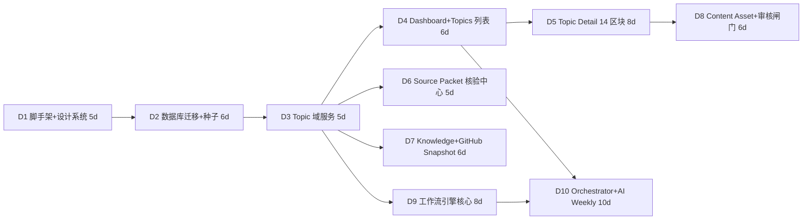

# 权威 MVP 范围与路线图基线（Canonical MVP Scope & Roadmap）

> **状态**：本文件是**V1 MVP 范围（In / Out）、路线图阶段（M0-M5）、Development Tasks 拆分（D1-D10）与设计决策日志（DC/OQ）的唯一事实源（Single Source of Truth）**。
> 后续 13 份正式文档（00-product-vision … 12-roadmap）中涉及范围、排期、任务拆分、决策记录的内容一律引用本文件。
> **字段命名、类型、枚举取值的唯一裁决依据** = `docs/_canonical-data-model.md`；**工作流行为契约** = `docs/_canonical-workflow.md`；**页面结构与设计系统** = `docs/_canonical-ia.md`。本文件只在其上定义**范围边界、阶段排期、任务拆分与决策记录**，不重复定义数据字段，不删减需求字段。
> **本迭代（文档阶段）约束**（需求二十）：本迭代**禁止**实现完整 AI Workflow、开始自动发布、删减核心 Topic / Source / Workflow 数据模型。本文件为规划基线，D1-D10 的落地执行须在用户确认（需求二十第 9 条）后启动。
> 发现设计冲突或需求不清晰时：先列出问题与推荐方案，不擅自删减需求字段。

---

## 0. 约定

- 阶段编号：`M0` … `M5`（milestone）。
- 任务编号：`D1` … `D10`（development task），后续任务 D11+ 在 §7 概要规划、确认后拆分。
- 决策编号：`DC-01` …（design decision，§4）；开放问题：`OQ-01` …（open question，§5）。
- 估时单位：**人日（person-day）**，按单人全职估算；多人并行时按依赖链重排（依赖关系见 §3 依赖图）。
- 阶段与任务中的功能点一律使用基线英文标识符（`workflow_runs`、`topic_relations`、`needs_review` …），中文仅作说明。

---

## 1. V1 MVP Scope（第一版范围，对齐需求十八）

### 1.1 In Scope（第一版必做）

| # | 中文 | 英文标识符 | 覆盖范围 | 阶段 |
|---|---|---|---|---|
| 1 | 内容总控台 Dashboard | `Dashboard` | `/dashboard` 六大区块：周概览 KPI 行、四大工作流状态卡（ai_weekly / github_weekly / evergreen_knowledge / wechat_deep_dive）、核心 CTA 区（`生成本周内容计划`、`确认并开始生产`，人工触发、落 `workflow_runs` 留痕）、待办审查队列、最近 Workflow Runs 时间线、趋势雷达图 | M1 |
| 2 | Topic 选题中心 | `Topic Center` | `/topics`：过滤栏（status / priority / topic_type / content_week / history_dedupe_status / 搜索）、Topic 表格、批量操作栏、候选池 Drawer（`event_pool`，selection_status） | M1 |
| 3 | Topic 详情 | `Topic Detail` | `/topics/[id]` 严格按 IA §3 的 **14 区块顺序**：基础信息→评分→Priority→Tags→Parent→Source Topics→Lineage 可视化→Source Packet→Workflow Runs→Content Assets→Derived Topics→Metrics→CTA→历史记录 | M1 |
| 4 | Source Packet 证据包与核验 | `Source Packet` | `/sources` 三层管理（`sources` → `source_packet_items` → `source_packets`）、包级五态 rollup、`source_consistency=conflict` 冲突裁决面板（写 `audit_log`） | M1 |
| 5 | Workflow 基础结构 | `Workflow Foundation` | `workflow_types` / `workflow_templates` / `workflow_batches` / `workflow_runs` / `workflow_tasks` / `workflow_outputs` 引擎与状态机、AI 调用层抽象（`/lib/ai/providers` + `/lib/ai/orchestrator` + `/lib/ai/workflows`）、`/workflows` 与 `/workflows/runs` 页 | M2 |
| 6 | Knowledge Topic Bank | `Knowledge Topic Bank` | `/knowledge`：知识网格/表格、concept 图（`upstream/related/downstream_concepts` 或 `knowledge_concept_edges`）、衍生预算指示（`knowledge_derivations` round_index 1..3）、开采操作入口 | M1 |
| 7 | GitHub Snapshot | `GitHub Snapshot` | `/github-weekly`：快照抓取（`snapshot_capture`）、不可变冻结（`status=frozen` 触发器禁改删）、Replay 新建行（`source_item_id` 血缘）、`selected=true` 落 Topic（`topic_type='technical_project'/'trend'`） | M1 |
| 8 | Content Asset 基础管理 | `Content Asset Management` | `/content` 与 `/content/[id]`：`content_assets` + `content_asset_versions`（版本全保留、`is_current` 切换）、编辑/预览、版本历史 Timeline、CTA 面板、待审核队列、批量操作 | M1 |
| 9 | 人工审核闸门 | `Human Review Gate` | 全局硬性原则落地：`workflow_runs.status=needs_review` 吸收态、`Review` / `Needs Revision` 审核操作（Approve / Needs Revision / Ready to Publish）、`audit_log` 全量留痕、**V1 绝不自动发布**（`publications.status='published'` 仅人工触发） | M1 基础 / M3 贯通 |

> 🔸 追加说明：`/publications`（仅 `planned` / `ready` 编排 + 人工回填 `published_date / published_url / published_by`）与 `/analytics`（`content_metrics` 录入 + `conversion_funnel` 视图 + Leads 池）属于 **M4 阶段**，不在 MVP 首发范围（对齐需求十八第一阶段清单），但数据模型已全量建表。

### 1.2 Out of Scope（第一版明确不做，需求十八"不要优先实现"）

| # | 中文 | 英文标识符 | 说明 | 再评估时机 |
|---|---|---|---|---|
| 1 | 自动发布 | `Auto Publishing` | V1 硬性原则：`published` 仅人工触发，系统/工作流只生成 `planned → ready` | 不排期（需求硬性原则 6） |
| 2 | 复杂 CRM | `Complex CRM` | `leads` 仅基础列表与分类，不做 CRM 工作流、集成、自动化跟进 | M5 后评估 |
| 3 | 视频生成 | `Video Generation` | `asset_type='short_video_script'` 仅产出脚本文本，不生成视频文件 | 后置评估 |
| 4 | 自动剪辑 | `Auto Editing` | 无任何自动剪辑/合成能力 | 后置评估 |
| 5 | 多租户 | `Multi-tenancy` | 单租户部署 | 后置评估 |
| 6 | 复杂 RBAC | `Complex RBAC` | V1 单用户；`/settings` 用户/权限区仅预留 | 后置评估 |
| 7 | 实时全网爬虫 | `Real-time Web Crawling` | 候选扫描**非实时**；V1 候选经人工录入或受限来源导入 `event_pool` | 需用户确认 V1 候选录入方式（OQ-02） |
| 8 | 🔸 定时自动调度 | `Scheduled Cron` | M3 以**手动触发** run 为主；每周一 09:00 定时器（`scheduling='weekly'`）放 M5 后启用 | M5 |
| 9 | 🔸 AI 自动生成配图/视频 | `AI Image/Video Gen` | `image_plan` 仅输出配图计划，不自动出图；真实截图/UI 必须 `from_brand_asset` / `from_verified_source` | M4 后评估 |

### 1.3 边界规则（In/Out 判据）

1. **判据一（范围）**：需求十八第一阶段清单为 V1 MVP 首发范围，超出项进入 M4/M5 或 Out 清单。
2. **判据二（门禁）**：任何内容产出必须经过人工审核；不存在绕过 `audit_log` 的状态变更路径（继承数据模型 §2.8）。
3. **判据三（产物边界）**：AI 原始产出一律先进 `workflow_outputs` 留痕，**仅人工审核通过后提升为 `content_assets`**（继承 workflow 基线 §6）。
4. **判据四（执行时机）**：数据模型在 M0 全量建表（34 表，不删减）；但完整 AI Workflow 逻辑到 **M3** 才实现——本迭代（文档阶段）禁止实现完整 AI Workflow（需求二十）。

---

## 2. Roadmap 阶段划分（M0 → M5）

### M0 地基（Foundation）

- **目标**：工程可运行、数据层完备、设计语言统一。后续所有阶段的地基。
- **交付物**：
  - Next.js（App Router）+ TypeScript strict + Tailwind CSS + shadcn/ui 工程；
  - 设计 token 与三层 AppShell（Sidebar 240px / Topbar 56px / Content，IA §4.4）；14 条路由占位页；
  - **34 张表全量迁移**（数据模型 §6 落库顺序）与种子数据（`ctas`、`workflow_types`、`workflow_templates` v1、`ai_prompt_templates`、`system_settings` 权重、`image_type_priorities`、`workflow_routing_rules` 默认映射）；
  - 关键触发器（`github_snapshots` frozen 禁改删、`publications.published` 仅人工）；
  - CI（lint / typecheck / build）。
- **验收要点**：`npm run build` 绿；34 表可查询；AppShell 三态（Skeleton / EmptyState / Error）就绪。
- **任务**：D1、D2。

### M1 数据模型 + 基础页面（Data Model & Base Pages）

- **目标**：核心实体 CRUD 与重点页面用**真实数据**渲染；人工审核基础操作可用。
- **交付物**：
  - 域服务：`topic_id` 业务 ID 生成器（`2026W36-001`，周内递增不回收）、`lineage service`（血缘权威读写 + 防环）、`audit_log` 统一落点、`source_packets` 包级 rollup；
  - 页面：`/dashboard`、`/topics`、`/topics/[id]`（14 区块）、`/sources`、`/knowledge`、`/github-weekly`、`/content`、`/content/[id]`；
  - 人工审核基础操作（审核队列、Approve / Needs Revision，写 `audit_log`）。
- **验收要点**：页面字段名引用数据模型列名；Topic Detail 14 区块顺序不重排；审核动作全部留痕；`topic_status` 迁移由守卫函数把关。
- **任务**：D3-D8。

### M2 工作流引擎（Workflow Engine）

- **目标**：通用、可执行、可重跑、可审计的工作流引擎（Workflow 基础结构）。
- **交付物**：
  - `workflow_runs` 生命周期状态机（`queued → running → completed / failed / needs_review`，`attempt_count` 同 run 重跑）与 `workflow_batches` 批次状态机；
  - `workflow_tasks` 步骤执行器、`workflow_outputs` 幂等回写（`applied`）；
  - AI 调用层抽象：`/lib/ai/providers`（统一 `call()` 接口 + mock provider）、`/lib/ai/orchestrator`、`/lib/ai/workflows` 目录骨架；
  - `ai_prompt_templates` 注册表读取链路（Prompt 单一来源，禁止写死在页面）；
  - `/workflows` 与 `/workflows/runs` 页（含 Run 详情 Drawer：tasks 时间线、outputs 产物、parent_run_id 调用树）。
- **验收要点**：用 mock provider 跑通一个模板 run 的完整生命周期；`needs_review → completed` 人工通过路径可用；同一产物只 `applied` 一次；调用树正确。
- **任务**：D9。

### M3 四个工作流（4 Workflows）

- **目标**：内容总控台 Orchestrator + 4 个子工作流全部可跑通，人工门禁全链路贯通。
- **交付物**：
  - Orchestrator 流水线 12 步（`candidate_reception → history_dedupe → topic_clustering → topic_id_assignment → scoring → priority_assignment → workflow_routing → capacity_control → cta_assignment → trend_radar_management → derived_topic_management → return_writeback`，workflow 基线 §2）；
  - `ai_weekly`（每周一口径、事件必达字段、选 5-8 条、90 秒中文口播、极简提纲、趋势雷达、二次候选、Return）；
  - `github_weekly`（快照不可变、Replay、落 Topic）；
  - `evergreen_knowledge`（一次一主 + 最多 3 衍生，双保险守卫）；
  - `wechat_deep_dive`（单值 `content_role`、单主 CTA、12 段蓝图、配图计划）；
  - 各工作流 Prompt 模板落 `ai_prompt_templates`（版本化）。
- **验收要点**：Dashboard 两 CTA 端到端可用；`event_pool` 候选 → 查重聚类 → 提升 `topics` 链路正确；快照冻结不可变；`knowledge_derivations` 预算超限被拦截并记 `audit_log`；`deep_dive_plans.primary_cta == topics.primary_cta` 审核校验项生效。
- **任务**：D10（Orchestrator + `ai_weekly` 首个垂直切片）→ D11-D13（github_weekly / evergreen_knowledge / wechat_deep_dive，见 §7）。

### M4 发布与指标（Publication & Metrics）

- **目标**：人工发布闭环与数据回填可视化。
- **交付物**：
  - `/publications`：`planned / ready` 编排、人工发布操作（回填 `published_date / published_url / published_by`，落 `audit_log`）；
  - `content_metrics` 录入（需求十三 18 字段全量保留、强制绑定 `topic_id`）；
  - `/analytics`：KPI 概览、Conversion Funnel（SQL 视图 `conversion_funnel`：Read → CTA Click → Lead → Registration → Demo → Sales Lead → Deal → Revenue）、平台/周维度下钻、Leads 池。
- **验收要点**：`published` 仅人工触发；指标全部绑定 `topic_id`；漏斗视图正确。
- **任务**：D14+（见 §7，确认后拆分）。

### M5 优化闭环（Optimization Loop）

- **目标**：数据反哺下一轮选题，形成"生产 → 发布 → 回填 → 优化 → 再选题"闭环（需求最终目标）。
- **交付物**：
  - 趋势雷达跨周对比与 `secondary_candidates` 回写 `event_pool`；
  - `knowledge_topic_bank.next_action` 驱动开采（Orchestrator 路由）；
  - 评分权重经 `system_settings` 配置调优（不硬编码）；
  - 知识状态推进（`high_performing` / `needs_remake`，逐资产真实状态以 `content_asset_versions.status` 为准）；
  - 每周一 09:00 定时调度（`scheduling='weekly'`）。
- **验收要点**：演示完整周循环闭环——"生成本周内容计划 → 审核 → 生产 → 审核 → 发布 → 回填 → 下一周选题可见数据反馈"。
- **任务**：D15+（见 §7，确认后拆分）。

---

## 3. 前 10 个 Development Tasks（D1-D10）

> 估时按单人全职人日；合计 **65 人日**。依赖链见 §3.11。

### D1 项目脚手架与设计系统基线落地

- **标题**：Project Scaffold & Design System Baseline
- **目标**：建立可运行的 Next.js 工程与全站统一的视觉/导航骨架。
- **范围**：Next.js App Router + TypeScript strict + Tailwind CSS + shadcn/ui 初始化；设计 token（`--color-*` / `--space-*` / `--radius-*` / `--shadow-*`，IA §4）；三层 AppShell（Sidebar / Topbar / Content）；14 条路由占位页；⌘K Command Menu 骨架；CI（lint / typecheck / build）。
- **验收标准**：14 条路由全部可访问且无报错；token 值与 IA 基线一致；`npm run build` 通过；三态约定（Skeleton / EmptyState / Error）在占位页生效。
- **依赖**：无。
- **估时**：5 人日。

### D2 数据库 Schema 全量迁移与种子数据

- **标题**：Database Schema Migration & Seed Data
- **目标**：按数据模型基线把 34 张表完整落库（不删减任何需求字段）。
- **范围**：Drizzle schema（枚举、索引、触发器）；建表顺序按数据模型 §6；循环引用列 `topics.source_packet_id` 建表后 `ALTER TABLE` 后补；触发器：`github_snapshots` frozen 禁 UPDATE/DELETE、`publications` 禁止 workflow 直写 `published`；种子数据（`ctas`、`workflow_types`、`workflow_templates` v1、`ai_prompt_templates` 初版、`system_settings` 评分权重、`image_type_priorities`、`workflow_routing_rules` 默认映射）。
- **验收标准**：迁移可重复执行（含回滚）；34 张表齐全且约束生效；frozen 快照 UPDATE/DELETE 触发异常；种子数据可查询。
- **依赖**：D1。
- **估时**：6 人日。

### D3 Topic 域服务：业务 ID、血缘与审计

- **标题**：Topic Domain Services（ID / Lineage / Audit）
- **目标**：Topic 核心服务的正确性——这是 Topic Detail 页与工作流回写的地基。
- **范围**：`topic_id` 生成器（目标内容周 `YYYY Www - NNN`、周内递增、删除不回收、`^[0-9]{4}W[0-9]{2}-[0-9]{3}$` 校验）；`lineage service`（同事务写 `topics.parent_topic_id` + `source_topic_ids` + `topic_relations`，祖先路径防环，`WITH RECURSIVE` 读取，深度 3-5 层）；`audit_log` 服务（状态变更/人工动作统一落点）；`score_rationale`（jsonb）写服务。
- **验收标准**：单测覆盖 topic_id 跨 ISO 周漂移与不回收；血缘递归查询双向正确；新增父/源指向自身被拒；所有状态迁移写 `audit_log`。
- **依赖**：D2。
- **估时**：5 人日。

### D4 Dashboard 与 Topic 列表页

- **标题**：Dashboard & Topic Center
- **目标**：内容总控台单屏总览与选题中心真实数据渲染。
- **范围**：`/dashboard` 六区块（周概览 KPI 行：P0/P1 Topic 数、待审核、待发布、已发布、本周 Leads、Demo、Consultation；四大工作流状态卡；核心 CTA 区——按钮可用并创建 `workflow_runs`（`workflow_type='orchestrator'`，status=`queued`）；待办审查队列；最近 runs 时间线；趋势雷达图）；`/topics`（过滤栏、表格含五维评分汇总条、批量操作栏、候选池 Drawer）。
- **验收标准**：页面使用真实数据渲染；CTA 触发 orchestrator run 落库留痕；过滤/排序生效；三态完备（无空白页）。
- **依赖**：D3。
- **估时**：6 人日。

### D5 Topic Detail 页（14 区块）

- **标题**：Topic Detail Page（14 Sections）
- **目标**：重点页面 `/topics/[id]` 全量实现。
- **范围**：严格按 IA §3 顺序实现 14 区块：基础信息 → 评分（五维条 + `business_relevance` 门控显示 + `score_rationale`）→ Priority（语义色徽标）→ Tags → Parent → Source Topics → Lineage 可视化（`LineageGraph` 有向图）→ Source Packet（包级 + 明细 + 冲突入口）→ Workflow Runs（父子调用树）→ Content Assets → Derived Topics → Metrics（`conversion_funnel` 聚合）→ CTA → 历史记录（`topic_status_history` 视图 Timeline）。
- **验收标准**：14 区块顺序与 IA 完全一致且不删节；血缘图双向 3-5 层；历史时间线数据来自 `audit_log`；展示字段名引用数据模型列名。
- **依赖**：D3、D4。
- **估时**：8 人日。

### D6 Source Packet 三层管理与核验中心

- **标题**：Source Packet & Verification Center
- **目标**：来源三层模型的完整管理与核验闭环。
- **范围**：`sources` / `source_packets` / `source_packet_items` CRUD；包级五态 rollup（conflict > needs_update > verified > partially_verified > unverified，禁止手填与明细不一致）；`key_numbers` 与 `number_test_conditions` 展示与逐条执行入口；`source_consistency='conflict'` 冲突裁决面板（写 `audit_log`）；`/sources` 页四区块。
- **验收标准**：rollup 规则单元测试通过；conflict 时 UI 展开逐条裁决；核验记录进 `audit_log`；`sources.source_quality_score` 与包级核验状态分层不混用。
- **依赖**：D3。
- **估时**：5 人日。

### D7 Knowledge Topic Bank 与 GitHub Snapshot 页

- **标题**：Knowledge Topic Bank & GitHub Snapshot Pages
- **目标**：`/knowledge` 与 `/github-weekly` 两页 + 衍生预算守卫。
- **范围**：`knowledge_topic_bank` 网格/表格（knowledge_status / content_status 徽标）、concept 图（数组三向 + `knowledge_concept_edges` 备用）、衍生预算条（round_index 1..3）；`github_snapshots` 列表（`status='frozen'` 锁标识、`selection_basis` 口径）、items 表（捕获列冻结/运营列可编辑）、Original / Replay 管理、`selected=true` 落 Topic；应用层守卫函数 `checkDerivedTopicBudget`（超限拦截 + `audit_log` action=`budget_denied`）。
- **验收标准**：知识状态/内容状态徽标正确；frozen 快照 UI 锁标识且后端拒绝修改/删除；Replay 新建行不覆盖 Original；衍生预算超限被拦截。
- **依赖**：D2、D3。
- **估时**：6 人日。

### D8 Content Asset 基础管理与人工审核闸门

- **标题**：Content Asset Management & Human Review Gate
- **目标**：资产与版本管理 + 审核操作闭环（人工门禁可视化）。
- **范围**：`content_assets`（`asset_key` 逻辑标识）+ `content_asset_versions`（版本全保留、`is_current` 切换、`created_by_run_id` 审计）CRUD；`/content` 列表（过滤栏、待审核队列、批量操作）与 `/content/[id]`（编辑/预览、版本 Timeline、CTA 面板、发布状态、审核操作）；审核动作（Approve / Needs Revision / Ready to Publish）落 `audit_log`；`primary_cta` 在 `Ready for Production` 前必填守卫。
- **验收标准**：版本历史全保留可回滚/对比；审核动作均写 `audit_log` 且 UI 显性"人工"标识；无绕过路径；`Ready to Publish` 前 CTA 校验生效。
- **依赖**：D3、D5。
- **估时**：6 人日。

### D9 Workflow 引擎核心与 AI 抽象层

- **标题**：Workflow Engine Core & AI Provider Abstraction
- **目标**：通用工作流引擎（Workflow 基础结构）——可执行、可重跑、可审计。
- **范围**：`workflow_runs` 生命周期状态机（含 `needs_review` 吸收态、`attempt_count` 同 run 重跑、`failed → queued` retry）；`workflow_batches` 批次状态机（`planned → dispatching → in_progress → needs_review / completed / failed`）；`workflow_tasks` 步骤执行器（`UNIQUE(run_id, sequence)`，含 `skipped`）；`workflow_outputs` 幂等回写（`applied` / `applied_at`）；`/lib/ai/providers` 统一 `call()` 接口（`AIRequest` / `AIResponse`，含 mock provider）+ `/lib/ai/orchestrator` / `/lib/ai/workflows` 目录与类型契约；`ai_prompt_templates` 读取链路；`/workflows` 与 `/workflows/runs` 页（Run 详情 Drawer：tasks 时间线、outputs 产物、`parent_run_id` 调用树、`error`）。
- **验收标准**：用 mock provider 跑通一个模板 run 的 `queued → running → completed` 全生命周期；`needs_review → completed` 人工通过路径可用；同一产物仅 `applied` 一次；子 run 的 `parent_run_id` 调用树正确；审计全覆盖。
- **依赖**：D2、D3。
- **估时**：8 人日。

### D10 Orchestrator 流水线与 AI Weekly 端到端贯通

- **标题**：Orchestrator Pipeline & AI Weekly End-to-End（首个垂直切片）
- **目标**：跑通 MVP 最小闭环——"生成本周内容计划 → 审核 Topic → 确认并开始生产 → AI 周报生产 → 人工审核 → Ready to Publish"。
- **范围**：Orchestrator 流水线 12 步实现（candidate_reception / history_dedupe / topic_clustering / topic_id_assignment / scoring / priority_assignment / workflow_routing / capacity_control / cta_assignment / trend_radar_management / derived_topic_management / return_writeback，每步落 `workflow_tasks` + 关键裁决落 `workflow_outputs`）；`ai_weekly` 工作流（`fact_check` → `score` → `select` 5-8 条 → `script_generate` 90 秒中文口播 → `outline_generate` → `trend_radar` → `secondary_candidates` → `return_writeback`）；事件必达字段落 `event_pool`（`event_date` 入池过滤键、`selection_status`、`elimination_reason`）；Prompt 模板全部落 `ai_prompt_templates`；`/lib/ai/workflows/ai-weekly.ts` 子工作流入口；不足 5 条按实际通过数发布并在批次标 `low_candidate` 触发 `needs_review`。
- **验收标准**：Dashboard 两 CTA 端到端可用；`event_pool` 候选 → 查重聚类 → 提升 `topics`（`derived_topic_id` 回填）链路正确；口播脚本产出进 `workflow_outputs`，**人工审核通过后**提升 `content_assets`（`asset_type='ai_weekly_script'`）；所有迁移写 `audit_log`；无自动发布路径。
- **依赖**：D4、D9。
- **估时**：10 人日。

### 3.11 依赖图与汇总

| 任务 | 标题 | 阶段 | 依赖 | 估时（人日） |
|---|---|---|---|---|
| D1 | 项目脚手架与设计系统基线落地 | M0 | — | 5 |
| D2 | 数据库 Schema 全量迁移与种子数据 | M0 | D1 | 6 |
| D3 | Topic 域服务：业务 ID、血缘与审计 | M1 | D2 | 5 |
| D4 | Dashboard 与 Topic 列表页 | M1 | D3 | 6 |
| D5 | Topic Detail 页（14 区块） | M1 | D3、D4 | 8 |
| D6 | Source Packet 三层管理与核验中心 | M1 | D3 | 5 |
| D7 | Knowledge Topic Bank 与 GitHub Snapshot 页 | M1 | D2、D3 | 6 |
| D8 | Content Asset 基础管理与人工审核闸门 | M1 | D3、D5 | 6 |
| D9 | Workflow 引擎核心与 AI 抽象层 | M2 | D2、D3 | 8 |
| D10 | Orchestrator 流水线与 AI Weekly 端到端贯通 | M3 | D4、D9 | 10 |
| **合计** | | | | **65** |

---

## 4. 设计决策日志（Design Decision Log）

> 汇总分析阶段与基线阶段（数据模型 / 工作流 / IA / 本文件）的所有关键决策。编号 `DC-xx`，按域分组。英文标识符一律以对应基线文件为唯一事实源。

### 4.1 产品与范围（Domain A — Product & Scope）

| 编号 | 主题 | 决策内容 | 定案处 |
|---|---|---|---|
| DC-01 | Topic 为核心实体 | 全系统以 `topics` 为枢纽，与 `content_assets` 严格分离；Topic 可衍生 8 类资产 | 数据模型 §5、需求一 |
| DC-02 | V1 MVP 范围 | In = 需求十八第一阶段 8 项 + 人工审核闸门；Out = 自动发布/复杂 CRM/视频生成/自动剪辑/多租户/复杂 RBAC/实时全网爬虫 | 本文件 §1 |
| DC-03 | 人工门禁硬性 | V1 绝不自动发布；`published` 仅人工触发；`needs_review` 为 run 级门禁吸收态 | 数据模型 §2.8、工作流 §4 |
| DC-04 | 阶段划分 | M0 地基 → M1 数据模型+基础页面 → M2 工作流引擎 → M3 4 个工作流 → M4 发布/指标 → M5 优化闭环 | 本文件 §2 |
| DC-05 | 首个垂直切片 | D10 = Orchestrator + `ai_weekly` 端到端（最小可演示闭环），其余 3 工作流 D11-D13 | 本文件 §3 |
| DC-06 | 单用户 | V1 单用户无复杂 RBAC；`/settings` 用户/权限区预留 | 本文件 §1.2、IA §2.14 |
| DC-07 | 视频/剪辑推迟 | `short_video_script` 仅产脚本文本，不产视频、不剪辑 | 本文件 §1.2 |

### 4.2 数据模型（Domain B — Data Model）

| 编号 | 主题 | 决策内容 | 定案处 |
|---|---|---|---|
| DC-08 | 命名与类型 | 表/列/枚举 snake_case；时间 `timestamptz`；`jsonb` 用于动态结构，禁止内嵌关键外键做联查主路径 | 数据模型 §0 |
| DC-09 | `topic_id` 规则 | `YYYY Www - NNN`（目标内容周语义 + `content_week` 显式列），周内递增不回收 | 数据模型 §2.1 |
| DC-10 | `batch_id` 规则 | `{ISO周}-{WORKFLOW_KIND}`，同周重跑追加 `-NN`；`run_number` 追加 `-R01` | 数据模型 §2.2 |
| DC-11 | 血缘建模 | 自引用列（`parent_topic_id` + `source_topic_ids`）+ 规范化边表 `topic_relations` 混合方案；`lineage service` 单事务同写，读取走递归 CTE；防环双保险 | 数据模型 §2.3 |
| DC-12 | 快照不可变 | `UNIQUE(week, snapshot_type, selection_basis)` + frozen 触发器禁改删 + Replay 新建行；捕获列冻结、运营列可变更 | 数据模型 §2.4 |
| DC-13 | 评分 → priority | 五维加权（权重画像按 `topic_type` 配置驱动）+ 分档（P0≥8.0 / P1≥6.5 / P2≥5.0 / P3<5.0）+ `business_relevance` 门控（<4 封顶 P2）+ hot/trend 兜底 P1；`score_rationale` 审计 | 数据模型 §2.5 |
| DC-14 | 单一主 CTA | `ctas` 受控词表；`topics.primary_cta` 单值；资产继承可覆盖但每资产仅一个；Deep Dive 审核校验 `plan.primary_cta == topic.primary_cta` | 数据模型 §2.6 |
| DC-15 | 一次一主 ≤3 衍生 | 一次生产 = 一个 `workflow_runs` run；`knowledge_derivations` 记账 + `UNIQUE(workflow_run_id, round_index)` + 守卫函数双保险 | 数据模型 §2.7 |
| DC-16 | 候选池独立 | `event_pool` 不并入 `topics`（候选先行、入选提升），保留淘汰原因 | 数据模型 §3.1 |
| DC-17 | Source 三层 | `sources`（注册，核验状态不在此层）→ `source_packet_items`（逐条核验）→ `source_packets`（包级五态由明细 rollup） | 数据模型 §3.2 |
| DC-18 | 循环引用破环 | `source_packets.topic_id` 必填归属；`topics.source_packet_id` 可空指向主包 | 数据模型 §3.2 |
| DC-19 | 资产版本分离 | `content_assets`（逻辑标识 + `current_version_id`）→ `content_asset_versions`（历史全保留，不做覆盖删除） | 数据模型 §3.7 |
| DC-20 | 指标全绑定 Topic | `content_metrics` 18 字段全量保留；Conversion Funnel 用 SQL 视图 `conversion_funnel` 派生，不新增字段 | 数据模型 §3.8 |
| DC-21 | 审计统一落点 | `audit_log` 承接所有人工动作/状态变更；`topic_status_history`、`source_packet_verifications` 为视图，不另建重复表 | 数据模型 §3.9 |
| DC-22 | Logo 保护 | `brand_assets` 数据层强制 `CHECK (type='logo' → ai_policy='reference_only')`；AI 禁止重绘 Logo | 数据模型 §3.7 |
| DC-23 | 两套独立边 | knowledge concept 图（`upstream/related/downstream`）与 Topic 血缘图互不写入 | 数据模型 §3.5 |

### 4.3 工作流（Domain C — Workflow）

| 编号 | 主题 | 决策内容 | 定案处 |
|---|---|---|---|
| DC-24 | 四层架构 | UI/Dashboard → Orchestrator（`workflow_type='orchestrator'`）→ 4 子工作流 → AI 调用层抽象；Prompt 不写死在页面 | 工作流 §1 |
| DC-25 | Orchestrator 12 步 | 候选接收 → 查重 → 聚类 → ID → 评分 → 优先级 → 路由 → 产能 → CTA → 趋势雷达 → 衍生管理 → Return 回写；每步落 `workflow_tasks` | 工作流 §2.1 |
| DC-26 | 路由默认映射 | `hot/trend→ai_weekly`、`technical_project→github_weekly`、`knowledge/evergreen→evergreen_knowledge`、`scenario/product/conversion→wechat_deep_dive`；全部 `overridable=true` | 工作流 §2.4 |
| DC-27 | run 状态机 | 5 态 + `needs_review` 门禁吸收态；`attempt_count` 同 run 重跑不新建；批次 `-NN` 重跑新建 | 工作流 §4 |
| DC-28 | 产物边界 | AI 原始产出先进 `workflow_outputs` 留痕，仅人工审核通过后提升 `content_assets`；`applied` 幂等回写 | 工作流 §6 |
| DC-29 | AI Weekly 口径 | 上一完整自然周（`week_start`/`week_end` 显式存）；入池过滤键 `event_date`；选 5-8 条；不足 5 条标 `low_candidate` 提示人工 | 数据模型 §2.10、工作流 §3.2 |
| DC-30 | 产能规则 | 全工作流 `concurrency_limit=1, serial_mode=true`（编排串行避免状态竞争） | 工作流 §3 |
| DC-31 | Prompt 单一来源 | `ai_prompt_templates`（DB 版本化 `UNIQUE(key, version)`）；`/ai-prompts/*.md` 为源文件导入来源；`workflow_templates.prompt_refs` 引用 | 数据模型 §3.3、工作流 §9 |
| DC-32 | AI 三层抽象 | `/lib/ai/providers`（模型适配器，统一 `call()`）→ `/lib/ai/orchestrator`（编排回写）→ `/lib/ai/workflows`（业务子工作流）；业务代码禁止直接 import 供应商 SDK | 工作流 §9 |
| DC-33 | 趋势雷达分工 | **生成在 workflow**（`trend_radar` task 产出 `trend_report`），**管理在 orchestrator**（回写 `event_pool` / `topic_clusters`） | 数据模型 §3.8、工作流 §5 |

### 4.4 IA 与设计（Domain D — IA & Design）

| 编号 | 主题 | 决策内容 | 定案处 |
|---|---|---|---|
| DC-34 | 14 路由全量保留 | 需求十四路由不变；L3 详情（`/workflows/runs/[id]`、`/sources/[id]`）用 Drawer 承载，不新增路由 | IA §1.3 |
| DC-35 | Topic Detail 区块顺序 | 14 区块顺序为硬性要求，任何页面实现不得重排/删节 | IA §3 |
| DC-36 | 三色体系与语义色 | 白/深灰/蓝三色体系；P0 红 / P1 橙 / P2 蓝 / P3 灰（P3 中性灰为追加）；状态 Badge + 颜色双重编码 | IA §4.1 |
| DC-37 | 深色主题预留 | token 同构预留 Dark 值，V1 默认浅色专业主题 | IA §4.1 |
| DC-38 | 三态约定 | 全站统一 Skeleton / EmptyState / Error，禁止空白页；V1 以桌面为第一优先级 | IA §4.4 |
| DC-39 | 高密度数据工作台 | 默认正文 14px、紧凑表格（cell 垂直 8-10px）、`tabular-nums`；Card/Table/Badge/Tabs/Drawer/Command Menu/Timeline 为主组件 | IA §4.2/§4.5 |

### 4.5 工程与路线图（Domain E — Engineering & Roadmap）

| 编号 | 主题 | 决策内容 | 定案处 |
|---|---|---|---|
| DC-40 | 技术栈 | Next.js + TypeScript strict + Tailwind CSS + shadcn/ui + PostgreSQL（Supabase）+ Drizzle ORM | 需求十六、数据模型头注 |
| DC-41 | 建表顺序 | 34 表按数据模型 §6 编号顺序执行；循环引用列后补 | 数据模型 §6 |
| DC-42 | 迁移策略 | 枚举 V1 推荐 `text + CHECK`（便于迁移回滚） | 数据模型 §0 |
| DC-43 | 任务拆分粒度 | 按"可独立验收的里程碑"拆：M0(2) / M1(6) / M2(1) / M3(1)；首个垂直切片优先 | 本文件 §3 |
| DC-44 | 估时口径 | 单人全职人日；合计 65 人日；多人并行按依赖链重排 | 本文件 §3.11 |
| DC-45 | 本迭代边界 | 文档阶段禁止实现完整 AI Workflow、禁止自动发布、禁止删减模型；D1 起执行须用户确认 | 需求二十、本文件头注 |

---

## 5. 开放问题清单（Open Questions）

> 供用户确认。编号 `OQ-xx`；确认后更新 §4 决策日志或在实现前裁决。

| 编号 | 问题 | 影响范围 | 推荐方案 |
|---|---|---|---|
| OQ-01 | LLM Provider 选型与接入：MVP 用哪个供应商（Anthropic / DeepSeek / OpenAI / 自托管）？API Key 与成本预算是否就绪？D9 是否先以 mock provider 验收、D10 换真实 Provider？ | D9、D10、成本 | D9 用 mock 验收；D10 前确认真实 Provider 与 key；`/lib/ai/providers` 保持可插拔 |
| OQ-02 | 候选事件池数据来源：V1 不做实时全网爬虫，"联网扫描后的候选事件"由谁录入 `event_pool`？（手动录入 / RSS / 邮件导入 / 受限源半自动采集） | D4、D10、M1 候选池 Drawer | V1 推荐手动录入 + 受限源（如 Newsletter/订阅）半自动导入 |
| OQ-03 | GitHub Trending 抓取方式：GitHub 官方 API 不直接提供 Trending 数据，`snapshot_capture` 用哪个数据源？（RSSHub / 第三方接口 / 网页解析 / 人工粘贴 CSV） | D7、D10、`github_weekly` | 推荐 V1 人工粘贴 + 半自动解析，D11（github_weekly）时再定 |
| OQ-04 | 认证与单用户：V1 是否启用 Supabase Auth 登录，还是本地单用户无鉴权（`actor` 用固定标识）？ | D1、`audit_log.actor` | V1 推荐 Supabase Auth 单账号登录，`actor` 用用户标识；否则固定 `manual-user` |
| OQ-05 | 部署环境：Supabase 项目是否已存在？本地开发数据库还是云端？URL / key 是否可用？ | D2 起全部任务 | 推荐新建 Supabase 项目，`drizzle-kit` 迁移；本地 `docker postgres` 备选 |
| OQ-06 | 定时调度启用时机：AI Weekly / GitHub Weekly 的 `scheduling='weekly'`（每周一 09:00）在哪个阶段启用？ | M3（D10）vs M5 | 推荐 M3 以手动触发为主、M5 启用定时器（OQ-06 确认后更新 §1.2 第 8 项） |
| OQ-07 | 内容语言：确认口播/文章/图文默认中文（90 秒中文口播、公众号中文）？ | D10、Prompt 模板 | 推荐默认中文，Prompt 模板显式声明 |
| OQ-08 | 发布渠道接入：确认 V1 公众号等平台**人工发布 + 回填链接**（不接平台 OpenAPI）？ | M4、`/publications` | 推荐人工发布回填（需求十二、数据模型 §2.8） |
| OQ-09 | 趋势雷达图表粒度与刷新策略（IA §6 遗留开放问题）：Dashboard 按周/跨周展示？刷新时机？ | D4、M5 | 推荐 Dashboard 当前周 + M5 增加跨周对比 |
| OQ-10 | 演示/验收数据：是否需要种子演示数据（模拟两周 topics / 一个 frozen 快照 / 若干 event_pool 候选）用于页面验收？ | D2、D4、D7 | 推荐提供 `demo-seed`（可一键清空），避免空态验收 |
| OQ-11 | 排期与规模：D1-D10 合计 65 人日的安排是否可接受？单人串行还是多人并行（并行需重排依赖链）？M4/M5（D11+）是否在 MVP 验收后立即拆分？ | 全部 | 推荐 MVP 验收后按本文件 §7 拆分 D11+ |

---

## 6. MVP 里程碑与退出标准（Milestones & Exit Criteria）

| 里程碑 | 内容 | 退出标准 |
|---|---|---|
| MS-1 | M1 结束 | 全部基础页面（Dashboard / Topics / Topic Detail / Sources / Knowledge / GitHub Weekly / Content）用真实数据渲染；Topic Detail 14 区块顺序合规；人工审核基础操作可用且全部落 `audit_log` |
| MS-2 | M2 结束 | mock provider 可跑通 run 全生命周期；`needs_review` 门禁路径与 `applied` 幂等验证通过；Runs 页可审计 |
| MS-3 | **M3 结束（MVP Exit）** | 端到端最小闭环可演示：**生成本周内容计划 → 审核 Topic → 确认并开始生产 → AI 周报生产（90 秒中文口播脚本）→ 人工审核 → Ready to Publish**；无自动发布路径；`event_pool` → `topics` 提升链路正确 |
| MS-4 | M4 结束 | 人工发布闭环（`planned/ready` + 人工回填 `published`）与指标录入/漏斗视图可用 |
| MS-5 | M5 结束 | 完整周循环闭环演示：发布 → 数据回填 → 下一周选题可见数据反馈 |

**硬性 Exit 约束（任何阶段不得违反）**：
1. 不存在绕过人工审核的发布路径（`publications.status='published'` 仅人工触发）。
2. 所有评分、定级、查重、聚类、CTA 判断、路由、状态迁移均有 `workflow_runs` 留痕。
3. 数据模型 34 表全量落库，需求字段零删减。

---

## 7. 后续任务规划（D11+ 概要，确认后拆分）

> 本迭代只拆分 D1-D10；以下为后续阶段的任务概要，用户确认 MVP 后按 §6 里程碑拆分详细任务（标题/目标/范围/验收标准/依赖/估时）。

| 阶段 | 规划任务 | 概要 | 估时（人日，预估） |
|---|---|---|---|
| M3 | D11 `github_weekly` 工作流 | `snapshot_capture` → `fact_check` → `select` → 图文卡片生成 → Return；快照不可变 + Replay 全链路 | 6 |
| M3 | D12 `evergreen_knowledge` 工作流 | 概念开采 → `knowledge_topic` 建库 → 内容生产 → 衍生 ≤3 → Return；`checkDerivedTopicBudget` 全链路 | 6 |
| M3 | D13 `wechat_deep_dive` 工作流 | Content Role 定义 → 12 段蓝图 → 配图计划 → 成文 → Return；蓝图审核状态机 | 7 |
| M4 | D14 `/publications` 发布中心 | 发布编排（`planned/ready`）+ 人工发布操作 + `audit_log` | 4 |
| M4 | D15 指标录入与 `/analytics` | `content_metrics` 18 字段录入（表单/导入）、`conversion_funnel` 视图、Leads 池 | 6 |
| M5 | D16 趋势雷达与二次候选回写 | 跨周对比、`secondary_candidates` → `event_pool`、`trend_radar` 管理闭环 | 4 |
| M5 | D17 优化闭环与定时调度 | `next_action` 驱动开采、评分权重调优 UI、`scheduling='weekly'` 定时器 | 5 |
| M5 | D18 知识状态推进 | `high_performing` / `needs_remake` 联动、`content_status` 聚合视图校准 | 3 |

> 备注：D11-D18 估时为概要预估，拆分时以实际验收标准重新核定。
